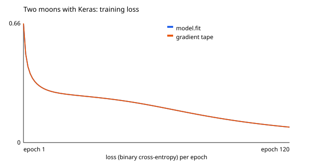

# TensorFlow and Keras basics

> Versão em português: [docs/pt/artificial-intelligence/tensorflow-keras-basics.md](../../pt/artificial-intelligence/tensorflow-keras-basics.md)

Mini-project MP-AI-7, in [`projects/artificial-intelligence/tensorflow-keras-basics`](../../../projects/artificial-intelligence/tensorflow-keras-basics). It teaches the same model in another framework, and what a high-level API hides. The background is in section [15](README.md#15-tensorflow-and-keras) of the area page, and the PyTorch side of every comparison is in [pytorch-basics](pytorch-basics.md) (MP-AI-6).

## The plan

The network is the one of [neural-network-from-scratch](neural-network-from-scratch.md) (MP-AI-2): 2 inputs, two hidden layers of 8 neurons with tanh, 1 output, 105 parameters. The dataset is the same too: 80 training points and 200 test points of two interleaved half circles, made by a copy of the same generator. Only the tool changes.

1. `model.py`: the network described as a list of Keras layers.
2. `keras_api.py`: training with three calls, `compile`, `fit` and `evaluate`.
3. `tape.py`: the same training with the step written by hand around a gradient tape, and then as a graph.
4. `side_by_side.py`: each concept in PyTorch and in TensorFlow.

## Describing the model

```python
model = keras.Sequential([
    keras.Input(shape=(2,)),
    keras.layers.Dense(8, activation="tanh"),
    keras.layers.Dense(8, activation="tanh"),
    keras.layers.Dense(1),
])
```

`Dense(8)` is a fully connected layer of 8 neurons. Only the number of outputs is given: the number of inputs comes from the layer before, starting at `Input`. The parameter count can be done by hand:

```text
first layer    2 x 8 weights + 8 biases = 24
second layer   8 x 8 weights + 8 biases = 72
output layer   8 x 1 weights + 1 bias   =  9
total                                    105
```

One detail differs from PyTorch: Keras stores the weights of a layer with shape (inputs, outputs), so the first kernel is (2, 8), and PyTorch stores (outputs, inputs), so its first weight is (8, 2). The computation is the same matrix product.

**Logit or sigmoid?** The last layer has no activation, so the model outputs a logit, and the loss is created with `from_logits=True`. The other common spelling is a last layer with `activation="sigmoid"` and the loss `"binary_crossentropy"`. It is the same model: the sigmoid only moves from inside the loss to the last layer. A test checks that both give the same number, and that this number is the `log(1 + e^(-s z))` of MP-AI-2. The logit form is safer with very large or very small numbers.

The starting weights follow the rule of MP-AI-2, uniform between -1 and 1, as in the PyTorch version.

## Three calls

```python
keras.utils.set_random_seed(7)
model.compile(
    optimizer=keras.optimizers.SGD(learning_rate=0.5),
    loss=keras.losses.BinaryCrossentropy(from_logits=True),
    metrics=[keras.metrics.BinaryAccuracy(threshold=0.0)],
)
history = model.fit(inputs, targets, epochs=120, batch_size=80, shuffle=False, verbose=0)
loss, accuracy = model.evaluate(test_inputs, test_targets, verbose=0)
```

- `compile` computes nothing. It stores three choices: how to update (the optimiser), what to minimise (the loss) and what else to report (the metrics).
- `fit` is the training loop. By default it cuts the data into mini-batches of 32 points and shuffles them. Here the batch is the whole training set, as in MP-AI-2: one epoch, one update.
- `evaluate` measures on data without training, and returns the loss and then each metric.

Two traps are visible in these few lines. The usual `metrics=["accuracy"]` cuts the output at 0.5, which is right for a probability and wrong for a logit: a logit of 0.2 means class 1, and 0.2 is below 0.5. The metric is told to cut at 0. And the default `batch_size=32` would make three updates per epoch on 80 points, a different training from the one being reproduced.

| Set | Points | Loss | Accuracy |
| --- | ---: | ---: | ---: |
| Training | 80 | 0.0839 | 97.5% |
| Test (never used in training) | 200 | 0.0710 | 98.5% |

| Epoch | Loss |
| ---: | ---: |
| 1 | 0.6567 |
| 10 | 0.2980 |
| 50 | 0.2222 |
| 100 | 0.1132 |
| 120 | 0.0850 |

Nowhere in this code is there a gradient or an update. They happened inside `fit`.

## Gradients with a tape

TensorFlow records operations only inside a `tf.GradientTape` block, and the tape is then asked for a slope:

```python
x = tf.Variable(3.0)
with tf.GradientTape() as tape:
    y = x * x
tape.gradient(y, x)        # 6.0, because dy/dx = 2x
```

The example of MP-AI-2, `f = (x + y) * z` at x = 2, y = 1, z = 4, can be done by hand first: `df/dx = z = 4`, `df/dy = z = 4`, `df/dz = x + y = 3`. The tape returns 4, 4 and 3.

Three rules that differ from PyTorch:

- A `tf.Tensor` cannot be changed. What training changes is a `tf.Variable`, and variables are watched by the tape automatically. A constant is not: its gradient comes back as `None`, with no error, unless `tape.watch(x)` is called. The demo shows `None` and then 6.
- A tape answers one `gradient` call and is then released. A second call raises an error, unless the tape was created with `persistent=True`.
- Nothing accumulates. The tape returns fresh gradients each time, so there is no `zero_grad`.

## The step that fit hides

```python
optimizer = keras.optimizers.SGD(learning_rate=0.5)
loss_fn = keras.losses.BinaryCrossentropy(from_logits=True)

for epoch in range(120):
    with tf.GradientTape() as tape:
        logits = model(inputs, training=True)                    # 1. forward
        loss = loss_fn(targets, logits)                          # 2. loss
    gradients = tape.gradient(loss, model.trainable_variables)   # 3 and 4. gradients
    optimizer.apply_gradients(zip(gradients, model.trainable_variables))  # 5. update
```

This is the loop of the PyTorch version in other words. With the same seed it starts from the same weights as the `fit` run, and it gives the same numbers:

| How it was trained | First loss | Last loss | Training accuracy | Test accuracy | Python ran the step |
| --- | ---: | ---: | ---: | ---: | ---: |
| `model.fit` | 0.6567 | 0.0850 | 97.5% | 98.5% | hidden |
| Gradient tape, eager | 0.6567 | 0.0850 | 97.5% | 98.5% | 120 |
| Gradient tape inside `tf.function` | 0.6567 | 0.0850 | 97.5% | 98.5% | 1 |

At every one of the 120 epochs the losses differ by less than 0.0001. So `fit` is not a different algorithm: it is this loop, already written.



The figure has two curves, `fit` and the tape loop, and they lie on top of each other.

## Eager against graph

The last column of the table counts how many times Python really executed the body of the step. Run normally (**eager execution**), every line runs at every step: 120 times. Wrapped in `tf.function`, the first call runs the Python code once to record the operations into a **graph** (this is called tracing), and the other 119 calls execute the graph without going through Python: the counter stays at 1.

That explains a classic surprise: a `print` or any other ordinary Python code inside a `tf.function` runs only while tracing. A test also shows when a new trace happens: calling the step with a batch of another shape (10 points instead of 80) records a second graph.

## PyTorch and TensorFlow side by side

| Concept | PyTorch | TensorFlow and Keras |
| --- | --- | --- |
| Tensor | `torch.Tensor`: `torch.tensor(points)` | `tf.Tensor` (cannot be changed): `tf.constant(points)`. Parameters are `tf.Variable` |
| Gradient | `requires_grad=True`, `loss.backward()`, read `.grad` | `with tf.GradientTape() as tape:`, then `tape.gradient(loss, variables)` |
| Layer | `nn.Linear(2, 8)` followed by `torch.tanh` | `keras.layers.Dense(8, activation="tanh")` |
| Model | a class that inherits from `nn.Module`, with `forward` | `keras.Sequential([...])` |
| Loss on a logit | `nn.BCEWithLogitsLoss()` | `keras.losses.BinaryCrossentropy(from_logits=True)` |
| Optimiser | `torch.optim.SGD(model.parameters(), lr=0.5)`, `zero_grad()` and `step()` | `keras.optimizers.SGD(learning_rate=0.5)`, `apply_gradients(zip(grads, variables))` |
| Training loop | written by hand: forward, loss, `zero_grad`, `backward`, `step` | `model.compile(...)` and `model.fit(...)`, or by hand with a tape |
| Measuring | `model.eval()` and `with torch.no_grad():` | `model.evaluate(...)`, or `model(inputs, training=False)` |
| Execution | eager: the graph is rebuilt at every forward pass | eager by default, a recorded graph with `@tf.function` |
| **Measured accuracy, 80 training points** | **97.5%** | **97.5%** (`fit`) |
| **Measured accuracy, 200 test points** | **98.0%** | **98.5%** (`fit`), **98.5%** (gradient tape) |

The PyTorch accuracies come from the committed results of [pytorch-basics](pytorch-basics.md) (`projects/artificial-intelligence/pytorch-basics/results/results.md`, first row of the training table). This project contains no PyTorch. Both runs use the same dataset, network, starting rule, seed number, learning rate and number of epochs. They do not start from the same random weights, because each framework has its own random generator, so the accuracies are close and not equal: 196 against 197 of the 200 test points. For reference, MP-AI-2 itself reached 99.5% from its own starting weights.

The table is the lesson: every row is one idea with two spellings. Whoever understands the five steps of the loop can read either framework.

## What a real system adds

- **Datasets that do not fit in memory**, read in mini-batches by `tf.data` and shuffled at every epoch.
- **Callbacks** in `fit`: stopping early when the validation loss stops improving, saving the best model, logging curves.
- **Saving and deploying.** A graph recorded by `tf.function` can be saved and run where there is no Python, such as a phone or a server in another language.
- **Custom training.** When one `fit` is not enough (two networks that train against each other, for example), the step is written with a tape, as here.

## Run it

```sh
cd projects/artificial-intelligence/tensorflow-keras-basics
./setup-unix-tensorflow-keras-basics.sh
```

On Windows, `./setup-windows-tensorflow-keras-basics.ps1`. Only the demo: `docker compose run --rm python-demo`. The image uses Python 3.13 because TensorFlow 2.21.0 has no package for Python 3.14, and it installs Keras 3.15.1 and NumPy 2.5.3. The lines about CUDA that TensorFlow prints only say that no GPU was found.
