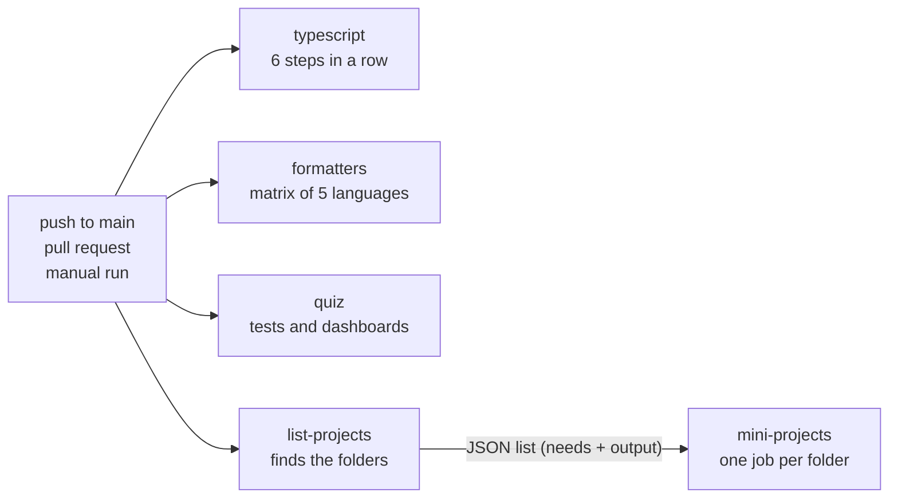

# CI pipeline as a lesson (MP-CI-1)

> Versão em português: [docs/pt/continuous-integration/ci-pipeline.md](../../pt/continuous-integration/ci-pipeline.md) · Versión en español: [docs/es/continuous-integration/ci-pipeline.md](../../es/continuous-integration/ci-pipeline.md)

Mini-project: [`projects/continuous-integration/ci-pipeline`](../../../projects/continuous-integration/ci-pipeline/README.md). Quiz topics: `ci-cd-concepts`, `workflows-events-jobs-steps`, `runners-matrix`, `caching-artifacts`, `secrets-environments-permissions`, `quality-gates`, `supply-chain-security`.

## The concept

**Continuous integration (CI)** means that every change is merged into one shared line of code often, and that a machine checks each change before people rely on it. The checks are the same every time, they run on a clean machine, and nobody has to remember to run them.

A **quality gate** is one of those checks seen as a door: the change goes through only if the check passes. A good gate has three properties:

- It is **automatic**. Its answer is an exit code, 0 for "pass" and anything else for "fail". No person decides.
- It is **specific**. It catches one kind of mistake and says which file and line.
- It is **reproducible**. The same command gives the same answer on a laptop and in CI.

This repository has 14 such gates in one file, [`.github/workflows/ci.yml`](../../../.github/workflows/ci.yml). This page reads that file from top to bottom.

## The words of GitHub Actions

| Word | Meaning | In `ci.yml` |
| --- | --- | --- |
| Workflow | a YAML file in `.github/workflows/` that describes an automation | `name: CI` |
| Event | what starts the workflow | `on:` |
| Job | a group of steps that runs on one machine | `typescript`, `formatters`, `quiz`, `list-projects`, `mini-projects` |
| Runner | the machine that runs a job, created new and thrown away | `runs-on: ubuntu-24.04` |
| Step | one command (`run:`) or one reusable action (`uses:`) | `- run: bun run typecheck` |
| Matrix | one job definition expanded into several jobs | `strategy.matrix` |

Jobs run in parallel unless one declares `needs:`. Steps of a job run one after the other, and the job stops at the first step that fails.

## The head of the file

```yaml
on:
  push:
    branches: [main]
  pull_request:
  workflow_dispatch:
```

Three events. A push to `main` checks what was merged. A pull request checks a change before it is merged. `workflow_dispatch` adds a "Run workflow" button, and the command `gh workflow run CI`. A push to any other branch starts nothing: that is why the demonstration branches of this lesson need a manual run.

```yaml
permissions:
  contents: read
```

Every run gets a temporary token, `GITHUB_TOKEN`. By default it may be allowed to write to the repository. This workflow only reads code, so it asks for read access and nothing else. This is the principle of least privilege: if a step is ever compromised (a malicious dependency, for example), the token it finds cannot push code or publish a release.

```yaml
concurrency:
  group: ci-${{ github.event_name }}-${{ github.ref }}
  cancel-in-progress: true
```

Two runs in the same group do not run together: the newer one cancels the older one. The group is "event plus branch", so pushing twice to the same pull request stops the run of the commit nobody cares about any more. The event is in the name on purpose: a push to `main` does not cancel a manual full run of `main`.

## The jobs



### `typescript`

Setup: `actions/checkout@v5` copies the repository onto the runner, `oven-sh/setup-bun@v2` installs Bun 1.4.2, and `bun install --frozen-lockfile` installs the dependencies. `--frozen-lockfile` makes the install fail when `package.json` and `bun.lock` disagree, in place of quietly resolving new versions: CI tests exactly what the lockfile says.

| Step | Command | Why it exists | What a failure looks like |
| --- | --- | --- | --- |
| Format and lint (Biome) | `bunx biome ci .` | one style for everyone, so a diff shows only what changed in meaning | `file.ts format` followed by a diff of the lines |
| Markdown lint (markdownlint) | `bun run lint:md` | the documentation is half of this repository, and prose has rules too | `file.md:7 error MD040/fenced-code-language Fenced code blocks should have a language specified` |
| Type check | `bun run typecheck` | a wrong type is found without running the code | `file.ts(8,2): error TS2322: Type 'string' is not assignable to type 'number'.` |
| Unit tests | `bun test quiz/tests/unit tools` | well typed code can still compute the wrong thing | `(fail) name of the test`, with expected and received values |
| Quiz content validation | `bun run quiz:validate` | the quiz is data, and data has rules too | `error: big-o/file.json id: en.alternatives: must have exactly 5 items` |
| Documentation index is up to date | `bun run docs:index --check` | a generated file must match what generates it | `docs/en/README.md is out of date: run "bun run docs:index"` |

The second step lints every Markdown file with markdownlint, the version pinned in `package.json`, under the rules of `.markdownlint-cli2.jsonc`. That file turns a few rules off and says why next to each one. `bun run format:md` fixes what can be fixed automatically.

The order is from cheap to expensive. Formatting takes a second and fails most often, so it goes first, and a job that fails early gives its answer early.

The last step shows a pattern worth knowing. `docs/en/README.md` is written by a script from the content of the repository. The check runs the script in memory and compares the result with the committed file. Whoever changes the content and forgets to regenerate the page is told by CI, with the command that fixes it.

### `formatters`

```yaml
strategy:
  fail-fast: false
  matrix:
    include:
      - lang: python
        check: ruff check . && ruff format --check .
      - lang: go
        check: test -z "$(gofmt -l projects benchmarks 2>/dev/null)"
```

A **matrix** turns one job definition into several jobs, one for each entry of `include`. Here each entry carries two values: the language and the command that checks it. The steps are the same for all five: build the pinned image of the language from `docker/<lang>.Dockerfile`, then run the command inside it with the repository mounted.

`fail-fast: false` matters. By default, when one job of a matrix fails, GitHub cancels the others. With it turned off the five languages always finish, and one run tells you everything that is wrong.

The command reaches the container in a careful way:

```yaml
env:
  CHECK: ${{ matrix.check }}
run: docker run --rm -v "$PWD:/app" -w /app sef-${{ matrix.lang }}:local sh -c "$CHECK"
```

`${{ ... }}` is replaced by GitHub **before** the shell reads the line. A command pasted straight into the script would bring its own quotes, close the quoted argument early, and part of it would run on the runner and not in the container. Passed through an environment variable, the text arrives whole. The same rule protects against script injection when the value comes from outside, such as the title of a pull request: never paste `${{ }}` into a script, pass it through `env`.

The formatters run in check mode (`--check`, `--dry-run`, `-l`): they change nothing and only report. A failure looks different in each tool. ruff prints `1 file would be reformatted`, rustfmt prints `Diff in file.rs`, clang-format prints `error: code should be clang-formatted`, mix prints `The following files are not formatted`. The Go check prints nothing at all, because `test -z` only sets the exit code. A silent failure is a weakness worth noticing: the person who sees it has to rerun `gofmt -l projects benchmarks` to learn the file name.

### `quiz`

The first step is one line, `./quiz/setup-unix-quiz.sh test`, and that line is the lesson: CI calls the same script a contributor calls. The script builds the quiz as a static site from a small fixture, runs the unit tests, starts the site in a container and runs the Playwright tests against it in another one. A failure is a Playwright report: the name of the test, the line that waited for something, and `1 failed`.

The second step opens every committed dashboard (`projects/*/*/dashboard/index.html`) from disk in a real browser, in a container started with `--network none`. A page fails when it logs an error, renders no text or asks for anything that is not a local file. A page that works with no network at all proves that it needs no CDN and no server, which is the promise the dashboards make. A failure reads `FAIL path/index.html` and `network request: https://...`.

### `list-projects` and `mini-projects`

These two jobs are one idea in two parts. The list of mini-projects is not written in the workflow. It is computed:

```yaml
list-projects:
  outputs:
    projects: ${{ steps.list.outputs.projects }}
  steps:
    - id: list
      run: |
        projects=$(for dir in projects/*/*/; do ... done | jq -R . | jq -sc .)
        echo "projects=${projects:-[]}" >> "$GITHUB_OUTPUT"
```

A step publishes a value by writing `name=value` to the file `$GITHUB_OUTPUT`. The job exposes it under `outputs`. The next job declares `needs: list-projects`, which both makes it wait and lets it read the value:

```yaml
mini-projects:
  needs: list-projects
  if: needs.list-projects.outputs.projects != '[]'
  timeout-minutes: 45
  strategy:
    fail-fast: false
    matrix:
      project: ${{ fromJson(needs.list-projects.outputs.projects) }}
```

`fromJson` turns the text `["projects/a/b","projects/c/d"]` into a list, and the matrix becomes one job per folder. This is a **dynamic matrix**. The `if` skips the job when the list is empty, because a matrix with no entries is an error. `timeout-minutes` stops a job that hangs, in place of the default limit of six hours.

Each job runs three lines: build the name of the script from the folder, `chmod +x` it (a file committed from Windows may lack the executable bit) and run it. A failure is whatever the tests of that mini-project print, and the job is named after the folder, so the red line in the list says where to look.

## The design decisions

**Every mini-project on every run.** Testing only the folders that changed is faster and it misses real breakages. A mini-project depends on files outside its folder: the base images in `docker/`, the workflow, the quiz content it links to. Changing one of those can break a folder nobody touched, and a pipeline that tests only changed folders would stay green. The price is machine time, paid on every run.

**Pinned versions everywhere.** The runner is `ubuntu-24.04`, not `ubuntu-latest`. The actions have a version (`actions/checkout@v5`), Bun has one (`1.4.2`), and every Docker image has a fixed tag. A pipeline that floats can turn red on a day when nobody changed anything, and then the question "what broke it?" has no answer in the repository. One honest note: `@v5` is a tag, and the owner of an action can move a tag. Pinning to the full commit hash is stricter, and it is what a project with a high risk in its supply chain does.

**No cache.** The workflow stores nothing between runs. Every run installs the dependencies and builds the images again. That is slower, and it is simple: there is no stale cache to explain a strange failure, and no cache that a pull request could poison. If run time becomes a problem, the first candidates are the Bun install cache and the Docker layers. It would be a trade, not a free win.

**Everything in Docker, called through scripts.** Almost every gate is one command a person can run locally with the same result, because the tools and their versions live in images and not on the runner. When CI is red, the first step is to run that command on your machine.

**The lowest permission that works.** Covered above: `contents: read`.

## The demo

The mini-project turns each gate into an experiment with two runs:

1. A container makes a clean copy of the files the gate needs and runs the gate command. It must pass.
2. It applies a prepared change, the smallest one that breaks that gate, and runs the same command. It must fail, with the message a contributor would see.

Some details are worth reading in the code:

- **The command is read from `ci.yml`.** `demo/run-gates.sh` extracts the `run:` line of the step by its name, so the demo runs what CI runs.
- **The changes end in `.fixture`.** A badly formatted `bad_format.go` stored in the repository would fail the real `formatters` job. As `bad_format.go.fixture` no tool sees it, and applying the change copies it to its place without the suffix.
- **Every change is named `ci-demo`.** The clean copy leaves such files out. On a demonstration branch the lesson still starts clean, so the branch fails one gate and the job of this mini-project stays green.
- **The repository is mounted read-only.** The containers cannot change it, and each one works on a copy.
- **Two checks watch the lesson itself.** `workflow-sync` fails when `ci.yml` gets a job, a named step or a formatter with no demonstration. `isolation` fails when a change breaks a gate it was not written for.

## The demonstration branches

`demo-branches.sh` (and `demo-branches.ps1`) applies each change to a branch `demo/ci-fails-<gate>` created from `main` in a temporary clone, pushes it and starts a manual run of CI on it. The default is a dry run that pushes nothing. The script refuses to work against any remote that is not this repository, and it never changes the working tree it is launched from.

What you should see in the list of jobs of each run: one red job, with the name of the gate, and everything else green. For `formatters` and `mini-projects`, the red job is one entry of the matrix and its siblings are green, which is `fail-fast: false` at work.

## Limits

- The branches were pushed on 2026-10-10, and the table of the README links the failed run of each gate.
- Three gates are shown on a reduced fixture, because the real ones start Docker and a container of the demo has no Docker inside: the end-to-end tests of the quiz (a one-page site in place of the quiz), the dashboards (one sample page in place of all of them) and the mini-project tests (one sample mini-project that needs only a shell).
- The `typescript` gates run the real commands on `quiz/`, `tools/` and `benchmarks/` with the small content of the quiz tests, and the formatter gates check sample files. The demo proves that each gate catches its mistake. Only the real pipeline proves that the whole repository is clean.

## Try it

1. Run `./setup-unix-ci-pipeline.sh demo biome` and read the diff Biome prints. Which three things would it change?
2. Open `demo/unit-tests/change/` and fix the function so the test passes. Why did the type checker not catch the bug?
3. In `ci.yml`, what would happen to a pull request that only edits a README if `mini-projects` tested only changed folders? And to one that changes `docker/python.Dockerfile`?
4. The Go check fails in silence. Write a version of that command that prints the names of the files and still fails.
