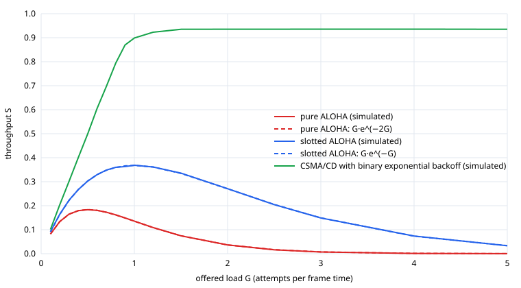

# ALOHA and CSMA/CD

> Versão em português: [docs/pt/networks/aloha-csma.md](../../pt/networks/aloha-csma.md) · Versión en español: [docs/es/networks/aloha-csma.md](../../es/networks/aloha-csma.md)

Mini-project: [`projects/networks/aloha-csma`](../../../projects/networks/aloha-csma/README.md). Language: Python. Quiz topic: `networks` / `medium-access-control`.

## The problem

Many stations share one channel: a radio frequency, a cable. If two transmit at the same time, both frames are destroyed. There is no coordinator handing out turns, so each station has to decide by itself when to transmit. The three protocols here are three answers, each one adding a single idea to the previous one.

| Protocol | Rule | Idea added |
| --- | --- | --- |
| pure ALOHA | transmit whenever you have a frame | none |
| slotted ALOHA | transmit only at the start of a slot | a common clock |
| CSMA/CD | listen first, stop as soon as a collision is noticed, wait a random time | carrier sense, collision detection, backoff |

## Units

Time is measured in **frame times**: one frame takes 1 unit. The **offered load G** is the mean number of transmission attempts per frame time. The **throughput S** is the mean number of frames that get through per frame time, so it is the fraction of the channel doing useful work. S can never exceed 1.

## Pure ALOHA

A frame that starts at time t occupies the channel until t + 1. It is destroyed by any frame that started after t - 1 (still on the air) or that starts before t + 1. The **vulnerable period** is therefore 2 frame times. With Poisson attempts, the probability of no other start in 2 frame times is e^(-2G), which gives:

```text
S = G * e^(-2G)        maximum at G = 0.5:  S = 1/(2e) = 0.184
```

`simulate_pure_aloha` draws exponential gaps between consecutive starts and counts a frame as successful when the gap before it and the gap after it are both at least 1.

## Slotted ALOHA

If frames may start only at slot boundaries, two frames either overlap completely or not at all. The vulnerable period halves to 1 frame time:

```text
S = G * e^(-G)         maximum at G = 1:  S = 1/e = 0.368
```

`simulate_slotted_aloha` draws the number of attempts in each slot and counts the slots with exactly one.

## CSMA/CD with binary exponential backoff

The simulator in `csma_cd.py` models a cable with 50 stations. Its clock ticks in **contention slots**: one slot is a round trip on the cable (2τ), the time a station needs to be sure it owns the channel. A frame lasts 32 slots.

- **Carrier sense, 1-persistent**: a station with a frame transmits as soon as the channel is idle.
- **Collision detection**: if two or more start in the same slot, they notice within that slot and stop. The collision wastes 1 slot, not a frame.
- **Backoff**: after the n-th collision of the same frame the station waits a random number of slots between 0 and 2^min(n, 10) - 1. After 16 collisions the frame is dropped.

The key number is the ratio between the frame and the slot. A success uses 32 slots of channel, a collision wastes 1. That is the same reason Ethernet has a minimum frame size and a maximum cable length: collision detection only works if the frame outlasts the round trip.

## Results

From [results/results.md](../../../projects/networks/aloha-csma/results/results.md), seed 2026:



| G | pure ALOHA | theory | slotted ALOHA | theory | CSMA/CD |
| --- | --- | --- | --- | --- | --- |
| 0.2 | 0.1339 | 0.1341 | 0.1644 | 0.1638 | 0.2042 |
| 0.5 | 0.1833 | 0.1839 | 0.3029 | 0.3033 | 0.4998 |
| 1.0 | 0.1356 | 0.1353 | 0.3684 | 0.3679 | 0.8987 |
| 2.0 | 0.0365 | 0.0366 | 0.2708 | 0.2707 | 0.9355 |
| 5.0 | 0.0002 | 0.0002 | 0.0330 | 0.0337 | 0.9353 |

- The simulated peaks are 0.1833 at G = 0.5 and 0.3684 at G = 1.0, which is 0.34% below and 0.15% above the theory.
- Past its peak, ALOHA gets worse as the load grows. At G = 5 pure ALOHA delivers almost nothing: the channel is full of frames and every one of them is damaged.
- CSMA/CD delivers what is offered while the load is low and then flattens near 0.94. Under overload it also drops frames (the last column of the full table): the backoff keeps the channel useful, it does not create capacity.

## Reproducibility

The simulators use simulated time and one random generator seeded from the command line. The same seed writes the same `results.json` on any machine, which is why the committed file can be compared with a new run. The chart is drawn only from that file.

## Limits of the model

- ALOHA uses the classic infinite-population model, where attempts (new and repeated) form a Poisson process. It reproduces the formulas, it does not model individual stations retrying.
- CSMA/CD ignores propagation delay inside a slot and the jam signal, and every frame has the same length.
- No hidden terminals: every station hears every other, as on a cable. Wireless networks need CSMA/CA, which is quiz material and not simulated here.

## Verifying

```sh
cd projects/networks/aloha-csma
docker compose run --rm python-test
docker compose run --rm python-demo
docker compose run --rm python-chart
```
