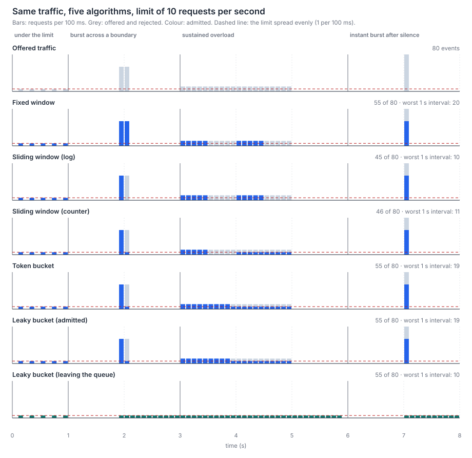

# Rate limiter algorithms (MP-RL-1)

> Versão em português: [docs/pt/rate-limiting/rate-limiter.md](../../pt/rate-limiting/rate-limiter.md)

Mini-project: [`projects/rate-limiting/rate-limiter`](../../../projects/rate-limiting/rate-limiter/README.md). Quiz topics: `fixed-window`, `sliding-window`, `token-bucket`, `leaky-bucket`, `redis-distributed`, `http-429-and-backoff`.

## The question

A limit such as "10 requests per second" does not say what happens when 20 requests arrive within 200 ms. Each algorithm answers differently, and the answer is what you are really choosing.

| Algorithm | State per client | How it decides | What it does with a burst |
| --- | --- | --- | --- |
| Fixed window | A window number and a counter | Admit while the counter of the current aligned window is below the limit | Lets up to twice the limit through around a boundary |
| Sliding log | One timestamp per admitted request | Admit while fewer than `limit` timestamps lie in (t − W, t] | Never more than the limit in any interval of length W |
| Sliding counter | Two counters | Admit while `previous × (1 − elapsed / W) + current` is below the limit | Close to the limit, with a small error |
| Token bucket | A balance and a timestamp | Admit when a token is available; tokens return at a steady rate, capped at the capacity | Passes a burst of the capacity at once, then the refill rate |
| Leaky bucket (queue) | A level and a timestamp | Admit while the bucket has room; admitted requests leave at a constant rate | Absorbs the burst and releases an even stream |

## The burst experiment

All five receive the same 80 requests in four phases, with the same configuration (limit 10, window 1000 ms, so capacity 10 and rate 10 per second for the buckets).



The table with the numbers is in the [README](../../../projects/rate-limiting/rate-limiter/README.md#results) and in `results/burst.md`. How to read it:

- **Under the limit (0 to 1 s).** Five requests in one second. Everybody admits everything: the algorithms only differ when the limit is reached.
- **Burst across a boundary (1.9 to 2.1 s).** Ten requests at the end of the window [1 s, 2 s) and ten at the start of [2 s, 3 s). The fixed window sees two windows with ten requests each and admits all 20. The sliding log admits 10. The sliding counter admits 11: at t = 2.01 s the previous window weighs 0.99 × 10 = 9.9, which is below 10, although the real last second holds 10 requests. The two buckets admit 11: ten saved tokens plus the one earned during the burst.
- **Sustained overload (3 to 5 s).** Twenty requests per second. The fixed window and the sliding log admit the first ten of each second and then nothing until the next one: the client sees half a second of success and half a second of refusals. The token bucket spends its ten saved tokens first and then admits one request every 100 ms. That is why it totals 29 in this phase: capacity + rate × time = 10 + 10 × 1.95 = 29.5 tokens between the first request (3.00 s) and the last (4.95 s), so 29 whole requests.
- **Instant burst after silence (7 s).** Fifteen requests in the same millisecond. Every algorithm admits ten. Only the last panel differs: the leaky bucket hands those ten to the system behind it one every 100 ms.

The column "worst 1 s interval" slides a one-second interval over the admitted requests and keeps the largest count. Fixed window: 20. Sliding log: 10. Sliding counter: 11. Token bucket: 19. Leaky bucket output: 10.

### Choosing

- A fixed window is enough when the limit is a rough guard and a double burst is harmless. It is also the cheapest on Redis: one `INCR`.
- A sliding log is for limits that must hold exactly and are small (login attempts, password resets), because it stores every admitted request.
- A sliding counter is the usual compromise for large limits.
- A token bucket fits APIs: clients are bursty by nature, and the capacity states how much burst is tolerated.
- A leaky bucket as a queue fits a system behind it with a strict constant capacity. It trades rejections for delay.

The token bucket and the leaky bucket of the same size admit exactly the same requests: a full token bucket and an empty leaky bucket are mirror images. The difference is what happens after admission.

## Deterministic tests

Every limiter takes the clock as an argument: `allow(nowMs)`. A test says "a request arrives at t = 999 ms" and gets the same answer on every run, with no sleeping. The table in `cases/cases.json` has three timelines per algorithm, each chosen to pin one edge: the boundary of a fixed window, a log entry that expires exactly one window later, the weight of the previous window in the counter, the cap of the token bucket, the departure times of the leaky bucket.

Times are whole milliseconds and the buckets use integer "credits" (one token is worth `windowMs` credits, each millisecond earns `limit` credits), so there is no floating-point rounding and the TypeScript and Go versions agree exactly. The Go tests read the same table, and also compare the Go experiment with the numbers written by TypeScript.

## What changes in Go

JavaScript runs one callback at a time, so `count += 1` cannot be interrupted. In Go, many goroutines call `Allow` at once, and "read the counter, compare, write" becomes a race. Each Go limiter holds a `sync.Mutex`, and a test fires 64 goroutines at one limiter under `go test -race`: exactly the limit is admitted.

It is the same bug as the next section, at a smaller scale: two threads of one process instead of two machines.

## The distributed version

Behind a load balancer, a limiter kept in the memory of each instance lets N instances admit N times the limit. The state moves to Redis, shared by all instances.

The obvious code is wrong:

```
instance A: GET rate:alice   -> 49
instance B: GET rate:alice   -> 49      (A has not written yet)
instance A: 49 < 50, INCR    -> 50
instance B: 49 < 50, INCR    -> 51      <- one more than the limit
```

Each Redis command is atomic, but the sequence is not. The fix is to run the whole decision inside Redis as one Lua script (`lua/fixed-window.lua`): Redis executes a script from start to end without letting any other command in between. The script also sets the expiry in the same step as the first increment, so a client that crashes cannot leave a counter that never expires.

Details that the code shows:

- **Short scripts.** While a script runs, every other client waits. The scripts here are a handful of O(1) commands.
- **`EVALSHA` and `NOSCRIPT`.** The script is loaded once and called by its SHA1. The script cache is volatile: after a restart Redis answers `NOSCRIPT`, and the client loads the script again and retries.
- **`KEYS` and `ARGV`.** The key comes in `KEYS[1]` and the numbers in `ARGV`, so Redis Cluster can route the script by key.
- **The Redis clock.** The token bucket script reads `TIME` on the server. Two instances with slightly different clocks would otherwise disagree about how many tokens were earned.
- **`429` and `Retry-After`.** A refused request gets `429 Too Many Requests` with `Retry-After` in whole seconds, rounded up, and `Cache-Control: no-store`.

The test starts two instances and sends 400 concurrent requests, alternating between them, for a limit of 50 per minute. With the script, exactly 50 are admitted in each of five rounds. With the naive version, up to 192 were admitted in the measured rounds, and exactly 50 in a few of them: a race depends on timing, which is what makes it hard to catch. The test repeats the naive round until one exceeds the limit.

What the lab does not cover: Redis replication is asynchronous, so after a failover a few increments may be lost and the limit briefly exceeded; and the application must decide what to do when Redis is unreachable (admit everything or refuse everything). Both are discussed in the quiz topic `redis-distributed`.

## Lab rules

Redis (`redis:8.10.2-alpine`) and the two instances talk on an internal docker-compose network. No port is published and no container reaches the internet. The concurrent test takes its targets from `TARGETS`, which defaults to the two compose services, and throws before sending anything when a host is not `localhost`, `127.0.0.1`, `limiter-a` or `limiter-b`.

## Acceptance criteria

| Item | How it is verified |
| --- | --- |
| MP-RL-1.1 fixed window, sliding window, token bucket and leaky bucket in memory, each passing a table-driven test of allowed and rejected requests over time | `docker compose run --rm ts-test` and `docker compose run --rm go-test`: both read `cases/cases.json` (15 timelines, 3 per algorithm; the sliding window has two variants, log and counter) |
| MP-RL-1.2 two instances together never allow more than the limit under concurrent load | `docker compose run --rm distributed-test`: exactly 50 of 400 concurrent requests admitted, five rounds, and the naive version exceeds the limit |
| MP-RL-1.3 chart of accepted requests over time for the algorithms with the same traffic | `./experiment-unix.sh` (or `.ps1`) writes `results/burst.svg` and `results/burst.pt-BR.svg` from `results/burst.json`; a test fails when the committed results are out of date |

## Run

```sh
cd projects/rate-limiting/rate-limiter
./setup-unix-rate-limiter.sh        # or .\setup-windows-rate-limiter.ps1
./experiment-unix.sh                # or .\experiment-windows.ps1
```

## Sources

- Tanenbaum and Wetherall, Computer Networks, 5th edition, chapter 5: traffic shaping, leaky bucket and token bucket.
- Redis documentation: the `INCR` command (rate limiter pattern), scripting with Lua (`EVAL`, `EVALSHA`, script cache).
- RFC 6585, section 4 (429 Too Many Requests) and RFC 9110, section 10.2.3 (`Retry-After`).
