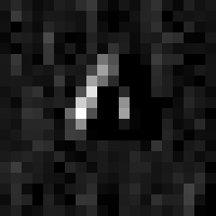

# Visión por computador con una CNN

> English version: [docs/en/artificial-intelligence/computer-vision-cnn.md](../../en/artificial-intelligence/computer-vision-cnn.md) · Versão em português: [docs/pt/artificial-intelligence/computer-vision-cnn.md](../../pt/artificial-intelligence/computer-vision-cnn.md)

Miniproyecto MP-AI-8, en [`projects/artificial-intelligence/computer-vision-cnn`](../../../projects/artificial-intelligence/computer-vision-cnn). Enseña cómo ve una red: imágenes como números, convolución, pooling y filtros aprendidos. La base está en la sección 16 de [la página del área](README.md#16-visión-por-computador). El framework es PyTorch, presentado en la [sección 14](README.md#14-qué-te-da-un-framework-pytorch), ejecutándose en la CPU.

## El problema

Un programa que reconoce un triángulo no se puede escribir como una lista de reglas, porque el triángulo puede ser más grande, más delgado, estar un poco a la izquierda o ligeramente girado. Queremos una red que lo aprenda a partir de ejemplos. La primera idea, conectar cada píxel con cada neurona, funciona solo mientras la forma se queda donde estaba durante el entrenamiento. Este miniproyecto muestra por qué, y qué hace distinto la red convolucional.

## Una imagen es una tabla de números

Cada imagen aquí es una imagen en escala de grises de 20 x 20: 400 números de 0 (negro) a 1 (blanco). El proyecto las dibuja él mismo, a partir de la geometría de cuatro formas (círculo, cuadrado, triángulo, cruz), con un tamaño, un grosor de línea y un brillo aleatorios, una posición que varía 1 píxel, y ruido. No se descarga nada, y la misma semilla siempre da las mismas imágenes.

PyTorch quiere las imágenes en lotes, como un tensor de cuatro dimensiones: imágenes x canales x alto x ancho. Las 1200 imágenes de entrenamiento son un tensor de forma `1200 x 1 x 20 x 20`. La dimensión de canales es 1 porque la imagen está en escala de grises. Una imagen a color tendría 3.

## Convolución a mano

Un filtro es una tabla pequeña de pesos. La convolución lo coloca sobre un fragmento de la imagen, multiplica cada peso por el píxel que tiene debajo, suma los productos, escribe la suma y avanza. `python/conv.py` hace exactamente eso con cuatro bucles: dos eligen la posición y dos recorren el filtro.

Un caso pequeño que se puede comprobar en papel. La imagen tiene 6 columnas, oscura a la izquierda y brillante a la derecha, y el filtro es el filtro Sobel para bordes verticales:

```text
one row of the image        Sobel x
 0  0  0  1  1  1          -1  0  1
 (all 6 rows are equal)    -2  0  2
                           -1  0  1

filter over columns 0-2:  all zeros                          ->  0
filter over columns 1-3:  right column is 1: 1 + 2 + 1       ->  4
filter over columns 2-4:  right column is 1: 1 + 2 + 1       ->  4
filter over columns 3-5:  left -1 -2 -1, right 1 + 2 + 1     ->  0
```

La fila de salida es `0 4 4 0`: un número grande donde cambia el brillo y cero donde la imagen es plana. Eso es un detector de bordes, y es una de las pruebas.

Dos detalles que el código deja explícitos:

- **El filtro no se invierte.** Las matemáticas llaman a esta operación correlación cruzada y reservan la palabra convolución para la versión con el filtro dado vuelta. Las bibliotecas de deep learning usan la que no invierte y la llaman convolución. Como los pesos se aprenden, invertir no cambiaría nada.
- **Tamaño de la salida.** Con una imagen de lado W, un filtro de lado F, padding P (ceros añadidos en cada borde) y stride S (el salto entre posiciones), la salida tiene lado `(W - F + 2P) / S + 1`, redondeado hacia abajo.

La demo ejecuta la versión escrita a mano y `torch.nn.functional.conv2d` sobre la misma imagen y las compara:

| Stride | Padding | (W - F + 2P) / S + 1 | Framework output | Same numbers |
| ---: | ---: | ---: | ---: | :---: |
| 1 | 0 | 18 x 18 | 18 x 18 | yes |
| 1 | 1 | 20 x 20 | 20 x 20 | yes |
| 2 | 0 | 9 x 9 | 9 x 9 | yes |
| 2 | 1 | 10 x 10 | 10 x 10 | yes |
| 3 | 2 | 8 x 8 | 8 x 8 | yes |

| Input | Sobel x (vertical edges) | Sobel y (horizontal edges) |
| :---: | :---: | :---: |
|  |  |  |

El gris es 0, el blanco es "de oscuro a brillante" y el negro es "de brillante a oscuro". Sobel x ve solo los lados verticales del cuadrado, Sobel y solo los horizontales.

## Las dos redes

**La CNN** repite convolución, ReLU y max pooling dos veces, luego promedia cada mapa y decide:

```text
1 x 20 x 20  -> conv 3x3, 8 filters  -> 8 x 20 x 20  -> max pool 2x2 -> 8 x 10 x 10
             -> conv 3x3, 24 filters -> 24 x 10 x 10 -> max pool 2x2 -> 24 x 5 x 5
             -> average of each map  -> 24 numbers   -> linear       -> 4 scores
```

- **Pesos compartidos.** La primera capa tiene 8 filtros de 3 x 3 pesos más 8 sesgos (biases): 8 x 9 + 8 = 80 parámetros, sea cual sea el tamaño de la imagen. Los mismos 9 pesos se usan en las 400 posiciones, así que un patrón aprendido en un lugar se encuentra en todas partes.
- **Max pooling** guarda el mayor valor de cada bloque de 2 x 2. `[[1, 3], [2, 0]]` se convierte en `3`. Divide cada lado entre dos, no tiene parámetros, y un patrón que se mueve 1 píxel muchas veces se queda dentro del mismo bloque.
- **Global average pooling** convierte cada uno de los 24 mapas finales en un número, su media. Ese número dice cuánto de un patrón hay en la imagen, y ya no dónde.

Parámetros: 80 + (24 x 3 x 3 x 8 + 24) + (24 x 4 + 4) = 80 + 1752 + 100 = **1932**.

**La red totalmente conectada (MLP)** conecta los 400 píxeles con 5 neuronas ocultas y estas con las 4 puntuaciones: (400 x 5 + 5) + (5 x 4 + 4) = 2005 + 24 = **2029** parámetros, 5.0% más que la CNN. Cada uno de sus pesos pertenece a una posición de píxel.

Ambas se entrenan de la misma manera: 20 épocas, mini-batches de 32 imágenes cortados a mano de un orden barajado, el optimizador Adam, pérdida de entropía cruzada, y los cinco pasos de todo bucle de PyTorch (predecir, calcular la pérdida, `zero_grad`, `backward`, `step`).

## Resultado 1: cuando la forma se mueve

Ambas redes se entrenan con 1200 formas centradas y se miden con 800 imágenes generadas con otra semilla, primero centradas como en el entrenamiento, y luego con cada forma movida de 2 a 4 píxeles en cada eje.

| Model | Parameters | Held-out, centred | Held-out, shifted |
| --- | ---: | ---: | ---: |
| CNN | 1932 | 99.9% | 93.3% |
| Fully connected (MLP) | 2029 | 99.9% | 5.1% |

En las imágenes centradas no hay diferencia: con este dataset fácil, ambas son casi perfectas. En las imágenes desplazadas la red totalmente conectada cae a 5.1%. Una suposición al azar entre 4 clases acertaría 25%, así que no está adivinando: se equivoca de forma sistemática. Lo que aprendió es "estos píxeles son brillantes para una cruz", y una forma movida enciende píxeles que significaban otra cosa.

La CNN mantiene 93.3% porque sus filtros encuentran las mismas esquinas y extremos de línea estén donde estén, y el promedio del final descarta la posición. Es honesto decir lo que esto no muestra:

- La CNN no es perfectamente invariante al desplazamiento. Pierde 6.6 puntos. Los ceros del padding en el borde y la cuadrícula fija de 2 x 2 del pooling hacen que una forma movida produzca números ligeramente distintos.
- La convolución sola no basta. Durante el desarrollo, una variante que aplanaba los 24 x 5 x 5 valores en la capa lineal (un peso por posición, la disposición clásica) cayó a cerca de 8% en el conjunto desplazado, como la MLP. El promedio global es lo que convierte "la respuesta se mueve con la forma" en "la respuesta no cambia". Esa variante no está en el código ni en los resultados confirmados.

## Resultado 2: aumento de datos

Un triángulo movido unos píxeles o girado 20 grados sigue siendo un triángulo. El aumento de datos (data augmentation) aplica esos cambios aleatorios a cada lote de entrenamiento, así que la red nunca ve la misma imagen dos veces y aprende a ignorarlos. Aquí cada imagen de entrenamiento recibe un desplazamiento aleatorio de hasta 4 píxeles y una rotación aleatoria de hasta 30 grados. Las imágenes reservadas nunca se aumentan. La CNN se entrena de nuevo desde los mismos pesos iniciales, así que el aumento es la única diferencia:

| Training of the CNN | Centred | Shifted | Rotated |
| --- | ---: | ---: | ---: |
| without augmentation | 99.9% | 93.3% | 62.5% |
| with augmentation | 97.5% | 94.9% | 84.9% |

La rotación es donde importa: una convolución no tiene tolerancia incorporada a ella, y la red entrenada solo con formas derechas obtiene 62.5% con formas giradas de 10 a 30 grados. Con aumento llega a 84.9%. La ganancia en imágenes desplazadas es pequeña (1.6 puntos), porque la arquitectura ya manejaba los desplazamientos. Y hay un precio: en imágenes centradas la exactitud baja de 99.9% a 97.5%. La tarea se volvió más difícil y la red y las 20 épocas siguieron siendo las mismas, como muestra la pérdida:

| Model | Epoch 1 | Epoch 5 | Epoch 10 | Epoch 15 | Epoch 20 |
| --- | ---: | ---: | ---: | ---: | ---: |
| CNN | 1.358 | 0.706 | 0.140 | 0.036 | 0.016 |
| Fully connected (MLP) | 0.855 | 0.020 | 0.005 | 0.002 | 0.001 |
| CNN + augmentation | 1.372 | 1.040 | 0.584 | 0.379 | 0.296 |


La red totalmente conectada tiene la pérdida de entrenamiento más baja de todas, y el peor resultado en imágenes desplazadas. Una pérdida de entrenamiento baja dice que la red se ajusta a las imágenes que vio, no que aprendió la idea correcta.

## Lo que aprendió la red

Nadie le dio a la CNN el filtro Sobel. Estos son los 8 filtros de su primera capa tras el entrenamiento (sin aumento de datos), cada uno ampliado. El gris es un peso de 0, el blanco un peso positivo, el negro uno negativo:


Esta es una imagen de prueba y los 8 mapas de activación (mapas de características) que produce, en el mismo orden que los filtros. Un píxel brillante significa "este filtro encontró aquí su patrón":


El mapa con la respuesta más fuerte, del filtro 3:



El filtro 3 es oscuro a la izquierda y brillante a la derecha, y su mapa se enciende en el lado izquierdo del triángulo: funciona como detector de bordes. Los filtros 6 y 8 son casi todos positivos, y sus mapas son una copia borrosa de la forma: miden brillo. Con 8 filtros diminutos y 1200 imágenes simples, los filtros son más ruidosos que los detectores de bordes limpios que se muestran en los libros de texto, que salen de redes grandes entrenadas con millones de fotografías.

## Qué añade un sistema de visión real

- **Redes más grandes y más profundas.** ResNet apila decenas o cientos de capas, que se vuelven entrenables gracias a las conexiones de atajo (shortcut). Esta CNN tiene 1932 parámetros, una ResNet-50 tiene cerca de 25 millones.
- **Transfer learning.** En lugar de entrenar desde cero, se reutiliza una red ya entrenada con millones de imágenes, y se entrena solo su última capa, o toda con una tasa de aprendizaje pequeña.
- **Otras tareas.** La detección da una caja y una etiqueta para cada objeto, y la segmentación da una etiqueta para cada píxel. Aquí hay una etiqueta por imagen.
- **Datos reales.** Fotografías a color, luz variada, fondos desordenados, y muchos más aumentos de datos (espejado, recorte, cambios de color).
- **GPUs y cargadores de datos.** Los lotes se cargan y se aumentan en paralelo, y el entrenamiento corre en una GPU. Aquí todo cabe en memoria y corre en la CPU en segundos.

Nada de esto está implementado aquí. Las piezas son las mismas: filtros que se deslizan, pooling, y una pérdida que el entrenamiento reduce.

## Ejecútalo

```sh
cd projects/artificial-intelligence/computer-vision-cnn
./setup-unix-computer-vision-cnn.sh        # or ./setup-windows-computer-vision-cnn.ps1
docker compose run --rm python-test        # only the tests
docker compose run --rm python-demo        # trains the networks and rewrites results/
```

El único requisito es Docker. Los contenedores no tienen acceso a la red, y las semillas, los 2 hilos y los algoritmos deterministas de PyTorch están fijados, así que la demo escribe los mismos números en cada ejecución sobre la misma imagen.
