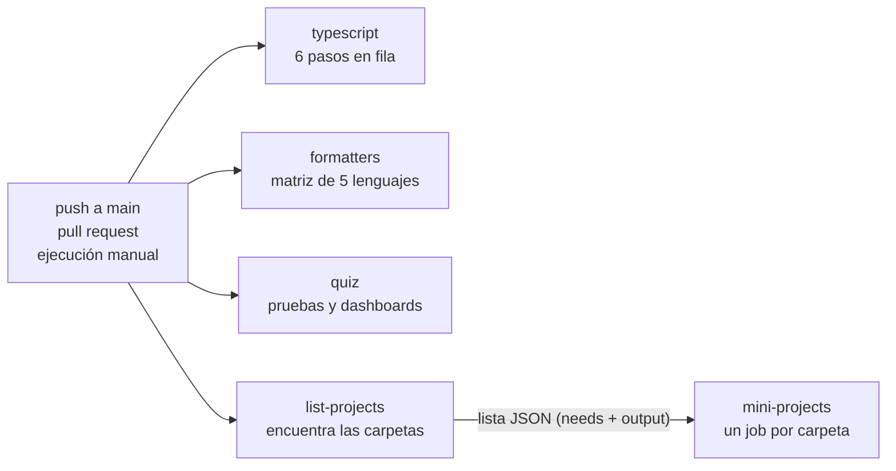

# El pipeline de CI como lección (MP-CI-1)

> English version: [docs/en/continuous-integration/ci-pipeline.md](../../en/continuous-integration/ci-pipeline.md) · Versão em português: [docs/pt/continuous-integration/ci-pipeline.md](../../pt/continuous-integration/ci-pipeline.md)

Mini-proyecto: [`projects/continuous-integration/ci-pipeline`](../../../projects/continuous-integration/ci-pipeline/README.es.md). Temas del quiz: `ci-cd-concepts`, `workflows-events-jobs-steps`, `runners-matrix`, `caching-artifacts`, `secrets-environments-permissions`, `quality-gates`, `supply-chain-security`.

## El concepto

**Integración continua (CI)** significa que cada cambio se integra con frecuencia a una única línea compartida de código, y que una máquina verifica cada cambio antes de que las personas dependan de él. Las verificaciones son siempre las mismas, corren en una máquina limpia, y nadie tiene que acordarse de ejecutarlas.

Una **puerta de calidad** es una de esas verificaciones vista como una puerta: el cambio pasa solo si la verificación pasa. Una buena puerta tiene tres propiedades:

- Es **automática**. Su respuesta es un código de salida, 0 para "pasó" y cualquier otro valor para "falló". Ninguna persona decide.
- Es **específica**. Detecta un tipo de error y dice en qué archivo y línea.
- Es **reproducible**. El mismo comando da la misma respuesta en un portátil y en CI.

Este repositorio tiene 14 puertas de esas en un archivo, [`.github/workflows/ci.yml`](../../../.github/workflows/ci.yml). Esta página lee ese archivo de arriba abajo.

## Las palabras de GitHub Actions

| Palabra | Significado | En `ci.yml` |
| --- | --- | --- |
| Workflow | un archivo YAML en `.github/workflows/` que describe una automatización | `name: CI` |
| Evento | lo que lanza el workflow | `on:` |
| Job | un grupo de pasos que corre en una máquina | `typescript`, `formatters`, `quiz`, `list-projects`, `mini-projects` |
| Runner | la máquina que ejecuta un job, creada nueva y descartada al final | `runs-on: ubuntu-24.04` |
| Step (paso) | un comando (`run:`) o una action reutilizable (`uses:`) | `- run: bun run typecheck` |
| Matriz | una definición de job expandida en varios jobs | `strategy.matrix` |

Los jobs corren en paralelo, salvo que uno declare `needs:`. Los pasos de un job corren uno después del otro, y el job se detiene en el primer paso que falla.

## La cabecera del archivo

```yaml
on:
  push:
    branches: [main]
  pull_request:
  workflow_dispatch:
```

Tres eventos. Un push a `main` verifica lo que se integró. Un pull request verifica un cambio antes de integrarlo. `workflow_dispatch` agrega un botón "Run workflow", y el comando `gh workflow run CI`. Un push a cualquier otra rama no lanza nada: por eso las ramas de demostración de esta lección necesitan una ejecución manual.

```yaml
permissions:
  contents: read
```

Cada ejecución recibe un token temporal, `GITHUB_TOKEN`. Por defecto puede tener permiso de escritura en el repositorio. Este workflow solo lee código, así que pide acceso de lectura y nada más. Es el principio de mínimo privilegio: si un paso llega a estar comprometido (por una dependencia maliciosa, por ejemplo), el token que encuentra no puede enviar código ni publicar una release.

```yaml
concurrency:
  group: ci-${{ github.event_name }}-${{ github.ref }}
  cancel-in-progress: true
```

Dos ejecuciones del mismo grupo no corren juntas: la más nueva cancela a la más antigua. El grupo es "evento más rama", así que dos pushes seguidos al mismo pull request detienen la ejecución del commit que ya no le interesa a nadie. El evento está en el nombre a propósito: un push a `main` no cancela una ejecución manual completa de `main`.

## Los jobs



### `typescript`

Preparación: `actions/checkout@v5` copia el repositorio al runner, `oven-sh/setup-bun@v2` instala Bun 1.4.2, y `bun install --frozen-lockfile` instala las dependencias. `--frozen-lockfile` hace que la instalación falle cuando `package.json` y `bun.lock` no coinciden, en vez de resolver versiones nuevas en silencio: CI prueba exactamente lo que dice el lockfile.

| Paso | Comando | Por qué existe | Cómo se ve un fallo |
| --- | --- | --- | --- |
| Format and lint (Biome) | `bunx biome ci .` | un solo estilo para todos, para que un diff muestre solo lo que cambió de significado | `archivo.ts format` seguido de un diff de las líneas |
| Markdown lint (markdownlint) | `bun run lint:md` | la documentación es la mitad de este repositorio, y la prosa también tiene reglas | `archivo.md:7 error MD040/fenced-code-language Fenced code blocks should have a language specified` |
| Type check | `bun run typecheck` | un tipo equivocado se encuentra sin ejecutar el código | `archivo.ts(8,2): error TS2322: Type 'string' is not assignable to type 'number'.` |
| Unit tests | `bun test quiz/tests/unit tools` | el código bien tipado igual puede calcular algo incorrecto | `(fail) nombre de la prueba`, con el valor esperado y el recibido |
| Quiz content validation | `bun run quiz:validate` | el quiz es un dato, y los datos también tienen reglas | `error: big-o/archivo.json id: en.alternatives: must have exactly 5 items` |
| Documentation index is up to date | `bun run docs:index --check` | un archivo generado debe coincidir con lo que lo genera | `docs/en/README.md is out of date: run "bun run docs:index"` |

El segundo paso verifica todo archivo Markdown con markdownlint, en la versión fijada en `package.json`, con las reglas de `.markdownlint-cli2.jsonc`. Ese archivo apaga algunas reglas y dice por qué junto a cada una. `bun run format:md` corrige lo que se puede corregir automáticamente.

El orden va de lo barato a lo caro. El formato tarda un segundo y es lo que más falla, así que va primero, y un job que falla temprano da su respuesta temprano.

El último paso muestra un patrón que conviene conocer. `docs/en/README.md` lo escribe un script a partir del contenido del repositorio. La comprobación ejecuta el script en memoria y compara el resultado con el archivo versionado. A quien cambia el contenido y olvida regenerar la página, CI se lo avisa, con el comando que lo arregla.

### `formatters`

```yaml
strategy:
  fail-fast: false
  matrix:
    include:
      - lang: python
        check: ruff check . && ruff format --check .
      - lang: go
        check: test -z "$(gofmt -l projects benchmarks 2>/dev/null)"
```

Una **matriz** convierte una definición de job en varios jobs, uno por cada entrada de `include`. Aquí cada entrada trae dos valores: el lenguaje y el comando que lo verifica. Los pasos son iguales para los cinco: construir la imagen fijada del lenguaje desde `docker/<lang>.Dockerfile` y luego ejecutar el comando dentro de ella, con el repositorio montado.

`fail-fast: false` importa. Por defecto, cuando un job de una matriz falla, GitHub cancela a los demás. Con eso desactivado los cinco lenguajes siempre terminan, y una ejecución cuenta todo lo que está mal.

El comando llega al contenedor con cuidado:

```yaml
env:
  CHECK: ${{ matrix.check }}
run: docker run --rm -v "$PWD:/app" -w /app sef-${{ matrix.lang }}:local sh -c "$CHECK"
```

`${{ ... }}` lo reemplaza GitHub **antes** de que el shell lea la línea. Un comando pegado directo en el script traería sus propias comillas, cerraría el argumento entre comillas antes de tiempo, y parte de él correría en el runner y no en el contenedor. Pasado por una variable de entorno, el texto llega entero. La misma regla protege contra la inyección de scripts cuando el valor viene de afuera, como el título de un pull request: nunca pegues `${{ }}` en un script, pásalo por `env`.

Los formateadores corren en modo de comprobación (`--check`, `--dry-run`, `-l`): no cambian nada, solo informan. El fallo se ve distinto en cada herramienta. ruff imprime `1 file would be reformatted`, rustfmt imprime `Diff in archivo.rs`, clang-format imprime `error: code should be clang-formatted`, mix imprime `The following files are not formatted`. La comprobación de Go no imprime nada, porque `test -z` solo fija el código de salida. Un fallo silencioso es una debilidad que vale la pena notar: quien lo ve tiene que ejecutar `gofmt -l projects benchmarks` de nuevo para saber el nombre del archivo.

### `quiz`

El primer paso es una línea, `./quiz/setup-unix-quiz.sh test`, y esa línea es la lección: CI llama al mismo script que llama un contribuidor. El script construye el quiz como sitio estático a partir de un fixture pequeño, ejecuta las pruebas unitarias, levanta el sitio en un contenedor y ejecuta las pruebas de Playwright contra él en otro. Un fallo es un informe de Playwright: el nombre de la prueba, la línea que esperaba algo, y `1 failed`.

El segundo paso abre cada dashboard versionado (`projects/*/*/dashboard/index.html`) directo desde el disco en un navegador real, en un contenedor iniciado con `--network none`. Una página falla cuando registra un error, no renderiza texto o pide algo que no sea un archivo local. Una página que funciona sin ninguna red prueba que no necesita CDN ni servidor, que es la promesa que hacen los dashboards. Un fallo se lee como `FAIL ruta/index.html` y `network request: https://...`.

### `list-projects` y `mini-projects`

Estos dos jobs son una idea en dos partes. La lista de mini-proyectos no está escrita en el workflow. Se calcula:

```yaml
list-projects:
  outputs:
    projects: ${{ steps.list.outputs.projects }}
  steps:
    - id: list
      run: |
        projects=$(for dir in projects/*/*/; do ... done | jq -R . | jq -sc .)
        echo "projects=${projects:-[]}" >> "$GITHUB_OUTPUT"
```

Un paso publica un valor escribiendo `nombre=valor` en el archivo `$GITHUB_OUTPUT`. El job lo expone en `outputs`. El job siguiente declara `needs: list-projects`, lo que a la vez lo hace esperar y le deja leer el valor:

```yaml
mini-projects:
  needs: list-projects
  if: needs.list-projects.outputs.projects != '[]'
  timeout-minutes: 45
  strategy:
    fail-fast: false
    matrix:
      project: ${{ fromJson(needs.list-projects.outputs.projects) }}
```

`fromJson` convierte el texto `["projects/a/b","projects/c/d"]` en una lista, y la matriz pasa a ser un job por carpeta. Esto es una **matriz dinámica**. El `if` salta el job cuando la lista está vacía, porque una matriz sin entradas es un error. `timeout-minutes` detiene un job que se colgó, en vez del límite por defecto de seis horas.

Cada job ejecuta tres líneas: armar el nombre del script a partir de la carpeta, darle `chmod +x` (un archivo versionado desde Windows puede no tener el bit de ejecución) y ejecutarlo. Un fallo es lo que impriman las pruebas de ese mini-proyecto, y el job lleva el nombre de la carpeta, así que la línea roja de la lista dice dónde mirar.

## Las decisiones de diseño

**Cada mini-proyecto en cada ejecución.** Probar solo las carpetas que cambiaron es más rápido y deja pasar roturas reales. Un mini-proyecto depende de archivos fuera de su carpeta: las imágenes base en `docker/`, el workflow, el contenido del quiz al que apunta. Cambiar uno de ellos puede romper una carpeta que nadie tocó, y un pipeline que prueba solo carpetas cambiadas seguiría en verde. El precio es tiempo de máquina, pagado en cada ejecución.

**Versiones fijadas en todas partes.** El runner es `ubuntu-24.04`, no `ubuntu-latest`. Las actions tienen versión (`actions/checkout@v5`), Bun tiene versión (`1.4.2`), y cada imagen Docker tiene una etiqueta fija. Un pipeline que flota puede ponerse en rojo un día en que nadie cambió nada, y entonces la pregunta "¿qué lo rompió?" no tiene respuesta en el repositorio. Una nota honesta: `@v5` es una etiqueta, y el dueño de una action puede mover una etiqueta. Fijar al hash completo del commit es más estricto, y es lo que hace un proyecto con riesgo alto en su cadena de suministro.

**Sin caché.** El workflow no guarda nada entre ejecuciones. Cada ejecución instala las dependencias y construye las imágenes otra vez. Es más lento, y es simple: no hay caché vieja que explique un fallo raro, ni caché que un pull request pueda envenenar. Si el tiempo de ejecución se vuelve un problema, los primeros candidatos son la caché de instalación de Bun y las capas de Docker. Sería un intercambio, no una ganancia gratis.

**Todo en Docker, llamado por scripts.** Casi cada puerta es un comando que una persona ejecuta en local con el mismo resultado, porque las herramientas y sus versiones viven en imágenes y no en el runner. Cuando CI está en rojo, el primer paso es ejecutar ese comando en tu máquina.

**El menor permiso que funciona.** Visto arriba: `contents: read`.

## La demo

El mini-proyecto convierte cada puerta en un experimento con dos ejecuciones:

1. Un contenedor hace una copia limpia de los archivos que la puerta necesita y ejecuta el comando de la puerta. Debe pasar.
2. Aplica un cambio preparado, el más pequeño que rompe esa puerta, y ejecuta el mismo comando. Debe fallar, con el mensaje que vería un contribuidor.

Algunos detalles merecen leerse en el código:

- **El comando se lee de `ci.yml`.** `demo/run-gates.sh` extrae la línea `run:` del paso por su nombre, así que la demo ejecuta lo que ejecuta CI.
- **Los cambios terminan en `.fixture`.** Un `bad_format.go` mal formateado guardado en el repositorio haría fallar el job `formatters` de verdad. Como `bad_format.go.fixture` ninguna herramienta lo ve, y aplicar el cambio lo copia a su lugar sin el sufijo.
- **Cada cambio se llama `ci-demo`.** La copia limpia deja esos archivos fuera. En una rama de demostración la lección sigue partiendo limpia, así que la rama falla en una puerta y el job de este mini-proyecto sigue en verde.
- **El repositorio se monta de solo lectura.** Los contenedores no pueden cambiarlo, y cada uno trabaja sobre una copia.
- **Dos comprobaciones vigilan la propia lección.** `workflow-sync` falla cuando `ci.yml` gana un job, un paso con nombre o un formateador sin demostración. `isolation` falla cuando un cambio rompe una puerta para la que no fue escrito.

## Las ramas de demostración

`demo-branches.sh` (y `demo-branches.ps1`) aplica cada cambio a una rama `demo/ci-fails-<gate>` creada desde `main` en un clon temporal, la envía y lanza en ella una ejecución manual de CI. Por defecto hace una simulación que no envía nada. El script se niega a trabajar contra cualquier remoto que no sea este repositorio, y nunca cambia el árbol de trabajo desde donde se lanza.

Lo que deberías ver en la lista de jobs de cada ejecución: un job en rojo, con el nombre de la puerta, y todo lo demás en verde. En `formatters` y `mini-projects`, el job en rojo es una entrada de la matriz y sus hermanos quedan en verde, que es `fail-fast: false` en acción.

## Límites

- Las ramas se enviaron el 2026-10-10, y la tabla del README enlaza la ejecución fallida de cada puerta.
- Tres puertas se muestran sobre un fixture reducido, porque las reales levantan Docker y un contenedor de la demo no tiene Docker dentro: las pruebas de punta a punta del quiz (un sitio de una página en lugar del quiz), los dashboards (una página de ejemplo en lugar de todas) y las pruebas de los mini-proyectos (un mini-proyecto de ejemplo que solo necesita un shell).
- Las puertas de `typescript` ejecutan los comandos reales sobre `quiz/`, `tools/` y `benchmarks/` con el contenido pequeño de las pruebas del quiz, y las puertas de formato comprueban archivos de ejemplo. La demo prueba que cada puerta detecta su error. Solo el pipeline de verdad prueba que todo el repositorio está limpio.

## Pruébalo

1. Ejecuta `./setup-unix-ci-pipeline.sh demo biome` y lee el diff que imprime Biome. ¿Qué tres cosas cambiaría?
2. Abre `demo/unit-tests/change/` y corrige la función para que la prueba pase. ¿Por qué el verificador de tipos no detectó el bug?
3. En `ci.yml`, ¿qué pasaría con un pull request que solo edita un README si `mini-projects` probara solo las carpetas cambiadas? ¿Y con uno que cambia `docker/python.Dockerfile`?
4. La comprobación de Go falla en silencio. Escribe una versión de ese comando que imprima los nombres de los archivos y aun así falle.
