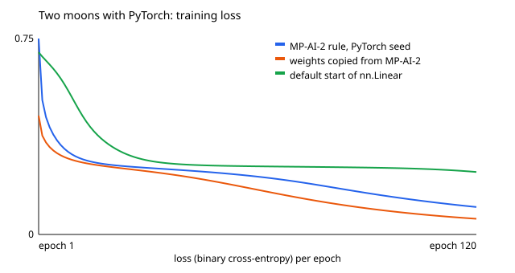

# Fundamentos de PyTorch

> English version: [docs/en/artificial-intelligence/pytorch-basics.md](../../en/artificial-intelligence/pytorch-basics.md)

Mini-projeto MP-AI-6, em [`projects/artificial-intelligence/pytorch-basics`](../../../projects/artificial-intelligence/pytorch-basics). Ensina o que um framework de aprendizado profundo faz por você, refazendo o [neural-network-from-scratch](neural-network-from-scratch.md) (MP-AI-2) com PyTorch. A base está na seção [14](README.md#14-o-que-um-framework-oferece-pytorch) da página da área.

## O plano

O MP-AI-2 escreveu três coisas à mão: um número que lembra como foi calculado (`Value`), uma rede feita desses números e um laço de treinamento. Um framework traz a primeira pronta, dá blocos de montar para a segunda e deixa a terceira com você. Este projeto faz o mesmo trabalho de novo e confere, número por número, que nada mudou além de quem escreveu o código.

1. `tensors.py`: o que é um tensor, e a diferenciação automática em exemplos pequenos.
2. `gradients.py`: a mesma rede nas duas versões, e os seus gradientes calculados de três formas.
3. `model.py` e `train.py`: a rede como um `nn.Module` e o laço de treinamento escrito à mão.
4. `versus.py`: linhas de código e tempo de treinamento das duas versões.

Os arquivos do MP-AI-2 são copiados para `python/scratch/`, porque um mini-projeto nunca importa outro.

## Um tensor é um arranjo com um formato

No MP-AI-2 uma camada era uma lista de objetos `Neuron`, e cada neurônio tinha uma lista de pesos. No PyTorch uma camada inteira é um **tensor**: um bloco de números com um formato (`shape`) e um `dtype` (o tipo do número, floats de 32 bits por padrão).

Existem duas multiplicações, e trocar uma pela outra é o bug mais comum:

```text
a = [[1, 2],      b = [[5, 6],
     [3, 4]]           [7, 8]]

a * b = [[ 5, 12],     posição por posição
         [21, 32]]

a @ b = [[19, 22],     produto de matrizes: linha de a vezes coluna de b
         [43, 50]]     19 = 1 x 5 + 2 x 7
```

Uma camada totalmente conectada é um produto de matrizes. O `nn.Linear(2, 8)` é dono de uma matriz de pesos de formato (8, 2), uma linha por neurônio, e de um viés de formato (8,). Para um lote de N pontos, formato (N, 2):

```text
saída = inputs @ weight.T + bias
        (N, 2)   (2, 8)     (8,)     ->   (N, 8)
```

O viés tem 8 números e o produto tem N linhas de 8. O PyTorch repete o viés em cada linha. Essa repetição automática do tensor menor se chama **broadcasting**. Ao longo da rede os formatos vão de (N, 2) para (N, 8), (N, 8) e (N, 1): todos os pontos são calculados de uma vez, sem laço de Python sobre pontos ou neurônios. É daí que vem a velocidade.

## Diferenciação automática

Um tensor criado com `requires_grad=True` é observado: o PyTorch registra cada operação feita com ele. O `backward()` percorre esse registro do resultado até as entradas e deixa cada inclinação em `.grad`. É o `backward()` da classe `Value`, para arranjos inteiros.

```python
x = torch.tensor(2.0, requires_grad=True)
y = torch.tensor(1.0, requires_grad=True)
z = torch.tensor(4.0, requires_grad=True)
f = (x + y) * z  # 12
f.backward()
# x.grad = 4, y.grad = 4, z.grad = 3
```

São os números que o MP-AI-2 encontrou para a mesma expressão. Um detalhe também é o mesmo: **os gradientes se acumulam**. Para `x * x` em x = 3 o gradiente é 6. Um segundo `backward()` deixa 12 em `x.grad`, não 6, e só o `zero_()` o traz de volta para 0. É por isso que todo laço de treinamento zera os gradientes a cada passo.

## A mesma rede, três gradientes

Esta é a conferência central do projeto. A rede 2-8-8-1 do MP-AI-2 é criada com a semente 7 dele, e cada um dos seus 105 pesos é copiado para um modelo do PyTorch (em floats de 64 bits, a precisão dos números do Python). As duas versões calculam a perda nos 80 pontos de treino e rodam a retropropagação. Um terceiro gradiente vem da definição de inclinação, sem cálculo nenhum:

```text
gradiente numérico = (perda(w + h) - perda(w - h)) / 2h        com h = 0,000001
```

| | Feito à mão (MP-AI-2) | PyTorch |
| --- | ---: | ---: |
| Perda | 0.4576158373 | 0.4576158373 |

| Parâmetro | Retropropagação escrita à mão | `backward()` do PyTorch | Numérico |
| --- | ---: | ---: | ---: |
| `hidden1` w[0][0] | -0.060789 | -0.060789 | -0.060789 |
| `hidden1` w[0][1] | 0.012666 | 0.012666 | 0.012666 |
| `hidden1` b[0] | -0.049645 | -0.049645 | -0.049645 |
| `hidden1` w[1][0] | -0.133021 | -0.133021 | -0.133021 |
| `hidden1` w[1][1] | 0.010081 | 0.010081 | 0.010081 |
| `hidden1` b[1] | -0.105778 | -0.105778 | -0.105778 |

Nos 105 gradientes, o PyTorch e a retropropagação escrita à mão diferem em menos de 1e-12, e o PyTorch e o gradiente numérico em menos de 1e-8. Os dois primeiros são o mesmo algoritmo, então concordam até os últimos dígitos. O numérico é uma aproximação, então concorda um pouco menos. Um erro de sinal em um único peso apareceria como uma diferença milhares de vezes acima da tolerância, e um teste confere isso também.

## O modelo e os cinco passos

```python
class MoonsNet(nn.Module):
    def __init__(self):
        super().__init__()
        self.hidden1 = nn.Linear(2, 8)
        self.hidden2 = nn.Linear(8, 8)
        self.output = nn.Linear(8, 1)

    def forward(self, inputs):
        hidden = torch.tanh(self.hidden1(inputs))
        hidden = torch.tanh(self.hidden2(hidden))
        return self.output(hidden)  # um logit, sem sigmoide
```

Atribuir uma camada a `self` a registra, então `model.parameters()` encontra sozinho os 105 números. O laço é escrito à mão, e é o laço do MP-AI-2 com uma linha a mais:

```python
loss_fn = nn.BCEWithLogitsLoss()
optimizer = torch.optim.SGD(model.parameters(), lr=0.5)

for epoch in range(120):
    logits = model(inputs)  # 1. ida
    loss = loss_fn(logits, targets)  # 2. perda
    optimizer.zero_grad()  # 3. zera os gradientes antigos
    loss.backward()  # 4. volta
    optimizer.step()  # 5. atualiza cada parâmetro
```

A `BCEWithLogitsLoss` é a perda do MP-AI-2 com outro nome. Para um logit z ela calcula `log(1 + e^(-z))` quando o rótulo é 1 e `log(1 + e^z)` quando é 0, que é o `log(1 + e^(-s z))` escrito lá à mão, na média do lote. Ela recebe o logit, não a probabilidade: calcular sigmoide e logaritmo em uma fórmula só evita `log(0)`. O `optimizer.step()` é `w = w - lr * grad` para cada parâmetro, e um teste confere isso depois de um passo.

Medir usa dois interruptores que são muito confundidos:

```python
model.eval()  # avisa às camadas que não estão treinando (dropout e parecidas)
with torch.no_grad():  # para de registrar as operações: sem grafo, menos memória
    predictions = model(test_inputs) > 0
```

O `eval()` não para os gradientes, e o `no_grad()` não muda o comportamento das camadas. Um teste mostra os dois fatos. A resposta é a classe 1 quando o logit é positivo, porque `sigmoid(z) > 0,5` exatamente quando `z > 0`.

## Resultados

Rede 2-8-8-1 com tanh, 120 épocas de descida do gradiente com o lote inteiro e taxa de aprendizado 0,5, nos 80 pontos de treino do MP-AI-2. A acurácia é medida nos 200 pontos de teste dele.

| Pesos iniciais | Épocas | Primeira perda | Última perda | Acurácia de treino | Acurácia de teste |
| --- | ---: | ---: | ---: | ---: | ---: |
| A regra do MP-AI-2, sorteada pelo PyTorch (`torch.manual_seed(7)`) | 120 | 0.7541 | 0.1057 | 97.5% | 98.0% |
| Copiados do MP-AI-2 (a semente 7 dele), floats de 64 bits | 120 | 0.4576 | 0.0604 | 98.8% | 99.5% |
| O padrão do `nn.Linear` | 120 | 0.7011 | 0.2405 | 87.5% | 92.5% |
| O padrão do `nn.Linear` | 300 | 0.7011 | 0.0182 | 100.0% | 99.5% |

Três coisas podem ser lidas nessa tabela.

- **A primeira linha** é a execução do critério de aceite: uma semente fixa e 98,0% nos pontos de teste. Ela usa a regra inicial do MP-AI-2 (pesos uniformes entre -1 e 1, vieses em zero), com números sorteados pelo gerador do próprio PyTorch.
- **A segunda linha** parte exatamente dos pesos do MP-AI-2 e dá exatamente o resultado publicado por ele: perda de 0.4576 a 0.0604, 98,8% e 99,5%. Mesmos pesos, mesmas contas, mesma resposta. Nas 20 primeiras épocas as duas curvas de perda diferem em menos de 1e-9.
- **As duas últimas linhas** mostram que os pesos iniciais importam. O `nn.Linear` começa com pesos menores (entre -1/raiz(entradas) e 1/raiz(entradas)), uma escolha que mantém redes profundas estáveis. Esta rede minúscula então aprende mais devagar: 92,5% depois de 120 épocas, 99,5% depois de 300.



## Feito à mão contra o framework

O trabalho é o mesmo nas duas versões e roda dentro do mesmo container: construir a rede e treiná-la por 20 épocas nos 80 pontos de treino. Cinco execuções de cada, depois de uma execução descartada do PyTorch. Linhas de código são as linhas que contêm código, sem linhas vazias, comentários e docstrings.

| Versão | Linhas de código | Mediana de 5 execuções | Mais rápida | Mais lenta | Por época |
| --- | ---: | ---: | ---: | ---: | ---: |
| Feito à mão (MP-AI-2) | 198 | 8.121 s | 7.679 s | 8.464 s | 406.04 ms |
| PyTorch (esta versão) | 78 | 0.027 s | 0.021 s | 0.065 s | 1.37 ms |

| Parte | Feito à mão (MP-AI-2) | PyTorch |
| --- | ---: | ---: |
| Diferenciação automática | 102 | 0 |
| Rede | 45 | 19 |
| Perda, laço de treinamento e acurácia | 51 | 59 |
| **Total** | **198** | **78** |

Máquina: AMD Ryzen 7 5700X3D, 16 núcleos lógicos vistos pelo container, PyTorch limitado a 2 threads, Linux sob WSL2, imagem `python:3.14.8-slim-trixie`, Python 3.14.8, PyTorch 2.14.1+cpu. São tempos de relógio: mudam de máquina para máquina e de execução para execução (a máquina estava ocupada com outros containers, e outra execução deu 6,4 s contra 0,010 s). O que fica é a ordem de grandeza: centenas de vezes.

Duas leituras da tabela:

- Toda a diferença de linhas é a diferenciação automática. O laço de treinamento não fica mais curto com o PyTorch, e esse é o ponto deste projeto: o framework não esconde o laço, esconde os gradientes.
- A velocidade não vem de um algoritmo mais esperto. A versão feita à mão cria um objeto Python para cada soma e cada multiplicação de cada ponto. O PyTorch faz um produto de matrizes por camada para todos os pontos, em código compilado.

## O que um sistema real acrescenta

- **Uma GPU.** `model.to("cuda")` leva o mesmo código para uma placa de vídeo. Nada aqui precisa disso.
- **Mini-lotes.** Conjuntos de dados reais não cabem em um lote só, então cada passo usa uma pequena parte aleatória dos dados, servida por um `DataLoader`.
- **Otimizadores melhores**, como o Adam, mais tipos de camada (convoluções, atenção, normalização) e formas de salvar e carregar um modelo treinado.
- **Mais cuidado com a aleatoriedade.** Uma semente fixa dá os mesmos números na mesma máquina e versão. Entre CPUs e versões os últimos dígitos podem diferir.

O mini-projeto [tensorflow-keras-basics](tensorflow-keras-basics.md) treina esta mesma rede com o outro grande framework, em que o laço pode ficar escondido atrás de uma chamada.

## Como rodar

```sh
cd projects/artificial-intelligence/pytorch-basics
./setup-unix-pytorch-basics.sh
```

No Windows, `./setup-windows-pytorch-basics.ps1`. Só a demo: `docker compose run --rm python-demo`.
