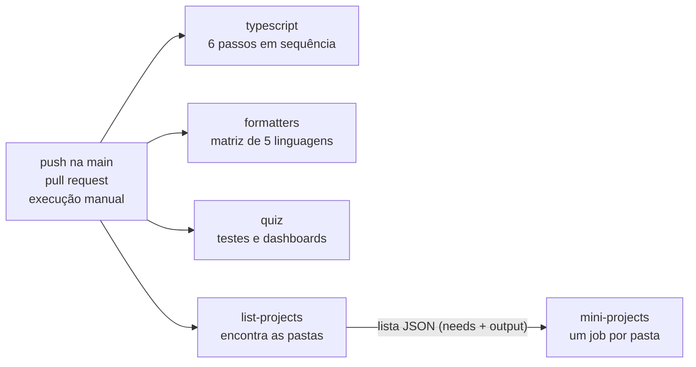

# O pipeline de CI como lição (MP-CI-1)

> English version: [docs/en/continuous-integration/ci-pipeline.md](../../en/continuous-integration/ci-pipeline.md) · Versión en español: [docs/es/continuous-integration/ci-pipeline.md](../../es/continuous-integration/ci-pipeline.md)

Mini-projeto: [`projects/continuous-integration/ci-pipeline`](../../../projects/continuous-integration/ci-pipeline/README.pt-BR.md). Tópicos do quiz: `ci-cd-concepts`, `workflows-events-jobs-steps`, `runners-matrix`, `caching-artifacts`, `secrets-environments-permissions`, `quality-gates`, `supply-chain-security`.

## O conceito

**Integração contínua (CI)** significa que toda mudança é integrada com frequência a uma única linha compartilhada de código, e que uma máquina verifica cada mudança antes de as pessoas dependerem dela. As verificações são sempre as mesmas, rodam em uma máquina limpa, e ninguém precisa lembrar de rodá-las.

Um **portão de qualidade** é uma dessas verificações vista como uma porta: a mudança só passa se a verificação passar. Um bom portão tem três propriedades:

- É **automático**. A resposta é um código de saída, 0 para "passou" e qualquer outro valor para "falhou". Nenhuma pessoa decide.
- É **específico**. Pega um tipo de erro e diz em qual arquivo e linha.
- É **reproduzível**. O mesmo comando dá a mesma resposta em um notebook e no CI.

Este repositório tem 14 portões desses em um arquivo, o [`.github/workflows/ci.yml`](../../../.github/workflows/ci.yml). Esta página lê esse arquivo de cima a baixo.

## As palavras do GitHub Actions

| Palavra | Significado | No `ci.yml` |
| --- | --- | --- |
| Workflow | um arquivo YAML em `.github/workflows/` que descreve uma automação | `name: CI` |
| Evento | o que dispara o workflow | `on:` |
| Job | um grupo de passos que roda em uma máquina | `typescript`, `formatters`, `quiz`, `list-projects`, `mini-projects` |
| Runner | a máquina que roda um job, criada nova e descartada no fim | `runs-on: ubuntu-24.04` |
| Step (passo) | um comando (`run:`) ou uma action reutilizável (`uses:`) | `- run: bun run typecheck` |
| Matriz | uma definição de job expandida em vários jobs | `strategy.matrix` |

Os jobs rodam em paralelo, a menos que um declare `needs:`. Os passos de um job rodam um depois do outro, e o job para no primeiro passo que falha.

## O cabeçalho do arquivo

```yaml
on:
  push:
    branches: [main]
  pull_request:
  workflow_dispatch:
```

Três eventos. Um push na `main` verifica o que foi integrado. Um pull request verifica uma mudança antes de ela ser integrada. `workflow_dispatch` acrescenta um botão "Run workflow", e o comando `gh workflow run CI`. Um push em qualquer outro branch não dispara nada: é por isso que os branches de demonstração desta lição precisam de uma execução manual.

```yaml
permissions:
  contents: read
```

Toda execução recebe um token temporário, o `GITHUB_TOKEN`. Por padrão ele pode ter permissão de escrita no repositório. Este workflow só lê código, então pede acesso de leitura e mais nada. É o princípio do menor privilégio: se um passo for comprometido um dia (por uma dependência maliciosa, por exemplo), o token que ele encontra não consegue enviar código nem publicar uma release.

```yaml
concurrency:
  group: ci-${{ github.event_name }}-${{ github.ref }}
  cancel-in-progress: true
```

Duas execuções do mesmo grupo não rodam juntas: a mais nova cancela a mais antiga. O grupo é "evento mais branch", então dois pushes seguidos no mesmo pull request interrompem a execução do commit que já não interessa a ninguém. O evento está no nome de propósito: um push na `main` não cancela uma execução manual completa da `main`.

## Os jobs



### `typescript`

Preparação: `actions/checkout@v5` copia o repositório para o runner, `oven-sh/setup-bun@v2` instala o Bun 1.4.2, e `bun install --frozen-lockfile` instala as dependências. `--frozen-lockfile` faz a instalação falhar quando `package.json` e `bun.lock` discordam, em vez de resolver versões novas em silêncio: o CI testa exatamente o que o lockfile diz.

| Passo | Comando | Por que existe | Como é uma falha |
| --- | --- | --- | --- |
| Format and lint (Biome) | `bunx biome ci .` | um estilo só para todos, para um diff mostrar apenas o que mudou de significado | `arquivo.ts format` seguido de um diff das linhas |
| Markdown lint (markdownlint) | `bun run lint:md` | a documentação é metade deste repositório, e prosa também tem regras | `arquivo.md:7 error MD040/fenced-code-language Fenced code blocks should have a language specified` |
| Type check | `bun run typecheck` | um tipo errado é encontrado sem executar o código | `arquivo.ts(8,2): error TS2322: Type 'string' is not assignable to type 'number'.` |
| Unit tests | `bun test quiz/tests/unit tools` | código bem tipado ainda pode calcular a coisa errada | `(fail) nome do teste`, com o valor esperado e o recebido |
| Quiz content validation | `bun run quiz:validate` | o quiz é dado, e dado também tem regras | `error: big-o/arquivo.json id: en.alternatives: must have exactly 5 items` |
| Documentation index is up to date | `bun run docs:index --check` | um arquivo gerado precisa bater com o que o gera | `docs/en/README.md is out of date: run "bun run docs:index"` |

O segundo passo verifica todo arquivo Markdown com o markdownlint, na versão fixada no `package.json`, com as regras do `.markdownlint-cli2.jsonc`. Esse arquivo desliga algumas regras e diz o porquê ao lado de cada uma. `bun run format:md` corrige o que dá para corrigir automaticamente.

A ordem vai do barato ao caro. A formatação leva um segundo e é o que mais falha, então vem primeiro, e um job que falha cedo dá a resposta cedo.

O último passo mostra um padrão que vale conhecer. O `docs/en/README.md` é escrito por um script a partir do conteúdo do repositório. A checagem roda o script em memória e compara o resultado com o arquivo versionado. Quem muda o conteúdo e esquece de regenerar a página é avisado pelo CI, com o comando que resolve.

### `formatters`

```yaml
strategy:
  fail-fast: false
  matrix:
    include:
      - lang: python
        check: ruff check . && ruff format --check .
      - lang: go
        check: test -z "$(gofmt -l projects benchmarks 2>/dev/null)"
```

Uma **matriz** transforma uma definição de job em vários jobs, um para cada entrada de `include`. Aqui cada entrada traz dois valores: a linguagem e o comando que a verifica. Os passos são iguais para as cinco: construir a imagem fixada da linguagem a partir de `docker/<lang>.Dockerfile` e depois rodar o comando dentro dela, com o repositório montado.

`fail-fast: false` faz diferença. Por padrão, quando um job de uma matriz falha, o GitHub cancela os outros. Com isso desligado as cinco linguagens sempre terminam, e uma execução conta tudo o que está errado.

O comando chega ao contêiner de um jeito cuidadoso:

```yaml
env:
  CHECK: ${{ matrix.check }}
run: docker run --rm -v "$PWD:/app" -w /app sef-${{ matrix.lang }}:local sh -c "$CHECK"
```

`${{ ... }}` é substituído pelo GitHub **antes** de o shell ler a linha. Um comando colado direto no script traria as próprias aspas, fecharia o argumento entre aspas antes da hora, e parte dele rodaria no runner e não no contêiner. Passado por uma variável de ambiente, o texto chega inteiro. A mesma regra protege contra injeção de script quando o valor vem de fora, como o título de um pull request: nunca cole `${{ }}` em um script, passe por `env`.

Os formatadores rodam em modo de checagem (`--check`, `--dry-run`, `-l`): não alteram nada, só informam. A falha tem uma cara em cada ferramenta. O ruff imprime `1 file would be reformatted`, o rustfmt imprime `Diff in arquivo.rs`, o clang-format imprime `error: code should be clang-formatted`, o mix imprime `The following files are not formatted`. A checagem de Go não imprime nada, porque `test -z` só define o código de saída. Uma falha silenciosa é uma fraqueza que vale notar: quem a vê precisa rodar `gofmt -l projects benchmarks` de novo para descobrir o nome do arquivo.

### `quiz`

O primeiro passo é uma linha, `./quiz/setup-unix-quiz.sh test`, e essa linha é a lição: o CI chama o mesmo script que um contribuidor chama. O script constrói o quiz como site estático a partir de um fixture pequeno, roda os testes unitários, sobe o site em um contêiner e roda os testes do Playwright contra ele em outro. Uma falha é um relatório do Playwright: o nome do teste, a linha que esperava por algo, e `1 failed`.

O segundo passo abre cada dashboard versionado (`projects/*/*/dashboard/index.html`) direto do disco em um navegador de verdade, em um contêiner iniciado com `--network none`. Uma página falha quando registra um erro, não renderiza texto ou pede algo que não seja um arquivo local. Uma página que funciona sem rede nenhuma prova que não precisa de CDN nem de servidor, que é a promessa que os dashboards fazem. Uma falha aparece como `FAIL caminho/index.html` e `network request: https://...`.

### `list-projects` e `mini-projects`

Estes dois jobs são uma ideia em duas partes. A lista de mini-projetos não está escrita no workflow. Ela é calculada:

```yaml
list-projects:
  outputs:
    projects: ${{ steps.list.outputs.projects }}
  steps:
    - id: list
      run: |
        projects=$(for dir in projects/*/*/; do ... done | jq -R . | jq -sc .)
        echo "projects=${projects:-[]}" >> "$GITHUB_OUTPUT"
```

Um passo publica um valor escrevendo `nome=valor` no arquivo `$GITHUB_OUTPUT`. O job o expõe em `outputs`. O job seguinte declara `needs: list-projects`, o que ao mesmo tempo o faz esperar e o deixa ler o valor:

```yaml
mini-projects:
  needs: list-projects
  if: needs.list-projects.outputs.projects != '[]'
  timeout-minutes: 45
  strategy:
    fail-fast: false
    matrix:
      project: ${{ fromJson(needs.list-projects.outputs.projects) }}
```

`fromJson` transforma o texto `["projects/a/b","projects/c/d"]` em uma lista, e a matriz vira um job por pasta. Isso é uma **matriz dinâmica**. O `if` pula o job quando a lista está vazia, porque uma matriz sem entradas é um erro. `timeout-minutes` interrompe um job que travou, em vez do limite padrão de seis horas.

Cada job roda três linhas: montar o nome do script a partir da pasta, dar `chmod +x` nele (um arquivo versionado a partir do Windows pode estar sem o bit de execução) e rodá-lo. Uma falha é o que os testes daquele mini-projeto imprimirem, e o job leva o nome da pasta, então a linha vermelha da lista diz onde olhar.

## As decisões de projeto

**Todo mini-projeto em toda execução.** Testar só as pastas que mudaram é mais rápido e deixa passar quebras reais. Um mini-projeto depende de arquivos fora da sua pasta: as imagens base em `docker/`, o workflow, o conteúdo do quiz para o qual ele aponta. Mudar um deles pode quebrar uma pasta em que ninguém mexeu, e um pipeline que testa só pastas alteradas continuaria verde. O preço é tempo de máquina, pago em toda execução.

**Versões fixadas em todo lugar.** O runner é `ubuntu-24.04`, não `ubuntu-latest`. As actions têm versão (`actions/checkout@v5`), o Bun tem versão (`1.4.2`), e toda imagem Docker tem uma tag fixa. Um pipeline que flutua pode ficar vermelho em um dia em que ninguém mudou nada, e aí a pergunta "o que quebrou?" não tem resposta no repositório. Uma observação honesta: `@v5` é uma tag, e o dono de uma action pode mover uma tag. Fixar no hash completo do commit é mais rígido, e é o que faz um projeto com risco alto na cadeia de suprimentos.

**Sem cache.** O workflow não guarda nada entre execuções. Toda execução instala as dependências e constrói as imagens de novo. É mais lento, e é simples: não existe cache velho para explicar uma falha estranha, nem cache que um pull request possa envenenar. Se o tempo de execução virar problema, os primeiros candidatos são o cache de instalação do Bun e as camadas do Docker. Seria uma troca, não um ganho de graça.

**Tudo em Docker, chamado por scripts.** Quase todo portão é um comando que uma pessoa roda localmente com o mesmo resultado, porque as ferramentas e suas versões vivem em imagens e não no runner. Quando o CI fica vermelho, o primeiro passo é rodar esse comando na sua máquina.

**A menor permissão que funciona.** Visto acima: `contents: read`.

## A demo

O mini-projeto transforma cada portão em um experimento com duas execuções:

1. Um contêiner faz uma cópia limpa dos arquivos que o portão precisa e roda o comando do portão. Precisa passar.
2. Ele aplica uma mudança preparada, a menor que quebra aquele portão, e roda o mesmo comando. Precisa falhar, com a mensagem que um contribuidor veria.

Alguns detalhes valem a leitura do código:

- **O comando é lido do `ci.yml`.** O `demo/run-gates.sh` extrai a linha `run:` do passo pelo nome, então a demo roda o que o CI roda.
- **As mudanças terminam em `.fixture`.** Um `bad_format.go` mal formatado guardado no repositório faria o job `formatters` de verdade falhar. Como `bad_format.go.fixture` nenhuma ferramenta o enxerga, e aplicar a mudança o copia para o seu lugar sem o sufixo.
- **Toda mudança se chama `ci-demo`.** A cópia limpa deixa esses arquivos de fora. Em um branch de demonstração a lição ainda parte limpa, então o branch falha em um portão e o job deste mini-projeto continua verde.
- **O repositório é montado somente leitura.** Os contêineres não conseguem alterá-lo, e cada um trabalha em uma cópia.
- **Duas checagens vigiam a própria lição.** `workflow-sync` falha quando o `ci.yml` ganha um job, um passo com nome ou um formatador sem demonstração. `isolation` falha quando uma mudança quebra um portão para o qual não foi escrita.

## Os branches de demonstração

O `demo-branches.sh` (e o `demo-branches.ps1`) aplica cada mudança em um branch `demo/ci-fails-<gate>` criado a partir da `main` em um clone temporário, envia o branch e dispara nele uma execução manual do CI. O padrão é uma simulação que não envia nada. O script se recusa a trabalhar contra qualquer remoto que não seja este repositório, e nunca altera a árvore de trabalho de onde é chamado.

O que você deve ver na lista de jobs de cada execução: um job vermelho, com o nome do portão, e todo o resto verde. Em `formatters` e `mini-projects`, o job vermelho é uma entrada da matriz e os irmãos dele ficam verdes, que é o `fail-fast: false` em ação.

## Limites

- Os branches foram enviados em 2026-10-10, e a tabela do README aponta a execução com falha de cada portão.
- Três portões são mostrados em um fixture reduzido, porque os reais sobem Docker e um contêiner da demo não tem Docker dentro: os testes de ponta a ponta do quiz (um site de uma página no lugar do quiz), os dashboards (uma página de exemplo no lugar de todas) e os testes dos mini-projetos (um mini-projeto de exemplo que só precisa de um shell).
- Os portões do `typescript` rodam os comandos reais sobre `quiz/`, `tools/` e `benchmarks/` com o conteúdo pequeno dos testes do quiz, e os portões de formatação conferem arquivos de exemplo. A demo prova que cada portão pega o seu erro. Só o pipeline de verdade prova que o repositório inteiro está limpo.

## Experimente

1. Rode `./setup-unix-ci-pipeline.sh demo biome` e leia o diff que o Biome imprime. Quais três coisas ele mudaria?
2. Abra `demo/unit-tests/change/` e corrija a função para o teste passar. Por que o verificador de tipos não pegou o bug?
3. No `ci.yml`, o que aconteceria com um pull request que só edita um README se `mini-projects` testasse só as pastas alteradas? E com um que muda `docker/python.Dockerfile`?
4. A checagem de Go falha em silêncio. Escreva uma versão daquele comando que imprima os nomes dos arquivos e ainda falhe.
