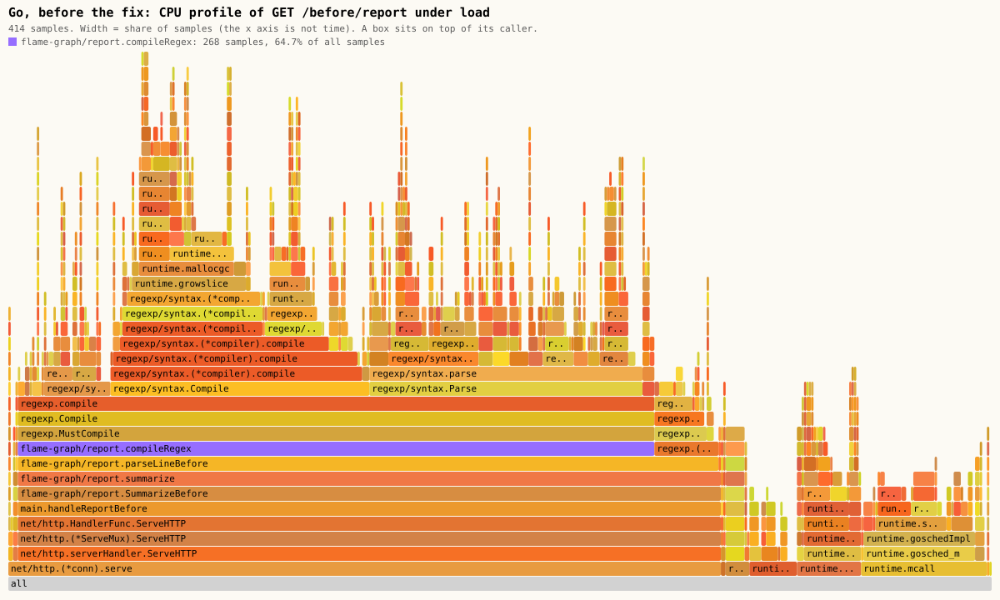
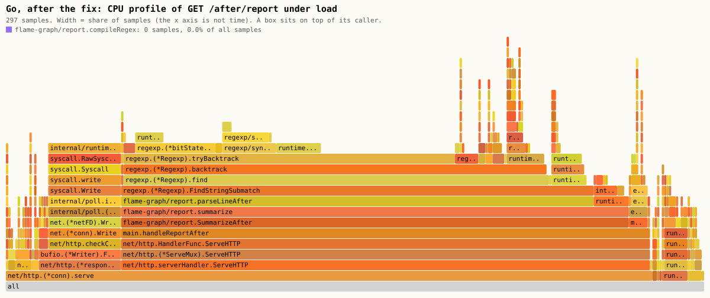

# Profiling com flame graph (MP-OBS-4)

> English version: [docs/en/observability/flame-graph.md](../../en/observability/flame-graph.md) · Versión en español: [docs/es/observability/flame-graph.md](../../es/observability/flame-graph.md)

Mini-projeto: [`projects/observability/flame-graph`](../../../projects/observability/flame-graph/README.pt-BR.md). Tópicos do quiz: `profiling`, `three-signals`.

## O problema

As métricas dizem que um serviço está lento. Um trace diz qual serviço e qual span de uma requisição. Nenhum dos dois diz qual **função** dentro do processo consome a CPU. Ler o código também não ajuda muito, porque linhas caras costumam parecer baratas:

```go
match := compileRegex(linePattern).FindStringSubmatch(line)
```

```ts
return quote(order, (sku) => buildPriceIndex(catalog).get(sku));
```

As duas parecem uma consulta. As duas fazem, para cada item de um laço, um trabalho que só precisa ser feito uma vez. Adivinhar para onde vai o tempo não é confiável; um profiler mede.

## 1. Um profiler de CPU por amostragem

Um profiler por amostragem não cronometra cada chamada. Muitas vezes por segundo (cerca de 100 no Go, até cerca de 1000 no motor JavaScript do Bun) ele interrompe o programa e anota a **pilha de chamadas** do que estava rodando. Uma função que usa muita CPU simplesmente é encontrada na pilha mais vezes.

Duas consequências:

- A sobrecarga é baixa e constante, então dá para tirar um perfil de um serviço que está atendendo carga real. Essa é a ideia por trás do profiling contínuo.
- O resultado é estatístico. Dez amostras não provam nada; o laboratório se recusa a concluir qualquer coisa com menos de 50 amostras dentro do handler. Um perfil de um serviço ocioso mostra só o runtime esperando, então o laboratório inicia a carga **antes** de pedir o perfil.

Cada runtime expõe o seu profiler por um endpoint HTTP que perfila o processo em execução por N segundos:

| | Go | TypeScript (Bun) |
| --- | --- | --- |
| Endpoint no laboratório | `GET /debug/pprof/profile?seconds=5` | `GET /debug/cpuprofile?seconds=5` |
| Mecanismo | `net/http/pprof`, biblioteca padrão | `node:inspector`: `Profiler.start`, `Profiler.stop` |
| Saída | pprof (protocol buffer comprimido com gzip) | `.cpuprofile` (árvore de chamadas em JSON, o formato do DevTools) |

Esses endpoints revelam detalhes internos. No laboratório eles só são alcançáveis em uma rede interna do docker-compose.

## 2. Pilhas dobradas

Os dois formatos são reduzidos ao mesmo texto simples, uma linha por pilha de chamadas distinta:

```text
net/http.(*conn).serve;...;main.handleReportBefore;...;flame-graph/report.compileRegex;regexp.MustCompile;... 37
```

Os quadros da raiz até a folha, unidos por `;`, e depois o número de amostras que tinham exatamente aquela pilha.

- Go: o `go tool pprof -traces -sample_index=samples` imprime cada grupo de amostras com a folha primeiro; o `go/fold` inverte cada bloco e soma as pilhas repetidas. Nenhuma biblioteca é necessária para decodificar o perfil.
- TypeScript: um `.cpuprofile` é uma árvore em que cada nó tem um `hitCount`, as amostras que encontraram a CPU exatamente ali. Subir de um nó até a raiz reconstrói a pilha dele.

## 3. Desenhando o flame graph

O renderizador (`ts/src/svg.ts`) funde as pilhas em uma árvore. Pilhas que começam com os mesmos quadros compartilham essas caixas, e essa fusão é todo o truque: milhares de amostras viram uma figura em que uma função quente é uma caixa larga.



Regras de leitura:

| O que você vê | O que significa |
| --- | --- |
| Uma caixa | Uma função |
| A caixa acima dela | Uma função que ela chamou. Uma coluna é uma pilha de chamadas, com a raiz embaixo |
| Largura | Fatia das amostras: a função mais tudo o que ela chamou (`cum` no pprof) |
| Uma caixa larga sem nada em cima | Tempo próprio (`flat` no pprof): a CPU estava no código da própria função |
| Da esquerda para a direita | Nada. Irmãos são ordenados por nome. **O eixo x não é tempo** |
| Cor | Nada. Só diferencia vizinhos. Uma função está destacada em roxo |

Na figura acima os platôs estão dentro de `regexp/syntax` e do alocador, código da biblioteca padrão que não dá para "otimizar" a partir da aplicação. A pergunta útil é: descendo a torre, qual é a primeira caixa que pertence à aplicação e não deveria ser tão larga? É `compileRegex`, com 90,5% das amostras do handler.

## 4. A correção

A etapa cara sai do laço e passa a ser feita uma vez.

```go
var lineRegex = regexp.MustCompile(linePattern) // uma vez, na inicialização

match := lineRegex.FindStringSubmatch(line)
```

```ts
const priceIndex = buildPriceIndex(catalog); // uma vez, na inicialização

return quote(order, (sku) => index.get(sku));
```

Um teste em cada linguagem confere que as duas variantes devolvem exatamente o mesmo resultado: uma correção precisa mudar o custo e mais nada.

Depois da correção a função quente some do perfil (0 amostras nas duas linguagens), e a figura muda de formato:



## 5. Medindo quanto a correção vale

O perfil responde "onde". Ele não responde "quanto mais rápido o serviço vai ficar": remover uma função que ocupa 90% da CPU do handler não torna cada requisição dez vezes mais rápida se o resto da requisição é rede e escalonamento. Por isso o laboratório mede a vazão antes e depois, com a mesma carga de laço fechado (16 conexões, 1 CPU por servidor, aquecimento descartado, mediana de 5 execuções):

| Serviço | Antes (req/s) | Depois (req/s) | Fator |
| --- | --- | --- | --- |
| Go | 222 | 3133 | **14,1x** |
| TypeScript (Bun) | 405 | 22894 | **56,5x** |

A máquina estava compartilhada com outras cargas e a dispersão entre as execuções foi grande (até 42% da mediana). Duas outras execuções completas deram 14,7x e 24,3x para o Go e 57,7x e 44,0x para o TypeScript. Tabela completa, dispersão e máquina: [results/results.md](../../../projects/observability/flame-graph/results/results.md).

## Perfil, trace, métrica

| Pergunta | Sinal |
| --- | --- |
| O serviço está mais lento que na semana passada? | Métrica (histograma de latência) |
| Qual serviço e qual etapa desta requisição foi lenta? | Trace |
| Qual função deste processo usa a CPU? | Perfil |

Um trace cobre uma requisição entre processos e inclui o tempo de espera. Um perfil de CPU cobre todas as requisições de um processo e inclui só o tempo na CPU: uma requisição que espera 800 ms por um banco de dados é longa em um trace e invisível em um perfil de CPU. O mini-projeto [three-signals](three-signals.md) mostra as duas primeiras linhas.

## O que o runtime faz com as suas pilhas

- O Go embute (inline) funções pequenas. `compileRegex` é embutida em quem a chama, e mesmo assim o perfil a mostra como um quadro, porque o formato do perfil registra chamadas embutidas. O `go/fold` as mantém.
- Na figura "before" do TypeScript, `quoteBefore` não aparece entre `handleQuoteBefore` e `quote`: a última ação dela é uma chamada em posição de cauda, e o JavaScriptCore pode reaproveitar o quadro de pilha para uma chamada assim. Um profiler mostra as pilhas que existem em tempo de execução.
- O profiler do JavaScript reporta só funções JavaScript. O código nativo do `Map` dentro de `buildPriceIndex` é contado como tempo próprio dela, então a figura do TypeScript é uma torre curta.

## Rodar

```sh
cd projects/observability/flame-graph
./setup-unix-flame-graph.sh       # ou .\setup-windows-flame-graph.ps1: build, testes, checagem ao vivo do perfil
docker compose run --rm flame     # gera de novo os perfis e os quatro arquivos SVG em results/
docker compose run --rm bench     # gera de novo a tabela de antes e depois
docker compose down -v
```

Versões: `golang:1.27.1-bookworm` (só a biblioteca padrão), `oven/bun:1.4.2`, `zod` 4.6.5.
