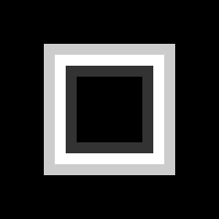
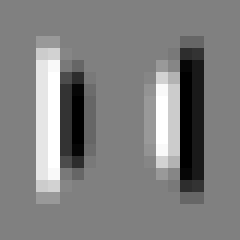
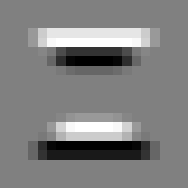
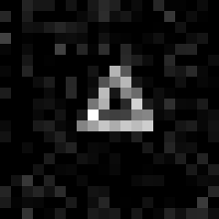
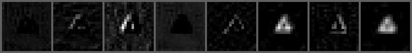
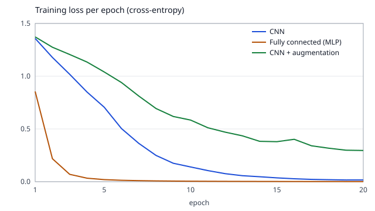

# computer-vision-cnn

> English version: [README.md](README.md)

Ensina **como uma rede enxerga: imagens como números, convolução, pooling e filtros aprendidos**. Uma convolução é escrita à mão com laços e conferida contra o PyTorch, número por número. Depois uma rede convolucional pequena (CNN) aprende a classificar quatro formas que o próprio projeto desenha (círculo, quadrado, triângulo, cruz), é comparada com uma rede totalmente conectada do mesmo tamanho em formas que mudaram de lugar, é treinada de novo com aumento de dados, e tem os seus filtros aprendidos e mapas de ativação gravados como figuras.

Explicação completa: [docs/pt/artificial-intelligence/computer-vision-cnn.md](../../../docs/pt/artificial-intelligence/computer-vision-cnn.md).

## Tópicos do quiz que ele demonstra

- `artificial-intelligence` / `computer-vision`: imagens como tensores, convolução como um produto escalar deslizante, o filtro de bordas (Sobel), o tamanho da saída (W - F + 2P) / S + 1, compartilhamento de parâmetros, max pooling, uma CNN contra uma rede totalmente conectada em imagens deslocadas, aumento de dados, filtros aprendidos e mapas de ativação (de características).
- `artificial-intelligence` / `image-generation`: aritmética da convolução (tamanho do filtro, stride, padding e o tamanho da saída).
- `artificial-intelligence` / `pytorch`: tensores e seus formatos (lote x canais x altura x largura), `nn.Module`, o laço de treino (prever, perda, `zero_grad`, `backward`, `step`), mini-lotes, sementes fixas.

## Como rodar

O único requisito é o Docker.

```sh
./setup-unix-computer-vision-cnn.sh        # Linux e macOS
./setup-windows-computer-vision-cnn.ps1    # Windows
```

O script constrói a imagem, roda os testes e depois roda a demo, que treina as três redes e regrava `results/`. Tudo roda na CPU, sem acesso à rede: nenhum conjunto de dados e nenhum modelo é baixado.

## Estrutura

| Caminho | O que é |
| --- | --- |
| `python/conv.py` | a convolução escrita com quatro laços, os filtros de Sobel, a fórmula do tamanho da saída, e a mesma chamada feita pelo PyTorch |
| `python/shapes.py` | o conjunto de dados: desenha as quatro formas em tensores 20 x 20 com semente fixa, e o deslocamento e a rotação usados no aumento de dados |
| `python/cnn.py` | a CNN, a rede totalmente conectada (MLP), o laço de treino, a acurácia e o experimento que treina e mede os três modelos |
| `python/figures.py` | um gravador de PNG (só biblioteca padrão) e a curva de perda em SVG |
| `python/demo.py` | roda o experimento e grava `results/` |
| `python/test_conv.py`, `python/test_cnn.py` | os testes, marcados com o critério de aceite que provam |
| `results/` | resultados versionados: `results.md`, `loss-curve.svg` e as figuras PNG |

A imagem é `python:3.14.8-slim-trixie` com `torch==2.14.1` (wheel de CPU), `numpy==2.5.3`, `pytest==9.1.1` e `ruff==0.16.10`. Não há torchvision, Pillow nem matplotlib: as formas, as transformações e os arquivos de figura são escritos pelo projeto. O NumPy é instalado porque o PyTorch o usa quando está presente, e o código nunca o importa. Nada é importado de outro mini-projeto.

## Testes

```sh
docker compose run --rm python-test
```

Roda `ruff check`, `ruff format --check` e `pytest` (38 testes, de 10 a 30 segundos de pytest na máquina em que foram escritos, conforme a carga dela, com o PyTorch limitado a 2 threads). As três redes são treinadas uma vez e cada teste lê esse único experimento.

| Critério | O que os testes conferem |
| --- | --- |
| MP-AI-8.1 | a convolução escrita à mão com o filtro de Sobel é igual a `torch.nn.functional.conv2d` em uma imagem gerada, também com 5 variantes de stride e padding e 3 filtros, o tamanho da saída segue a fórmula, e o filtro não é espelhado |
| MP-AI-8.2 | a CNN chega a pelo menos 95% em imagens separadas para teste, as duas redes têm contagens de parâmetros a menos de 10% uma da outra, e a rede totalmente conectada fica pelo menos 30 pontos abaixo da CNN nas imagens deslocadas |
| MP-AI-8.3 | a tabela de resultados tem a acurácia em imagens centradas, deslocadas e giradas com e sem aumento de dados, o aumento ganha pelo menos 10 pontos nas imagens giradas, e os filtros e os mapas de ativação são gravados como arquivos PNG válidos |

## Demo

```sh
docker compose run --rm python-demo    # grava results/
```

Os números abaixo são os de [`results/results.md`](results/results.md).

**Convolução à mão contra o framework.** Uma imagem 20 x 20 e o filtro de Sobel 3 x 3:

| Stride | Padding | (W - F + 2P) / S + 1 | Saída do framework | Mesmos números |
| ---: | ---: | ---: | ---: | :---: |
| 1 | 0 | 18 x 18 | 18 x 18 | sim |
| 1 | 1 | 20 x 20 | 20 x 20 | sim |
| 2 | 0 | 9 x 9 | 9 x 9 | sim |
| 2 | 1 | 10 x 10 | 10 x 10 | sim |
| 3 | 2 | 8 x 8 | 8 x 8 | sim |

| Entrada | Sobel x (bordas verticais) | Sobel y (bordas horizontais) |
| :---: | :---: | :---: |
|  |  |  |

**CNN contra uma rede totalmente conectada.** As duas são treinadas em 1200 formas centradas e medidas em 800 imagens que nunca viram:

| Modelo | Parâmetros | Teste, centradas | Teste, deslocadas |
| --- | ---: | ---: | ---: |
| CNN | 1932 | 99,9% | 93,3% |
| Totalmente conectada (MLP) | 2029 | 99,9% | 5,1% |

As duas aprendem as formas centradas. Quando as formas andam de 2 a 4 pixels, a CNN mantém 93,3% e a rede totalmente conectada cai para 5,1%, abaixo dos 25% de um chute ao acaso: ela não está chutando, está errando de forma sistemática. Cada peso dela pertence a uma posição de pixel, então uma forma deslocada acende pixels que significavam outra coisa durante o treino.

**Aumento de dados.** A mesma CNN, a partir dos mesmos pesos iniciais, treinada com deslocamentos e rotações aleatórios:

| Treino da CNN | Centradas | Deslocadas | Giradas |
| --- | ---: | ---: | ---: |
| sem aumento de dados | 99,9% | 93,3% | 62,5% |
| com aumento de dados | 97,5% | 94,9% | 84,9% |

**O que a primeira camada aprendeu.** Os 8 filtros aprendidos (cinza é 0, branco positivo, preto negativo), uma imagem de teste, e os 8 mapas de ativação que ela produz:








Não há dashboard: as tabelas e as figuras em [`results/`](results/) são o resultado.

## Limites

- O conjunto de dados é de brinquedo: imagens 20 x 20, quatro formas limpas, 1200 imagens de treino. A acurácia aqui não diz nada sobre fotografias.
- A CNN não é perfeitamente invariante a deslocamento: ela perde 6,6 pontos nas imagens deslocadas. Os zeros do padding na borda e a grade fixa 2 x 2 do pooling fazem uma forma deslocada produzir números um pouco diferentes.
- A maior parte da robustez a deslocamento vem da média global no fim, junto com os pesos compartilhados. Durante o desenvolvimento, uma variante que achatava os últimos mapas em uma camada linear (um peso por posição) caiu para cerca de 8% nas imagens deslocadas, como a rede totalmente conectada. Essa variante não está no código nem nos resultados versionados.
- O aumento de dados não é de graça: a acurácia nas centradas cai de 99,9% para 97,5% e a perda de treino ainda está caindo depois de 20 épocas (0,296), porque a tarefa é mais difícil e a rede e o número de épocas são os mesmos. Nas imagens giradas ela chega a 84,9%, não a 100%.
- Com 8 filtros 3 x 3 treinados com poucos dados, os filtros aprendidos são mais ruidosos que os detectores de borda dos livros. Alguns parecem filtros de borda, outros só medem o brilho.
- Os números são reproduzíveis na mesma imagem Docker (sementes fixas, 2 threads, algoritmos determinísticos). Outra CPU ou outra versão do PyTorch pode mudar as últimas casas decimais, e por isso os testes usam limites e não valores exatos.
- Sem ResNet, transfer learning, detecção ou segmentação: a página de documentação diz o que eles acrescentam.
