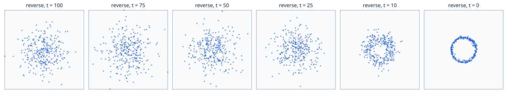
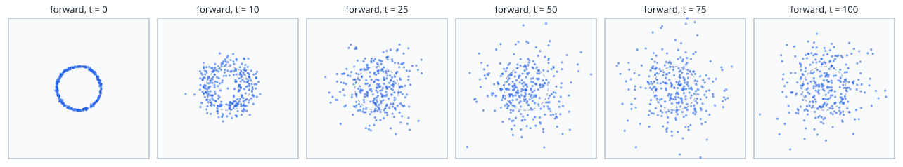
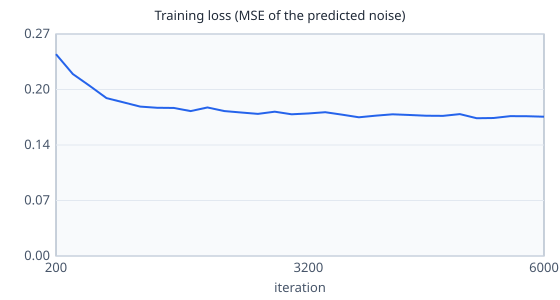

# diffusion-toy

> English version: [README.md](README.md) · Versión en español: [README.es.md](README.es.md)

Ensina **como um modelo de imagens aprende a remover ruído**, com pontos de duas dimensões no lugar de pixels. A "imagem" é um ponto sobre um anel. Um processo direto soma ruído gaussiano passo a passo até o anel virar ruído puro, uma rede pequena escrita à mão com NumPy (sem framework de deep learning) aprende a prever o ruído que foi somado, e a geração parte de ruído puro e tira um pouco dele 100 vezes, até os pontos voltarem para o anel. É o método de "Denoising Diffusion Probabilistic Models" (Ho, Jain e Abbeel, 2020) em um tamanho que permite desenhar cada passo.

Explicação completa: [docs/pt/artificial-intelligence/diffusion-toy.md](../../../docs/pt/artificial-intelligence/diffusion-toy.md).

## Tópicos do quiz que ele demonstra

- `artificial-intelligence` / `image-generation`: o processo direto (ruído somado passo a passo, e o atalho para qualquer passo), o objetivo do treino (prever o ruído), a geração passo a passo a partir de ruído puro, por que um modelo de difusão é mais lento que um modelo que responde em uma passada só (uma chamada da rede por passo).
- `artificial-intelligence` / `probability-statistics`: a distribuição gaussiana, média e variância, por que a soma de ruídos gaussianos é gaussiana, como conferir se uma amostra parece gaussiana.
- `artificial-intelligence` / `training`: a perda de erro quadrático médio, a retropropagação escrita à mão, o otimizador Adam, a verificação numérica do gradiente.

## Como rodar

O único requisito é o Docker.

```sh
./setup-unix-diffusion-toy.sh        # Linux e macOS
./setup-windows-diffusion-toy.ps1    # Windows
```

O script constrói a imagem, roda os testes e roda a demo, que regrava `results/`.

## Estrutura

| Caminho | O que é |
| --- | --- |
| `python/diffusion.py` | tudo o que é a lição: o anel, a agenda de ruído, o processo direto (passo a passo e atalho), a rede, a retropropagação, o Adam, o treino, o processo reverso, e as medidas (distância até o anel, fatias, verificações gaussianas) |
| `python/svg.py` | os gráficos de dispersão e o gráfico de linha, escritos como texto SVG |
| `python/demo.py` | treina, roda os dois processos e grava `results/` |
| `python/test_diffusion.py` | os testes, um ou mais por critério de aceite |
| `results/forward.svg`, `results/reverse.svg` | os pontos nos passos 0, 10, 25, 50, 75 e 100 de cada processo |
| `results/loss.svg` | a perda do treino |
| `results/results.md` | todos os números citados abaixo |

Uma linguagem, Python (`python:3.14.8-slim-trixie`), com uma dependência de execução, `numpy==2.5.3`, usada só para vetores e produtos de matrizes. Não há PyTorch nem TensorFlow: a rede, a sua volta (backward) e o otimizador são uma parte pequena de `diffusion.py`. Nenhum código é importado de outro mini-projeto.

## Testes

```sh
docker compose run --rm python-test
```

Roda `ruff check`, `ruff format --check` e 12 testes (cerca de 15 segundos, quase tudo no único treino que os testes compartilham).

| Critério | Teste | O que ele prova |
| --- | --- | --- |
| MP-AI-5.1 | `test_last_forward_step_is_indistinguishable_from_gaussian_noise` | 20000 pontos com ruído somado passo a passo passam em 7 verificações contra uma normal padrão, enquanto o anel limpo e o passo 25 falham nelas |
| MP-AI-5.1 | `test_step_by_step_agrees_with_the_shortcut` | andar pelos passos e saltar com a fórmula fechada dão as mesmas estatísticas |
| MP-AI-5.2 | `test_generated_points_land_on_the_ring` | distância média de 2000 pontos gerados até o anel abaixo de **0,10** |
| MP-AI-5.2 | `test_generated_points_cover_the_whole_ring` | cada uma das 12 fatias do anel tem entre 50% e 150% de uma parte igual |
| MP-AI-5.3 | `test_demo_writes_the_points_of_several_reverse_steps` | a demo grava os quatro arquivos de resultado, com 6 painéis de 300 pontos |
| (apoio) | `test_backpropagation_matches_numerical_gradient` | os gradientes escritos à mão são iguais às diferenças centradas, para todos os 195 pesos de uma rede pequena |

## Demo

```sh
docker compose run --rm python-demo    # grava results/
```

O processo reverso, do ruído puro (esquerda) até os pontos gerados (direita). O círculo tracejado é o alvo:



| Passo t | Distância média até o anel | Raio médio | Dispersão do raio | Variância de x | Variância de y |
| ---: | ---: | ---: | ---: | ---: | ---: |
| 100 | 0,535 | 1,244 | 0,647 | 0,967 | 0,995 |
| 75 | 0,543 | 1,252 | 0,654 | 0,971 | 1,023 |
| 50 | 0,509 | 1,206 | 0,622 | 0,936 | 0,905 |
| 25 | 0,449 | 1,099 | 0,556 | 0,772 | 0,744 |
| 10 | 0,256 | 0,992 | 0,320 | 0,552 | 0,534 |
| 0 | 0,047 | 0,987 | 0,066 | 0,496 | 0,482 |

O que dá sentido ao número 0,047:

| Pontos | Distância média até o anel |
| --- | ---: |
| Dado real (o conjunto de treino) | 0,024 |
| Gerados (passo 0 do processo reverso) | 0,047 |
| Ruído puro (passo 100, onde a geração começa) | 0,535 |
| Limite do teste | 0,10 |

O limite 0,10 é cerca do dobro do valor medido e menos de um quinto da distância do ruído puro. As 12 fatias do anel têm pontos (de 137 a 182 em cada uma, 167 se fosse perfeitamente igual), então o modelo não colapsou em um ponto só.

O processo direto, do anel (esquerda) até o ruído (direita):



No passo 100 os 20000 pontos passam em todas as verificações contra uma normal padrão (média, variância, correlações, parcelas a até 1 e 2 desvios padrão, estatística de Kolmogorov-Smirnov 0,0038 e 0,0113 contra uma tolerância de 0,0138). O sinal que sobra é sqrt(alpha_bar_100) = 0,0045 do ponto original.

A perda do treino cai de 0,2465 (primeiras 200 iterações) para 0,1702 (últimas 200):



Não há dashboard: as três figuras e as tabelas de [`results/results.md`](results/results.md) são o resultado. Os textos dentro das figuras e de `results/results.md` estão em inglês.

## Limites

- "Indistinguível de ruído gaussiano" quer dizer que as sete verificações não conseguem separar os dois com 20000 pontos. O ponto original continua lá, multiplicado por 0,0045. Enxergar isso exigiria uma amostra da ordem de um milhão de pontos.
- O anel gerado é cerca de duas vezes mais grosso que o real (dispersão do raio 0,066 contra 0,030). Isso vem do erro de uma rede pequena treinada por poucos segundos e dos passos grosseiros (100 em vez de 1000). A demo não separa as duas causas.
- A perda não chega a zero e nunca poderia: o mesmo ponto com ruído pode vir de muitos pares diferentes de ponto limpo e ruído, então a melhor resposta possível é uma média.
- Uma forma só, sem condição: o modelo sempre desenha o anel. Não há prompt de texto, U-Net, espaço latente nem os amostradores mais rápidos. A página de docs diz o que cada um acrescenta.
- Todas as sementes são fixas e os números foram gravados pela demo no Docker. Em outro processador a última casa de um número arredondado pode mudar, e é por isso que os testes usam limites e não valores exatos.
