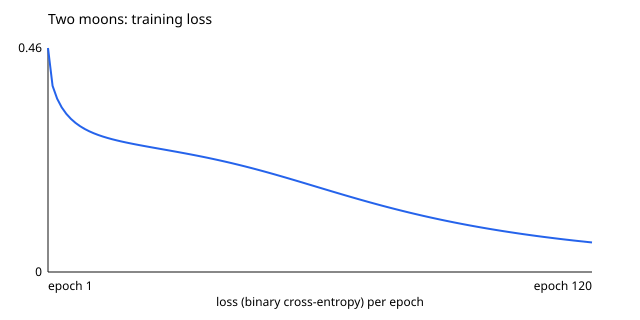
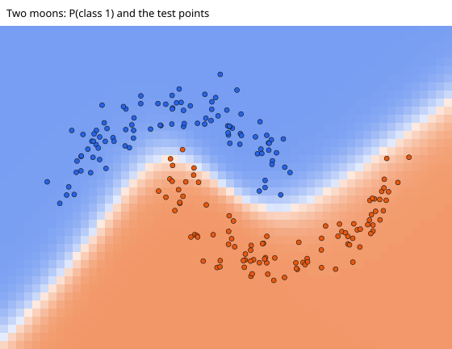

# Results: neural-network-from-scratch

Generated with `docker compose run --rm python-demo` (Python, no dependencies, fixed seeds).

## Backpropagation on one expression

```text
f = (x + y) * z with x = 2, y = 1, z = 4   ->   f = 12
df/dx = 4   df/dy = 4   df/dz = 3
```

## XOR

Network 2-4-1 with tanh (17 parameters), 300 epochs of gradient descent, learning rate 0.5.

| x1 | x2 | XOR | P(class 1) | Answer |
| ---: | ---: | ---: | ---: | ---: |
| 0 | 0 | 0 | 0.005 | 0 |
| 0 | 1 | 1 | 0.974 | 1 |
| 1 | 0 | 1 | 0.973 | 1 |
| 1 | 1 | 0 | 0.037 | 0 |

Loss: 0.7863 in the first epoch, 0.0244 in the last. Per epoch: [`loss-xor.csv`](loss-xor.csv).

## Two moons

Network 2-8-8-1 with tanh (105 parameters), 120 epochs, learning rate 0.5. 80 training points and 200 test points, generated with noise 0.12 and different seeds.

| Set | Points | Accuracy |
| --- | ---: | ---: |
| Training | 80 | 98.8% |
| Test (never used in training) | 200 | 99.5% |

| Epoch | Loss |
| ---: | ---: |
| 1 | 0.4576 |
| 2 | 0.3803 |
| 5 | 0.3231 |
| 10 | 0.2876 |
| 25 | 0.2524 |
| 50 | 0.2009 |
| 100 | 0.0844 |
| 120 | 0.0604 |

Per epoch: [`loss-moons.csv`](loss-moons.csv). Curve: [`loss-curve.svg`](loss-curve.svg).



## Decision boundary

The network is asked for its answer on a grid of points. `.` is class 0, `#` is class 1, and the training points are drawn on top (`o` class 0, `x` class 1).

```text
................................................................
................................................................
................................................................
........................o.......................................
.....................o..........................................
................o...oo...o......o...............................
...............oo....o..o...o................................###
...................o...........o...o.......................#####
..........o...oo................o..o....................########
....................................oo.o..............####x#####
........o..o.........######x........o..............#############
...................######x#x###.....o..o.o......###x###x#x######
........o........######xx########.....o.......########x#########
........o.......#######xxx###########....############x##########
...............####################x####o###########xx##########
.......o.....###############x##x#################x##############
............################x######x###x####x#xx##x#############
..........###################x#####x#x#x########################
.........#####################x#####x###x#x#xx##################
.......###################################x#####################
.....###########################################################
....############################################################
..##############################################################
################################################################
```

In colour, with the test points: [`decision-boundary.svg`](decision-boundary.svg).


