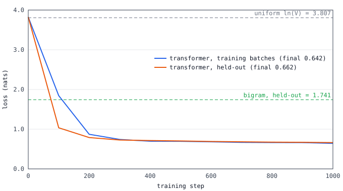
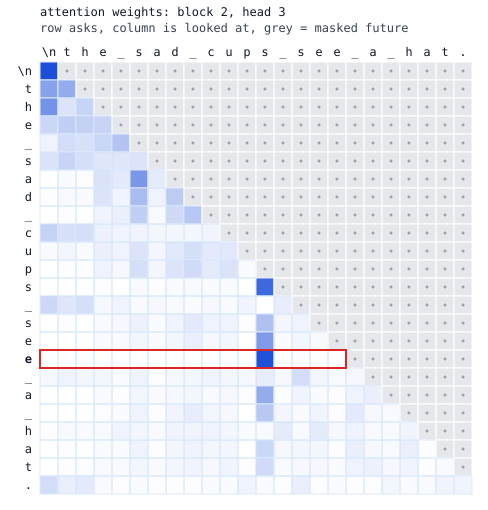

# tiny-language-model

> English version: [README.md](README.md) · Versão em português: [README.pt-BR.md](README.pt-BR.md)

Enseña **cómo un modelo de lenguaje predice el siguiente token, desde el conteo hasta la autoatención**. Dos modelos aprenden el mismo texto pequeño, carácter por carácter. El primero es una tabla de bigramas hecha contando. El segundo es un transformer solo decodificador (decoder-only) cuyo paso hacia adelante y cuya retropropagación están escritos a mano con NumPy, sin ningún framework de deep learning. Con texto con el que ninguno de los dos se entrenó, el transformer tiene una pérdida de 0.662 frente a 1.741 del bigrama, y la demo muestra por qué: usa pistas que están varios caracteres atrás. El mismo modelo entrenado se muestrea luego con decodificación voraz (greedy), temperatura, top-k y top-p, y una tabla mide cómo cada ajuste cambia la entropía y la variedad de lo que escribe.

Explicación completa: [docs/es/artificial-intelligence/tiny-language-model.md](../../../docs/es/artificial-intelligence/tiny-language-model.md).

## Temas del quiz que demuestra

- `artificial-intelligence` / `language-models`: predicción del siguiente token, el modelo de bigramas hecho contando, entropía cruzada y perplejidad en texto reservado, el bucle de generación, muestreo con decodificación voraz, temperatura, top-k y top-p.
- `artificial-intelligence` / `attention-transformer`: query, key y value, pesos softmax, la máscara causal, embeddings de posición, atención multicabeza, la estructura de un bloque (atención, MLP, conexiones residuales, normalización de capa).
- `artificial-intelligence` / `probability-statistics`: una fila de conteos convertida en una distribución de probabilidad, softmax, entropía cruzada, entropía en bits, sacar una muestra con un generador con semilla.
- `artificial-intelligence` / `training`: retropropagación por la regla de la cadena, la comprobación del gradiente con diferencias centradas, el optimizador Adam, mini-batches, pérdida de entrenamiento frente a pérdida reservada.

## Ejecutar

El único requisito es Docker.

```sh
./setup-unix-tiny-language-model.sh        # Linux and macOS
./setup-windows-tiny-language-model.ps1    # Windows
```

El script construye la imagen, ejecuta las pruebas y luego ejecuta la demo, que entrena ambos modelos y reescribe `results/`. No se descarga nada en tiempo de ejecución y los contenedores no tienen red.

## Estructura

| Ruta | Qué es |
| --- | --- |
| `python/corpus.py` | el generador con semilla del texto, la división en líneas de entrenamiento y reservadas, el vocabulario de caracteres, y `line_kind`, que dice si una línea obedece la gramática |
| `python/bigram.py` | el modelo de bigramas: conteos, suavizado add-one, pérdida, perplejidad, muestreo |
| `python/transformer.py` | el transformer: paso hacia adelante, paso hacia atrás a mano, entropía cruzada, Adam, el bucle de entrenamiento |
| `python/sampling.py` | temperatura, top-k, top-p, voraz, entropía, y el bucle de generación |
| `python/experiment.py` | el experimento único compartido por las pruebas y la demo: semillas, tamaños, las sondas, la tabla de muestreo, el ejemplo de atención |
| `python/svg.py` | la curva de pérdida y el mapa de calor de la atención, escritos como texto SVG |
| `python/demo.py` | imprime las tablas y escribe `results/` |
| `python/test_*.py`, `python/conftest.py` | las pruebas. El modelo se entrena una vez por ejecución de pruebas |
| `results/` | salida confirmada (committed) de la demo: `results.md`, `loss-curve.svg`, `attention.svg` |

Solo Python (`python:3.14.8-slim-trixie`), con una dependencia, `numpy==2.5.3`. Sin PyTorch ni TensorFlow: escribir a mano la atención y su gradiente es la lección. No se importa nada de otro miniproyecto. Los tokens son caracteres sueltos: cortar el texto en tokens mayores es el tema de [bpe-tokenizer](../bpe-tokenizer/).

Decisiones que vale la pena conocer:

- **El texto se genera**, con una pequeña gramática con cuatro tipos de línea, cada uno escondiendo una pista varios caracteres atrás: `ana has a cat. she likes it.` (el pronombre depende del nombre), `the red cats see a dog.` (el verbo concuerda con el sujeto), `tom says 4+5=9.` (el dígito depende de ambos números) y `([x]y){z}` (el corchete de cierre debe coincidir). Sin esas pistas un transformer no podría superar a un bigrama.
- **Las líneas reservadas nunca son líneas de entrenamiento.** El generador conserva una línea solo la primera vez que la sortea, así que las 2400 líneas son todas distintas. Se barajan y las últimas 240 se reservan. Una prueba comprueba que los dos conjuntos no se intersectan.
- Bloques **pre-norm** (normalización de capa antes de la atención y antes del MLP), ReLU en el MLP, embeddings de posición aprendidos, sin dropout.
- **Tamaños**: contexto de 32 caracteres, d_model 48, 4 cabezas, 2 bloques, 62 253 parámetros, float32. Adam durante 1000 pasos con lotes de 32 ventanas.
- **Un solo hilo de BLAS** (`OPENBLAS_NUM_THREADS=1` en el Dockerfile): las matrices son diminutas, más hilos solo las hacen más lentas, y el resultado es el mismo en cada ejecución.

## Pruebas

```sh
docker compose run --rm python-test
```

Ejecuta `ruff check`, `ruff format --check` y 53 pruebas, en cerca de medio minuto. El modelo se entrena una vez, con la misma función y semilla que la demo. Cada criterio de aceptación tiene sus pruebas:

| Criterion | Test | What it measures |
| --- | --- | --- |
| MP-AI-4.1 | `test_every_row_is_a_probability_distribution`, `test_sampling_is_reproducible_with_a_fixed_seed` | cada fila de la tabla de bigramas suma 1, y la misma semilla escribe el mismo texto |
| MP-AI-4.2 | `test_the_transformer_beats_the_bigram_on_heldout_text`, `test_no_heldout_line_is_a_training_line` | pérdida reservada 0.662 frente a 1.741, se exige que sea al menos 0.5 nat menor |
| MP-AI-4.2 | `test_backpropagation_matches_the_numerical_gradient` | el gradiente escrito a mano de cada grupo de parámetros coincide con las diferencias centradas en float64 (error relativo inferior a 1e-6) |
| MP-AI-4.3 | `test_lower_temperature_gives_less_varied_output`, `test_top_k_and_top_p_lower_the_entropy_of_plain_sampling` | la entropía de las muestras baja con la temperatura, y top-k y top-p la reducen |
| MP-AI-4.4 | `test_the_demo_writes_the_results` | la demo escribe la tabla y las dos figuras |

Otras pruebas cubren la máscara causal (cambiar el último token no cambia ninguna predicción anterior, y el triángulo superior de los pesos de atención es exactamente cero), los embeddings de posición, Adam, el verificador de la gramática y los ejemplos resueltos de la documentación.

## Demo

```sh
docker compose run --rm python-demo    # writes results/results.md and two SVG figures
```

La salida de abajo está copiada de [`results/results.md`](results/results.md).

**Pérdida en texto reservado**, entropía cruzada en nats, menor es mejor:

| Model | Context it sees | Train loss | Held-out loss | Held-out perplexity |
| --- | --- | ---: | ---: | ---: |
| Uniform guess, ln(45) | nothing |  | 3.807 | 45.00 |
| Bigram (counting) | 1 character | 1.730 | 1.741 | 5.70 |
| Transformer | up to 32 characters | 0.640 | 0.662 | 1.94 |



**Lo que compra el contexto.** La probabilidad que cada modelo da al carácter que exige la gramática a continuación (`_` es un espacio):

| Context | Right next | Wrong next | Bigram: P(right) | Bigram: P(wrong) | Transformer: P(right) | Transformer: P(wrong) |
| --- | :---: | :---: | ---: | ---: | ---: | ---: |
| `ana_has_a_cat._` | `s` | `h` | 0.141 | 0.077 | 0.982 | 0.011 |
| `leo_has_a_cat._` | `h` | `s` | 0.077 | 0.141 | 0.980 | 0.014 |
| `the_old_dogs_see` | `_` | `s` | 0.395 | 0.099 | 0.999 | 0.000 |
| `the_old_dog_see` | `s` | `_` | 0.099 | 0.395 | 0.998 | 0.001 |
| `tom_says_4+5=` | `9` | `1` | 0.091 | 0.417 | 0.433 | 0.410 |
| `tom_says_7+8=1` | `5` | `.` | 0.051 | 0.110 | 0.350 | 0.000 |
| `{[x]` | `}` | `]` | 0.065 | 0.100 | 0.210 | 0.005 |
| `[{x}` | `]` | `}` | 0.113 | 0.099 | 0.327 | 0.009 |

El bigrama da los mismos números a "ana" y a "leo": solo ve el espacio. El transformer está casi seguro del pronombre y de la concordancia, y casi nunca cierra un corchete con el tipo equivocado (tras `{[x]` también puede continuar con una letra o abrir otro corchete, así que 0.210 para `}` no es un error). Las sumas son la regla que solo aprendió a medias.

**Controles de muestreo**, 100 líneas por ajuste, misma semilla:

| Setting | Mean entropy (bits) | Distinct lines of 100 | Grammatical lines of 100 | First line written |
| --- | ---: | ---: | ---: | --- |
| greedy | 0.000 | 1 | 100 | `the new cat sees a cup.` |
| temperature 0.2 | 0.304 | 66 | 100 | `the old cups see a cup.` |
| temperature 0.5 | 0.520 | 97 | 95 | `the old bags see a cat.` |
| temperature 1.0 | 0.856 | 99 | 73 | `ana says 5+8=14.` |
| temperature 1.5 | 1.464 | 100 | 38 | `[9=1ups find a k map.` |
| temperature 1.0, top-k 3 | 0.380 | 86 | 85 | `leo says 4+9=14.` |
| temperature 1.0, top-p 0.9 | 0.751 | 99 | 87 | `[[x[y]{zx}x]}x` |
| temperature 1.5, top-k 3 | 0.464 | 92 | 72 | `leo says 4+9=14.` |
| temperature 1.5, top-p 0.9 | 1.039 | 99 | 67 | `[[x(y){z(yzyy)}]` |

La entropía media es la entropía de la distribución de la que realmente se sacó cada carácter. Menor temperatura, menor entropía, menos líneas distintas, y más de ellas correctas. La decodificación voraz escribe la misma línea 100 veces. Como comparación, la tabla de bigramas escribe líneas como `likeog w cu2+8=6it.`, y ninguna de sus 100 líneas es gramatical.

**Atención.** Una cabeza sobre la línea reservada `the sad cups see a hat.`. El triángulo gris es la máscara causal. En la fila resaltada el modelo está sobre la última letra de "see" y debe decidir si sigue una "s". Esta cabeza pone 0.98 de su peso en la "s" de "cups", cuatro caracteres atrás:



No hay panel (dashboard): las tablas y las dos figuras de [`results/`](results/) son el resultado.

## Límites

- El corpus es sintético y diminuto (47 kB, 45 caracteres), construido para que el contexto importe. Los números no dicen nada sobre el lenguaje real.
- Las sumas solo se aprenden a medias en 1000 pasos: tras `4+5=` el modelo da 0.433 a `9`, y 27 de las 100 líneas escritas con temperatura 1.0 rompen una regla. Entrenar más ayuda, pero la ejecución de las pruebas ya no cabría en su presupuesto de tiempo.
- Las líneas reservadas son combinaciones nuevas de palabras que el modelo vio durante el entrenamiento, no palabras nuevas.
- Las pérdidas vienen de un entrenamiento en float32. En la misma máquina una nueva ejecución da el mismo archivo. En otro procesador los últimos decimales pueden diferir, por eso las pruebas usan márgenes y no valores exactos.
- El texto reservado se puntúa en ventanas consecutivas de 32 caracteres, así que los primeros caracteres de cada ventana se predicen con poco contexto. Esto hace que el transformer parezca ligeramente peor de lo que es.
- Sin caché de clave-valor: la generación vuelve a ejecutar toda la ventana para cada carácter nuevo. Sin dropout, sin weight decay, sin warm-up de la tasa de aprendizaje, sin weight tying.
- El encargo pedía una fixture de entrenamiento con alcance de módulo. Aquí tiene alcance de sesión, así que el modelo se entrena una vez para todos los archivos de prueba y no una vez por archivo.
