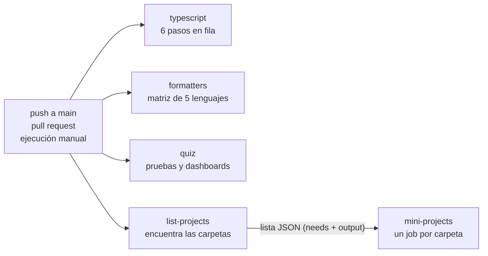

# ci-pipeline

> English version: [README.md](README.md) · Versão em português: [README.pt-BR.md](README.pt-BR.md)

El pipeline de integración continua de este repositorio, convertido en lección. El tema es un archivo real, [`.github/workflows/ci.yml`](../../../.github/workflows/ci.yml): qué verifica cada job, por qué existe, cómo se ve un fallo y cómo ejecutar la misma verificación en tu máquina. La parte ejecutable rompe cada puerta de calidad a propósito, dentro de Docker, y muestra a la puerta detectando el error.

Código: MP-CI-1. Explicación completa: [docs/es/continuous-integration/ci-pipeline.md](../../../docs/es/continuous-integration/ci-pipeline.md).

## Temas del quiz que demuestra

- `continuous-integration` / `ci-cd-concepts`: retroalimentación rápida, las mismas verificaciones en local y en CI, un build en rojo detiene la línea
- `continuous-integration` / `workflows-events-jobs-steps`: eventos (`push`, `pull_request`, `workflow_dispatch`), jobs, steps, `needs`, salidas de job, `if`, `concurrency`
- `continuous-integration` / `runners-matrix`: un runner fijado, una matriz estática con `include`, una matriz dinámica armada con `fromJson`, `fail-fast`
- `continuous-integration` / `caching-artifacts`: por qué este workflow no tiene caché, y cuánto cuesta eso
- `continuous-integration` / `secrets-environments-permissions`: un `GITHUB_TOKEN` de solo lectura, un valor pasado por `env` en vez de pegado en un script
- `continuous-integration` / `quality-gates`: una puerta para cada tipo de error, y una rama que falla en cada una
- `continuous-integration` / `supply-chain-security`: actions fijadas, imágenes fijadas, lockfile congelado

## Cómo ejecutarlo

El único requisito es Docker.

```sh
./setup-unix-ci-pipeline.sh        # Linux y macOS
./setup-windows-ci-pipeline.ps1    # Windows
```

El script construye las imágenes fijadas del repositorio y demuestra las 14 puertas. La primera ejecución descarga las imágenes de cinco toolchains de lenguaje y de un navegador: cerca de 11 GB en disco. Las ejecuciones siguientes tardan cerca de dos minutos.

## El pipeline de un vistazo



Cuatro jobs empiezan a la vez, cada uno en una máquina `ubuntu-24.04` nueva. Solo `mini-projects` espera, porque necesita la lista que produce `list-projects`. La ejecución queda en verde cuando todos los jobs quedan en verde.

## Cada job

### `typescript`

Instala las dependencias de JavaScript con `bun install --frozen-lockfile` y luego ejecuta seis pasos. Un job se detiene en el primer paso que falla, así que las verificaciones baratas van primero.

| Paso | Qué detecta | Cómo ejecutarlo en tu máquina |
| --- | --- | --- |
| Format and lint (Biome) | código sin formatear, y errores de lint | `bunx biome ci .` (se corrige con `bun run format`) |
| Markdown lint (markdownlint) | un archivo Markdown que rompe una regla, como un bloque de código sin lenguaje | `bun run lint:md` (se corrige con `bun run format:md`) |
| Type check | un valor usado con el tipo equivocado | `bun run typecheck` |
| Unit tests | código bien tipado y aun así incorrecto | `bun test quiz/tests/unit tools` |
| Quiz content validation | una pregunta que rompe el formato: 5 alternativas, 3 idiomas, tema conocido | `bun run quiz:validate` |
| Documentation index is up to date | una página generada que no se regeneró | `bun run docs:index --check` (se corrige con `bun run docs:index`) |

### `formatters`

Un job por lenguaje (Python, Go, Rust, C++, Elixir), a partir de una matriz. Cada job construye la imagen fijada de ese lenguaje desde `docker/<lenguaje>.Dockerfile` y ejecuta el formateador en modo de comprobación sobre `projects/` y `benchmarks/`. Un formateador en modo de comprobación no cambia nada: solo dice si cambiaría algo. `fail-fast: false` deja que los cinco jobs terminen, así que una ejecución informa todos los lenguajes que están mal.

Para ejecutar uno en tu máquina, por ejemplo Go:

```sh
docker build -q -f docker/go.Dockerfile -t sef-go:local docker
docker run --rm -v "$PWD:/app" -w /app sef-go:local sh -c 'gofmt -l projects benchmarks'
```

### `quiz`

Dos pasos. "Unit and end-to-end tests" ejecuta `./quiz/setup-unix-quiz.sh test`: construye el quiz como sitio estático a partir de un fixture pequeño, ejecuta sus pruebas unitarias y luego maneja un navegador real contra él con Playwright. "Static dashboards open from disk" abre cada dashboard versionado en ese navegador con `--network none` y falla cuando una página registra un error, no renderiza nada o le pide cualquier cosa a la red.

### `list-projects`

Un job corto que produce un dato, no un veredicto. Lista cada carpeta `projects/<área>/<nombre>/` que tiene un `setup-unix-<nombre>.sh` y publica la lista como una salida en JSON. Por eso un mini-proyecto nuevo entra a CI sin ningún cambio en el workflow.

### `mini-projects`

Lee esa salida con `fromJson` y se convierte en un job por mini-proyecto. Cada job ejecuta el script de setup de su carpeta, que construye imágenes Docker fijadas y ejecuta las pruebas en ellas. Cada mini-proyecto se prueba en cada ejecución, no solo los que cambiaron, porque un archivo compartido (una imagen base en `docker/`, el workflow, el contenido del quiz) puede romper una carpeta que nadie tocó. Ejecuta uno en tu máquina con su propio script, por ejemplo `./projects/testing/tdd-kata/setup-unix-tdd-kata.sh`.

## Las puertas y sus demostraciones

Cada puerta tiene un cambio preparado en `demo/<gate>/change/` y una nota corta en `demo/<gate>/NOTE.md`. La demo local aplica el cambio a una copia limpia dentro de un contenedor. La rama lo aplica al repositorio real.

| Puerta | Job y paso | El cambio preparado | Demo local | Rama | Ejecución fallida |
| --- | --- | --- | --- | --- | --- |
| `biome` | `typescript`, Format and lint | TypeScript sin formatear | comando real, conjunto reducido de archivos | `demo/ci-fails-biome` | PENDIENTE |
| `markdownlint` | `typescript`, Markdown lint | un bloque de código sin lenguaje | comando real, conjunto reducido de archivos | `demo/ci-fails-markdownlint` | PENDIENTE |
| `typecheck` | `typescript`, Type check | una función que devuelve el tipo equivocado | comando real, conjunto reducido de archivos | `demo/ci-fails-typecheck` | PENDIENTE |
| `unit-tests` | `typescript`, Unit tests | una prueba que falla | comando real | `demo/ci-fails-unit-tests` | PENDIENTE |
| `quiz-validate` | `typescript`, Quiz content validation | una pregunta con 4 alternativas | comando real, contenido de fixture | `demo/ci-fails-quiz-validate` | PENDIENTE |
| `docs-index` | `typescript`, Documentation index | una página generada editada a mano | comando real, contenido de fixture | `demo/ci-fails-docs-index` | PENDIENTE |
| `format-python` | `formatters`, python | Python sin formatear | comando e imagen reales, archivos de ejemplo | `demo/ci-fails-format-python` | PENDIENTE |
| `format-go` | `formatters`, go | Go sin formatear | comando e imagen reales, archivos de ejemplo | `demo/ci-fails-format-go` | PENDIENTE |
| `format-rust` | `formatters`, rust | Rust sin formatear | comando e imagen reales, archivos de ejemplo | `demo/ci-fails-format-rust` | PENDIENTE |
| `format-cpp` | `formatters`, cpp | C++ sin formatear | comando e imagen reales, archivos de ejemplo | `demo/ci-fails-format-cpp` | PENDIENTE |
| `format-elixir` | `formatters`, elixir | Elixir sin formatear | comando e imagen reales, archivos de ejemplo | `demo/ci-fails-format-elixir` | PENDIENTE |
| `quiz-e2e` | `quiz`, Unit and end-to-end tests | una prueba de navegador que no puede pasar | reducida: misma imagen y configuración, página de ejemplo | `demo/ci-fails-quiz-e2e` | PENDIENTE |
| `dashboards` | `quiz`, Static dashboards open from disk | un dashboard que necesita una CDN | reducida: mismo script e imagen, página de ejemplo | `demo/ci-fails-dashboards` | PENDIENTE |
| `mini-project` | `mini-projects`, script de setup | un mini-proyecto de ejemplo roto | reducida: mismas líneas de shell, mini-proyecto de ejemplo | `demo/ci-fails-mini-project` | PENDIENTE |

**PENDIENTE**: las ramas aún no se enviaron, así que no hay ejecuciones que enlazar. La columna se completa después de `./demo-branches.sh --push` (mira abajo).

## Demo

Una puerta por vez:

```sh
./setup-unix-ci-pipeline.sh demo typecheck
./setup-windows-ci-pipeline.ps1 demo typecheck
```

```text
=== typecheck ===
$ bun run typecheck
  clean copy: passed
  change applied: tools/scaffold/src/ci-demo-type-error.ts
  with the change: failed (exit code 1), which is what a contributor would see:
    | $ tsc --noEmit -p quiz && tsc --noEmit -p tools/bench && tsc --noEmit -p tools/scaffold && tsc --noEmit -p benchmarks
    | tools/scaffold/src/ci-demo-type-error.ts(8,2): error TS2322: Type 'string' is not assignable to type 'number'.
```

El comando de la línea con `$` se lee del propio `ci.yml`, así que la demo no se aleja de lo que ejecuta CI.

## Pruebas

El script de setup sin argumento es la suite de pruebas. Para cada una de las 14 puertas comprueba tres cosas: la puerta pasa en la copia limpia, falla con el cambio, y el fallo trae el mensaje esperado. Dos comprobaciones más corren junto con ellas:

- `workflow-sync`: cada job, paso con nombre y lenguaje de formateador de `ci.yml` tiene una demostración aquí, y los tres READMEs mencionan cada job y cada rama. Agrega una puerta al workflow y esta lección queda en rojo hasta que se explique.
- `isolation`: los cambios que pertenecen a otros jobs no rompen el job `typescript`, y un cambio pensado para el paso 3 de ese job no rompe los pasos 1 y 2. Eso es lo que hace que cada rama falle en una puerta y no en dos.

## Ramas de demostración

```sh
./demo-branches.sh                  # simulación, por defecto: arma las ramas en un clon temporal
./demo-branches.sh --push           # envía las 14 y lanza CI en cada una
./demo-branches.sh --push biome     # solo una
./demo-branches.ps1 -Push biome     # Windows
```

El script trabaja en un clon temporal y solo lee el árbol de trabajo desde donde se lanza. Se niega a correr cuando `origin` no es `AlexGalhardo/computer-science-fundamentals`, y con `--push` también se niega cuando la `main` local no es la `main` de GitHub. Un push a una rama `demo/` no lanza el workflow, que escucha pushes a `main`, pull requests y ejecuciones manuales. Por eso el script lanza una ejecución manual con `gh workflow run CI --ref <rama>` e imprime su URL. Cada ejecución prueba todos los mini-proyectos, así que 14 ramas son 14 ejecuciones completas: envía unas pocas por vez.

## Límites

- **MP-CI-1.2 está cumplido a medias.** Los 14 cambios y el script existen y se probaron en local. Las ramas no se enviaron, así que la columna "Ejecución fallida" aún no tiene enlaces.
- `quiz-e2e`, `dashboards` y `mini-project` corren sobre un fixture reducido. Las puertas reales levantan Docker (docker-compose, un contenedor por comprobación, el script de setup de cada mini-proyecto), y un contenedor de esta demo no tiene Docker dentro. Los fixtures están en `fixture/`: un sitio de una página, un dashboard de ejemplo y un mini-proyecto de ejemplo que solo necesita un shell. La imagen de Playwright, su configuración, el script de los dashboards y las líneas de shell del paso son los reales.
- Las seis puertas de `typescript` ejecutan los comandos reales sobre una copia de `quiz/`, `tools/` y `benchmarks/`, sin `projects/`, y con el contenido pequeño de las pruebas del quiz en lugar de las preguntas reales. Así que "la copia limpia pasa" no prueba que todo el repositorio esté limpio: eso lo prueba el job `typescript` de verdad.
- Las puertas de formato comprueban los archivos de ejemplo en `fixture/formatters/`, no todos los archivos del repositorio.
- La puerta de Go no imprime nada cuando falla: `test -z "$(gofmt -l ...)"` solo fija el código de salida. Para ver los nombres de los archivos, ejecuta `gofmt -l projects benchmarks`.

## Estructura

| Ruta | Qué es |
| --- | --- |
| `demo/run-gates.sh` | la demo y sus aserciones, en shell POSIX para que corra en cualquiera de las imágenes |
| `demo/<gate>/change/` | el cambio preparado: archivos que reflejan la raíz del repositorio y terminan en `.fixture`, para que los linters reales no los vean |
| `demo/<gate>/NOTE.md` | una línea por idioma sobre qué es el cambio |
| `fixture/` | archivos de ejemplo para las puertas reducidas y para los formateadores |
| `demo-branches.sh`, `demo-branches.ps1` | crean y envían las ramas de demostración |
| `docker-compose.yml` | un servicio por imagen fijada del repositorio |

La lección no tiene TypeScript propio: sus lenguajes son YAML y shell.
