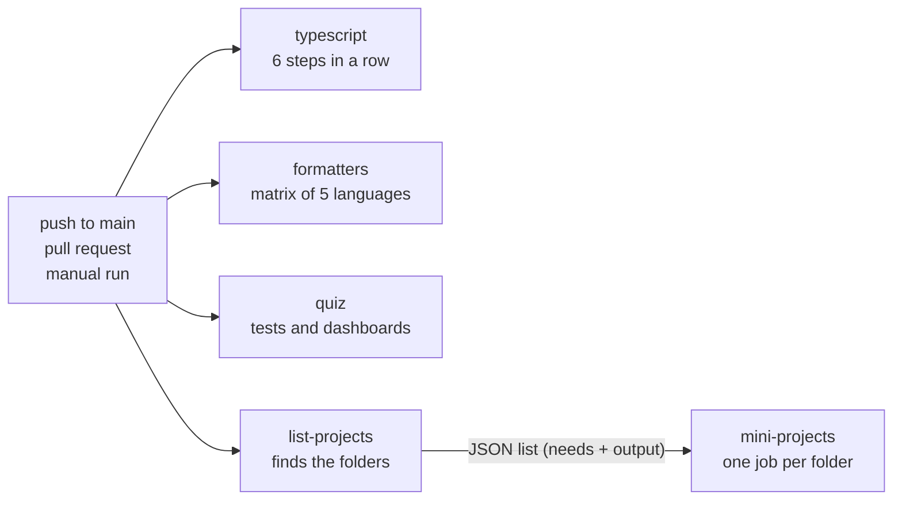

# ci-pipeline

> Versão em português: [README.pt-BR.md](README.pt-BR.md) · Versión en español: [README.es.md](README.es.md)

The continuous integration pipeline of this repository, turned into a lesson. The subject is one real file, [`.github/workflows/ci.yml`](../../../.github/workflows/ci.yml): what each job checks, why it exists, what a failure looks like and how to run the same check on your machine. The runnable part breaks each quality gate on purpose, inside Docker, and shows the gate catching it.

Code: MP-CI-1. Full explanation: [docs/en/continuous-integration/ci-pipeline.md](../../../docs/en/continuous-integration/ci-pipeline.md).

## Quiz topics it demonstrates

- `continuous-integration` / `ci-cd-concepts`: fast feedback, the same checks locally and in CI, a red build stops the line
- `continuous-integration` / `workflows-events-jobs-steps`: events (`push`, `pull_request`, `workflow_dispatch`), jobs, steps, `needs`, job outputs, `if`, `concurrency`
- `continuous-integration` / `runners-matrix`: a pinned runner, a static matrix with `include`, a dynamic matrix built with `fromJson`, `fail-fast`
- `continuous-integration` / `caching-artifacts`: why this workflow has no cache, and what that costs
- `continuous-integration` / `secrets-environments-permissions`: a read-only `GITHUB_TOKEN`, a value passed through `env` instead of pasted into a script
- `continuous-integration` / `quality-gates`: one gate per kind of mistake, and a branch that fails each one
- `continuous-integration` / `supply-chain-security`: pinned actions, pinned images, a frozen lockfile

## Run

The only requirement is Docker.

```sh
./setup-unix-ci-pipeline.sh        # Linux and macOS
./setup-windows-ci-pipeline.ps1    # Windows
```

The script builds the pinned images of the repository and demonstrates the 14 gates. The first run downloads the images of five language toolchains and a browser: about 11 GB on disk. Later runs take about two minutes.

## The pipeline at a glance



Four jobs start at once, each on its own fresh `ubuntu-24.04` machine. Only `mini-projects` waits, because it needs the list that `list-projects` produces. The run is green when every job is green.

## Every job

### `typescript`

Installs the JavaScript dependencies with `bun install --frozen-lockfile` and then runs six steps. A job stops at its first failing step, so the cheap checks come first.

| Step | What it catches | Run it locally |
| --- | --- | --- |
| Format and lint (Biome) | code that is not formatted, and lint mistakes | `bunx biome ci .` (fix with `bun run format`) |
| Markdown lint (markdownlint) | a Markdown file that breaks a rule, such as a code block with no language | `bun run lint:md` (fix with `bun run format:md`) |
| Type check | a value used as the wrong type | `bun run typecheck` |
| Unit tests | code that is well typed and still wrong | `bun test quiz/tests/unit tools` |
| Quiz content validation | a question that breaks the format: 5 alternatives, 3 languages, known topic | `bun run quiz:validate` |
| Documentation index is up to date | a generated page that was not regenerated | `bun run docs:index --check` (fix with `bun run docs:index`) |

### `formatters`

One job per language (Python, Go, Rust, C++, Elixir), from a matrix. Each job builds the pinned image of that language from `docker/<language>.Dockerfile` and runs the formatter in check mode over `projects/` and `benchmarks/`. A formatter in check mode changes nothing: it only says whether it would. `fail-fast: false` lets the five jobs finish, so one run reports every language that is wrong.

Run one locally, for example Go:

```sh
docker build -q -f docker/go.Dockerfile -t sef-go:local docker
docker run --rm -v "$PWD:/app" -w /app sef-go:local sh -c 'gofmt -l projects benchmarks'
```

### `quiz`

Two steps. "Unit and end-to-end tests" runs `./quiz/setup-unix-quiz.sh test`: it builds the quiz as a static site from a small fixture, runs its unit tests and then drives a real browser against it with Playwright. "Static dashboards open from disk" opens every committed dashboard in that browser with `--network none` and fails when a page logs an error, renders nothing or asks the network for anything.

### `list-projects`

A short job that produces data, not a verdict. It lists every folder `projects/<area>/<name>/` that has a `setup-unix-<name>.sh` and publishes the list as a JSON output. That is why a new mini-project enters CI with no change to the workflow.

### `mini-projects`

Reads that output with `fromJson` and becomes one job per mini-project. Each job runs the setup script of its folder, which builds pinned Docker images and runs the tests in them. Every mini-project is tested on every run, not only the ones that changed, because a shared file (a base image in `docker/`, the workflow, the quiz content) can break a folder nobody touched. Run one locally with its own script, for example `./projects/testing/tdd-kata/setup-unix-tdd-kata.sh`.

## The gates and their demonstrations

Each gate has a prepared change in `demo/<gate>/change/` and a short note in `demo/<gate>/NOTE.md`. The local demo applies the change to a clean copy inside a container. The branch applies it to the real repository.

| Gate | Job and step | The prepared change | Local demo | Branch | Failed run |
| --- | --- | --- | --- | --- | --- |
| `biome` | `typescript`, Format and lint | unformatted TypeScript | real command, reduced file set | `demo/ci-fails-biome` | [failed run](https://github.com/AlexGalhardo/computer-science-fundamentals/actions/runs/38048113228) |
| `markdownlint` | `typescript`, Markdown lint | a code block with no language | real command, reduced file set | `demo/ci-fails-markdownlint` | [failed run](https://github.com/AlexGalhardo/computer-science-fundamentals/actions/runs/38048120941) |
| `typecheck` | `typescript`, Type check | a function that returns the wrong type | real command, reduced file set | `demo/ci-fails-typecheck` | [failed run](https://github.com/AlexGalhardo/computer-science-fundamentals/actions/runs/38048128388) |
| `unit-tests` | `typescript`, Unit tests | a failing test | real command | `demo/ci-fails-unit-tests` | [failed run](https://github.com/AlexGalhardo/computer-science-fundamentals/actions/runs/38048136281) |
| `quiz-validate` | `typescript`, Quiz content validation | a question with 4 alternatives | real command, fixture content | `demo/ci-fails-quiz-validate` | [failed run](https://github.com/AlexGalhardo/computer-science-fundamentals/actions/runs/38048144569) |
| `docs-index` | `typescript`, Documentation index | a generated page edited by hand | real command, fixture content | `demo/ci-fails-docs-index` | [failed run](https://github.com/AlexGalhardo/computer-science-fundamentals/actions/runs/38048153531) |
| `format-python` | `formatters`, python | unformatted Python | real command and image, sample files | `demo/ci-fails-format-python` | [failed run](https://github.com/AlexGalhardo/computer-science-fundamentals/actions/runs/38048162838) |
| `format-go` | `formatters`, go | unformatted Go | real command and image, sample files | `demo/ci-fails-format-go` | [failed run](https://github.com/AlexGalhardo/computer-science-fundamentals/actions/runs/38048171156) |
| `format-rust` | `formatters`, rust | unformatted Rust | real command and image, sample files | `demo/ci-fails-format-rust` | [failed run](https://github.com/AlexGalhardo/computer-science-fundamentals/actions/runs/38048178682) |
| `format-cpp` | `formatters`, cpp | unformatted C++ | real command and image, sample files | `demo/ci-fails-format-cpp` | [failed run](https://github.com/AlexGalhardo/computer-science-fundamentals/actions/runs/38048185484) |
| `format-elixir` | `formatters`, elixir | unformatted Elixir | real command and image, sample files | `demo/ci-fails-format-elixir` | [failed run](https://github.com/AlexGalhardo/computer-science-fundamentals/actions/runs/38048192938) |
| `quiz-e2e` | `quiz`, Unit and end-to-end tests | a browser test that cannot pass | reduced: same image and configuration, sample page | `demo/ci-fails-quiz-e2e` | [failed run](https://github.com/AlexGalhardo/computer-science-fundamentals/actions/runs/38048201135) |
| `dashboards` | `quiz`, Static dashboards open from disk | a dashboard that needs a CDN | reduced: same script and image, sample page | `demo/ci-fails-dashboards` | [failed run](https://github.com/AlexGalhardo/computer-science-fundamentals/actions/runs/38048210540) |
| `mini-project` | `mini-projects`, setup script | a broken sample mini-project | reduced: same shell lines, sample mini-project | `demo/ci-fails-mini-project` | [failed run](https://github.com/AlexGalhardo/computer-science-fundamentals/actions/runs/38048219496) |

The links were filled in on 2026-10-10, after `./demo-branches.sh --push`. Each run is red in exactly the job of its row.

## Demo

One gate at a time:

```sh
./setup-unix-ci-pipeline.sh demo typecheck
./setup-windows-ci-pipeline.ps1 demo typecheck
```

```text
=== typecheck ===
$ bun run typecheck
  clean copy: passed
  change applied: tools/scaffold/src/ci-demo-type-error.ts
  with the change: failed (exit code 1), which is what a contributor would see:
    | $ tsc --noEmit -p quiz && tsc --noEmit -p tools/bench && tsc --noEmit -p tools/scaffold && tsc --noEmit -p benchmarks
    | tools/scaffold/src/ci-demo-type-error.ts(8,2): error TS2322: Type 'string' is not assignable to type 'number'.
```

The command on the `$` line is read from `ci.yml` itself, so the demo cannot drift away from what CI runs.

## Tests

The setup script with no argument is the test suite. For each of the 14 gates it asserts three things: the gate passes on the clean copy, it fails with the change, and the failure carries the expected message. Two more checks run with them:

- `workflow-sync`: every job, named step and formatter language of `ci.yml` has a demonstration here, and the three READMEs mention every job and every branch. Add a gate to the workflow and this lesson turns red until it is explained.
- `isolation`: the changes that belong to other jobs do not break the `typescript` job, and a change for step 3 of that job does not break steps 1 and 2. That is what makes each branch fail one gate and not two.

## Demonstration branches

```sh
./demo-branches.sh                  # dry run, the default: builds the branches in a temporary clone
./demo-branches.sh --push           # pushes all 14 and starts CI on each
./demo-branches.sh --push biome     # only one
./demo-branches.ps1 -Push biome     # Windows
```

The script works in a temporary clone and only reads the working tree it is launched from. It refuses to run when `origin` is not `AlexGalhardo/computer-science-fundamentals`, and with `--push` it also refuses when the local `main` is not the `main` on GitHub. A push to a `demo/` branch does not start the workflow, which listens to pushes to `main`, pull requests and manual runs. So the script starts a manual run with `gh workflow run CI --ref <branch>` and prints its URL. Each run tests every mini-project, so 14 branches are 14 full runs: push a few at a time.

## Limits

- `quiz-e2e`, `dashboards` and `mini-project` run on a reduced fixture. The real gates start Docker (docker-compose, a container per check, the setup script of each mini-project), and a container of this demo has no Docker inside. The fixtures are in `fixture/`: a one-page site, a sample dashboard and a sample mini-project that needs only a shell. The Playwright image, its configuration, the dashboard script and the shell lines of the step are the real ones.
- The six `typescript` gates run the real commands on a copy of `quiz/`, `tools/` and `benchmarks/`, without `projects/`, and with the small content of the quiz tests in place of the real questions. So "the clean copy passes" does not prove that the whole repository is clean: the real `typescript` job proves that.
- The formatter gates check the sample files in `fixture/formatters/`, not every file of the repository.
- The Go gate prints nothing when it fails: `test -z "$(gofmt -l ...)"` only sets the exit code. To see the file names, run `gofmt -l projects benchmarks`.

## Structure

| Path | What it is |
| --- | --- |
| `demo/run-gates.sh` | the demo and its assertions, in POSIX shell so that it runs in every image |
| `demo/<gate>/change/` | the prepared change: files that mirror the repository root and end in `.fixture`, so the real linters do not see them |
| `demo/<gate>/NOTE.md` | one line per language on what the change is |
| `fixture/` | sample files for the reduced gates and for the formatters |
| `demo-branches.sh`, `demo-branches.ps1` | create and push the demonstration branches |
| `docker-compose.yml` | one service per pinned image of the repository |

The lesson has no TypeScript of its own: its languages are YAML and shell.
