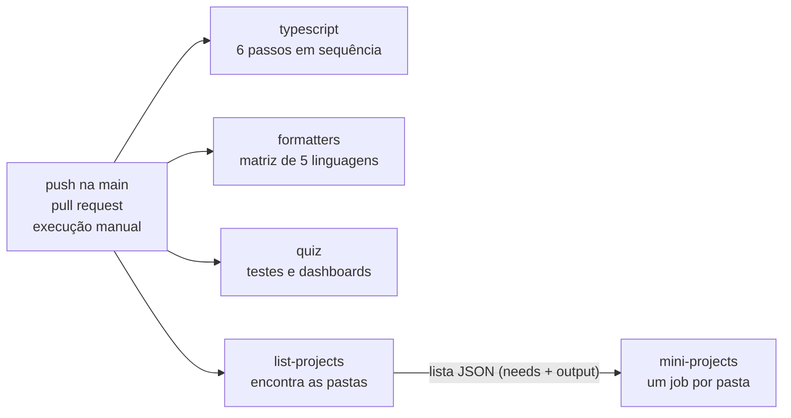

# ci-pipeline

> English version: [README.md](README.md) · Versión en español: [README.es.md](README.es.md)

O pipeline de integração contínua deste repositório, transformado em lição. O assunto é um arquivo real, [`.github/workflows/ci.yml`](../../../.github/workflows/ci.yml): o que cada job verifica, por que ele existe, como é uma falha e como rodar a mesma verificação na sua máquina. A parte executável quebra cada portão de qualidade de propósito, dentro do Docker, e mostra o portão pegando o erro.

Código: MP-CI-1. Explicação completa: [docs/pt/continuous-integration/ci-pipeline.md](../../../docs/pt/continuous-integration/ci-pipeline.md).

## Tópicos do quiz que ele demonstra

- `continuous-integration` / `ci-cd-concepts`: feedback rápido, as mesmas verificações na máquina e no CI, um build vermelho para a linha
- `continuous-integration` / `workflows-events-jobs-steps`: eventos (`push`, `pull_request`, `workflow_dispatch`), jobs, steps, `needs`, saídas de job, `if`, `concurrency`
- `continuous-integration` / `runners-matrix`: um runner fixado, uma matriz estática com `include`, uma matriz dinâmica montada com `fromJson`, `fail-fast`
- `continuous-integration` / `caching-artifacts`: por que este workflow não tem cache, e quanto isso custa
- `continuous-integration` / `secrets-environments-permissions`: um `GITHUB_TOKEN` somente leitura, um valor passado por `env` em vez de colado em um script
- `continuous-integration` / `quality-gates`: um portão para cada tipo de erro, e um branch que falha em cada um
- `continuous-integration` / `supply-chain-security`: actions fixadas, imagens fixadas, lockfile congelado

## Como rodar

O único requisito é o Docker.

```sh
./setup-unix-ci-pipeline.sh        # Linux e macOS
./setup-windows-ci-pipeline.ps1    # Windows
```

O script constrói as imagens fixadas do repositório e demonstra os 14 portões. A primeira execução baixa as imagens de cinco toolchains de linguagem e de um navegador: cerca de 11 GB em disco. As execuções seguintes levam cerca de dois minutos.

## O pipeline de relance



Quatro jobs começam ao mesmo tempo, cada um em uma máquina `ubuntu-24.04` nova. Só `mini-projects` espera, porque precisa da lista que `list-projects` produz. A execução fica verde quando todos os jobs ficam verdes.

## Cada job

### `typescript`

Instala as dependências JavaScript com `bun install --frozen-lockfile` e depois roda seis passos. Um job para no primeiro passo que falha, então as verificações baratas vêm primeiro.

| Passo | O que ele pega | Como rodar na sua máquina |
| --- | --- | --- |
| Format and lint (Biome) | código fora da formatação, e erros de lint | `bunx biome ci .` (corrija com `bun run format`) |
| Markdown lint (markdownlint) | um arquivo Markdown que quebra uma regra, como um bloco de código sem linguagem | `bun run lint:md` (corrija com `bun run format:md`) |
| Type check | um valor usado com o tipo errado | `bun run typecheck` |
| Unit tests | código bem tipado e ainda assim errado | `bun test quiz/tests/unit tools` |
| Quiz content validation | uma questão que quebra o formato: 5 alternativas, 3 idiomas, tópico conhecido | `bun run quiz:validate` |
| Documentation index is up to date | uma página gerada que não foi regenerada | `bun run docs:index --check` (corrija com `bun run docs:index`) |

### `formatters`

Um job por linguagem (Python, Go, Rust, C++, Elixir), a partir de uma matriz. Cada job constrói a imagem fixada daquela linguagem a partir de `docker/<linguagem>.Dockerfile` e roda o formatador em modo de checagem sobre `projects/` e `benchmarks/`. Um formatador em modo de checagem não altera nada: só diz se alteraria. `fail-fast: false` deixa os cinco jobs terminarem, então uma execução informa todas as linguagens que estão erradas.

Para rodar um deles na sua máquina, por exemplo Go:

```sh
docker build -q -f docker/go.Dockerfile -t sef-go:local docker
docker run --rm -v "$PWD:/app" -w /app sef-go:local sh -c 'gofmt -l projects benchmarks'
```

### `quiz`

Dois passos. "Unit and end-to-end tests" roda `./quiz/setup-unix-quiz.sh test`: constrói o quiz como site estático a partir de um fixture pequeno, roda os testes unitários e depois conduz um navegador de verdade contra ele com o Playwright. "Static dashboards open from disk" abre cada dashboard versionado nesse navegador com `--network none` e falha quando uma página registra um erro, não renderiza nada ou pede qualquer coisa à rede.

### `list-projects`

Um job curto que produz um dado, não um veredito. Ele lista toda pasta `projects/<área>/<nome>/` que tem um `setup-unix-<nome>.sh` e publica a lista como uma saída em JSON. É por isso que um mini-projeto novo entra no CI sem nenhuma mudança no workflow.

### `mini-projects`

Lê essa saída com `fromJson` e vira um job por mini-projeto. Cada job roda o script de setup da sua pasta, que constrói imagens Docker fixadas e roda os testes nelas. Todo mini-projeto é testado em toda execução, não só os que mudaram, porque um arquivo compartilhado (uma imagem base em `docker/`, o workflow, o conteúdo do quiz) pode quebrar uma pasta em que ninguém mexeu. Rode um deles na sua máquina com o próprio script, por exemplo `./projects/testing/tdd-kata/setup-unix-tdd-kata.sh`.

## Os portões e suas demonstrações

Cada portão tem uma mudança preparada em `demo/<gate>/change/` e uma nota curta em `demo/<gate>/NOTE.md`. A demo local aplica a mudança em uma cópia limpa dentro de um contêiner. O branch a aplica no repositório real.

| Portão | Job e passo | A mudança preparada | Demo local | Branch | Execução que falhou |
| --- | --- | --- | --- | --- | --- |
| `biome` | `typescript`, Format and lint | TypeScript sem formatação | comando real, conjunto reduzido de arquivos | `demo/ci-fails-biome` | PENDENTE |
| `markdownlint` | `typescript`, Markdown lint | um bloco de código sem linguagem | comando real, conjunto reduzido de arquivos | `demo/ci-fails-markdownlint` | PENDENTE |
| `typecheck` | `typescript`, Type check | uma função que devolve o tipo errado | comando real, conjunto reduzido de arquivos | `demo/ci-fails-typecheck` | PENDENTE |
| `unit-tests` | `typescript`, Unit tests | um teste que falha | comando real | `demo/ci-fails-unit-tests` | PENDENTE |
| `quiz-validate` | `typescript`, Quiz content validation | uma questão com 4 alternativas | comando real, conteúdo de fixture | `demo/ci-fails-quiz-validate` | PENDENTE |
| `docs-index` | `typescript`, Documentation index | uma página gerada editada à mão | comando real, conteúdo de fixture | `demo/ci-fails-docs-index` | PENDENTE |
| `format-python` | `formatters`, python | Python sem formatação | comando e imagem reais, arquivos de exemplo | `demo/ci-fails-format-python` | PENDENTE |
| `format-go` | `formatters`, go | Go sem formatação | comando e imagem reais, arquivos de exemplo | `demo/ci-fails-format-go` | PENDENTE |
| `format-rust` | `formatters`, rust | Rust sem formatação | comando e imagem reais, arquivos de exemplo | `demo/ci-fails-format-rust` | PENDENTE |
| `format-cpp` | `formatters`, cpp | C++ sem formatação | comando e imagem reais, arquivos de exemplo | `demo/ci-fails-format-cpp` | PENDENTE |
| `format-elixir` | `formatters`, elixir | Elixir sem formatação | comando e imagem reais, arquivos de exemplo | `demo/ci-fails-format-elixir` | PENDENTE |
| `quiz-e2e` | `quiz`, Unit and end-to-end tests | um teste de navegador que não tem como passar | reduzida: mesma imagem e configuração, página de exemplo | `demo/ci-fails-quiz-e2e` | PENDENTE |
| `dashboards` | `quiz`, Static dashboards open from disk | um dashboard que precisa de uma CDN | reduzida: mesmo script e imagem, página de exemplo | `demo/ci-fails-dashboards` | PENDENTE |
| `mini-project` | `mini-projects`, script de setup | um mini-projeto de exemplo quebrado | reduzida: mesmas linhas de shell, mini-projeto de exemplo | `demo/ci-fails-mini-project` | PENDENTE |

**PENDENTE**: os branches ainda não foram enviados, então não há execuções para apontar. A coluna é preenchida depois de `./demo-branches.sh --push` (veja abaixo).

## Demo

Um portão por vez:

```sh
./setup-unix-ci-pipeline.sh demo typecheck
./setup-windows-ci-pipeline.ps1 demo typecheck
```

```text
=== typecheck ===
$ bun run typecheck
  clean copy: passed
  change applied: tools/scaffold/src/ci-demo-type-error.ts
  with the change: failed (exit code 1), which is what a contributor would see:
    | $ tsc --noEmit -p quiz && tsc --noEmit -p tools/bench && tsc --noEmit -p tools/scaffold && tsc --noEmit -p benchmarks
    | tools/scaffold/src/ci-demo-type-error.ts(8,2): error TS2322: Type 'string' is not assignable to type 'number'.
```

O comando da linha com `$` é lido do próprio `ci.yml`, então a demo não se afasta do que o CI roda.

## Testes

O script de setup sem argumento é a suíte de testes. Para cada um dos 14 portões ele confere três coisas: o portão passa na cópia limpa, falha com a mudança, e a falha traz a mensagem esperada. Duas checagens rodam junto:

- `workflow-sync`: todo job, passo com nome e linguagem de formatador do `ci.yml` tem uma demonstração aqui, e os três READMEs mencionam todo job e todo branch. Acrescente um portão ao workflow e esta lição fica vermelha até ele ser explicado.
- `isolation`: as mudanças que pertencem a outros jobs não quebram o job `typescript`, e uma mudança feita para o passo 3 desse job não quebra os passos 1 e 2. É isso que faz cada branch falhar em um portão e não em dois.

## Branches de demonstração

```sh
./demo-branches.sh                  # simulação, o padrão: monta os branches em um clone temporário
./demo-branches.sh --push           # envia os 14 e dispara o CI em cada um
./demo-branches.sh --push biome     # só um
./demo-branches.ps1 -Push biome     # Windows
```

O script trabalha em um clone temporário e só lê a árvore de trabalho de onde é chamado. Ele se recusa a rodar quando `origin` não é `AlexGalhardo/computer-science-fundamentals`, e com `--push` também se recusa quando a `main` local não é a `main` do GitHub. Um push para um branch `demo/` não dispara o workflow, que escuta pushes na `main`, pull requests e execuções manuais. Por isso o script dispara uma execução manual com `gh workflow run CI --ref <branch>` e imprime a URL dela. Cada execução testa todos os mini-projetos, então 14 branches são 14 execuções completas: envie alguns por vez.

## Limites

- **MP-CI-1.2 está cumprido pela metade.** As 14 mudanças e o script existem e foram experimentados localmente. Os branches não foram enviados, então a coluna "Execução que falhou" ainda não tem links.
- `quiz-e2e`, `dashboards` e `mini-project` rodam em um fixture reduzido. Os portões reais sobem Docker (docker-compose, um contêiner por checagem, o script de setup de cada mini-projeto), e um contêiner desta demo não tem Docker dentro. Os fixtures ficam em `fixture/`: um site de uma página, um dashboard de exemplo e um mini-projeto de exemplo que só precisa de um shell. A imagem do Playwright, a configuração dele, o script dos dashboards e as linhas de shell do passo são os reais.
- Os seis portões do `typescript` rodam os comandos reais em uma cópia de `quiz/`, `tools/` e `benchmarks/`, sem `projects/`, e com o conteúdo pequeno dos testes do quiz no lugar das questões reais. Então "a cópia limpa passa" não prova que o repositório inteiro está limpo: quem prova isso é o job `typescript` de verdade.
- Os portões de formatação conferem os arquivos de exemplo em `fixture/formatters/`, não todos os arquivos do repositório.
- O portão de Go não imprime nada quando falha: `test -z "$(gofmt -l ...)"` só define o código de saída. Para ver os nomes dos arquivos, rode `gofmt -l projects benchmarks`.

## Estrutura

| Caminho | O que é |
| --- | --- |
| `demo/run-gates.sh` | a demo e suas asserções, em shell POSIX para rodar em qualquer uma das imagens |
| `demo/<gate>/change/` | a mudança preparada: arquivos que espelham a raiz do repositório e terminam em `.fixture`, para os linters reais não os enxergarem |
| `demo/<gate>/NOTE.md` | uma linha por idioma sobre o que é a mudança |
| `fixture/` | arquivos de exemplo para os portões reduzidos e para os formatadores |
| `demo-branches.sh`, `demo-branches.ps1` | criam e enviam os branches de demonstração |
| `docker-compose.yml` | um serviço por imagem fixada do repositório |

A lição não tem TypeScript próprio: as linguagens dela são YAML e shell.
