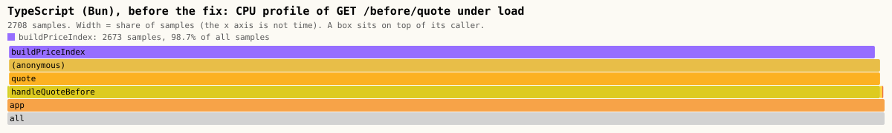
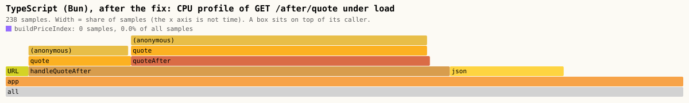

# flame-graph

> Versão em português: [README.pt-BR.md](README.pt-BR.md)

A service is slow and the code looks fine. Where does the time go? This mini-project has two small HTTP services, one in Go and one in TypeScript (Bun), each with a **hidden hot path**: a line that reads like a cheap lookup and is in fact most of the work. A **CPU profile** taken under load, drawn as a **flame graph**, points at the function. Then the fix is applied and a **before/after benchmark** measures what it was worth.

Code: MP-OBS-4. Full explanation: [docs/en/observability/flame-graph.md](../../../docs/en/observability/flame-graph.md).

```
load generator --> go-server  GET /before/report   (compiles a regular expression for every log line)
                              GET /after/report    (compiled once)
                              GET /debug/pprof/profile?seconds=5      -> CPU profile (pprof)
               --> ts-server  GET /before/quote    (rebuilds a price index for every order line)
                              GET /after/quote     (built once)
                              GET /debug/cpuprofile?seconds=5         -> CPU profile (.cpuprofile)

CPU profile --> folded stacks (one line per call stack, with its sample count) --> SVG flame graph
```

## What the flame graphs show

All four pictures are generated by `docker compose run --rm flame` and committed in [results/](results/), together with the folded stacks they were drawn from.

Go, before the fix. The purple box is `compileRegex`: 90.5% of the samples taken inside the handler.


Go, after the fix. `compileRegex` is gone and the handler is a thin tower: most of what is left is matching the lines and writing the response.


TypeScript, before the fix. `buildPriceIndex` holds 99.4% of the handler.



TypeScript, after the fix.



| Service | Variant | Samples | Inside the handler | Inside the hot function | Share of the handler |
| --- | --- | --- | --- | --- | --- |
| Go | before | 414 | 296 | 268 | 90.5% |
| Go | after | 297 | 225 | 0 | 0.0% |
| TypeScript (Bun) | before | 2708 | 2689 | 2673 | 99.4% |
| TypeScript (Bun) | after | 238 | 148 | 0 | 0.0% |

Source: [results/profile.md](results/profile.md). Hot function: `flame-graph/report.compileRegex` in Go, `buildPriceIndex` in TypeScript.

### How to read a flame graph

- Every box is a function. The box **above** it is a function it called, so a column is a call stack, with the root at the bottom.
- The **width** of a box is its share of the samples: the function itself plus everything it called.
- The **x axis is not time**. Sibling boxes are sorted by name. Left and right mean nothing, and a box does not "happen before" the one on its right.
- A wide box with nothing on top (a **plateau**) is where the CPU actually was: that width is the function's own time (self time, or `flat` in pprof). A wide box covered by its children only passed the time along (`cum` in pprof).
- Colours mean nothing; they only tell neighbours apart. Here one function is painted purple, like a search hit.
- Look for the widest box that you own and did not expect to be wide. In the Go picture the plateaus are inside `regexp/syntax`, the standard library, which you cannot fix. Going down the tower, the first box of the application is `compileRegex`: that is the call to remove.

A profile is not a trace. A trace follows **one request** across services and shows where its wall-clock time went, waiting included. A CPU profile adds up **all requests** of one process and shows which functions were on the CPU; time spent waiting for a database does not appear in it.

## Before and after

Generated by `docker compose run --rm bench`, committed in [results/results.md](results/results.md) and [results/results.json](results/results.json). Requests per second: median of 5 runs of 5 s, with the slowest and the fastest run.

| Service | Runtime | Before | After | Factor |
| --- | --- | --- | --- | --- |
| Go | go1.27.1 | 222 (191 to 246) | 3133 (2666 to 3994) | **14.1x** |
| TypeScript (Bun) | bun 1.4.2 | 405 (398 to 430) | 22894 (20947 to 24549) | **56.5x** |

The fix makes the Go service **14.1 times** and the TypeScript service **56.5 times** faster on this workload.

How it was measured: AMD Ryzen 7 5700X3D (16 logical CPUs, 15.6 GiB), Docker on WSL2, each server limited to 1 CPU and 256 MB, a closed-loop load generator with 16 connections on the internal docker-compose network, 2 s of warm-up discarded. The machine was shared with other workloads during the measurement, which is why the spread between runs is large (up to 42% of the median for Go). Two other complete runs on the same machine gave 14.7x and 24.3x for Go and 57.7x and 44.0x for TypeScript: read the factor as "more than ten times", not as a constant. It belongs to this workload (300 log lines, an order of 200 lines over 400 products) and to this machine.

## Quiz topics it demonstrates

- `observability` / `profiling`: what a sampling CPU profiler measures, how to read a flame graph (width, the x axis, plateaus), flat against cumulative time, `net/http/pprof`
- `observability` / `three-signals`: a profile against a trace, and what each one can and cannot answer

## Run

The only requirement is Docker.

```sh
./setup-unix-flame-graph.sh        # Linux and macOS
./setup-windows-flame-graph.ps1    # Windows
```

The script builds the two images, runs the unit tests of both languages, then loads and profiles both services and checks that the fresh flame graphs point at the hot function. That live run writes to `out/`, which git ignores. Everything is removed at the end.

## Demo

```sh
docker compose run --rm flame     # load + CPU profiles + folded stacks + the four SVG flame graphs
docker compose run --rm bench     # before/after throughput
docker compose down -v
```

`flame` runs three steps in order (`capture`, `go-fold`, `flame`) and rewrites `results/*.folded`, `results/flame-*.svg` and `results/profile.md`. It exits with an error when a "before" profile does not put more than 50% of the handler's samples in the hot function, or when an "after" profile still has 5% or more. `bench` rewrites `results/results.md` and `results/results.json`. Open the SVG files in a browser and hover a box to see its name, samples and share.

Raw profiles are kept in `profiles/` (ignored by git). The Go ones open in the standard tool, for example `go tool pprof -top profiles/go-before.pb.gz`, and the TypeScript ones (`.cpuprofile`) open in the Performance panel of Chrome DevTools.

## Tests

```sh
docker compose run --rm go-test
docker compose run --rm ts-test
```

Both run with no network.

- Go: `gofmt`, `go vet` and `go test`. The two variants return the same summary; the parser of `go tool pprof -traces` output reverses the stacks and adds repeated ones.
- TypeScript: `tsc --noEmit` and `bun test`. The two variants return the same quote; folded stacks are parsed and written back; a `.cpuprofile` call tree becomes folded stacks with no sample lost; the SVG has one box per frame with a width proportional to its samples, the root at the bottom, escaped names and well-formed XML; the load generator refuses a target that is not local; and, on the **committed** profiles, the hot function holds more than 50% of the handler before the fix and less than 5% after, and each committed SVG is exactly what the renderer draws from its committed profile.

## Structure

| Path | What it is |
| --- | --- |
| `go/report/` | The log summary in two variants, `SummarizeBefore` (hot path in `compileRegex`) and `SummarizeAfter` |
| `go/cmd/server/` | HTTP server with both routes and `net/http/pprof` |
| `go/fold/`, `go/cmd/fold/` | Turns a pprof CPU profile into folded stacks, through `go tool pprof -traces` |
| `ts/src/pricing.ts` | The order quote in two variants, `quoteBefore` (hot path in `buildPriceIndex`) and `quoteAfter` |
| `ts/src/app.ts`, `ts/src/profiler.ts` | HTTP server with both routes and a CPU profile endpoint built on `node:inspector` |
| `ts/src/folded.ts` | Folded stacks: parser, writer, and the conversion from `.cpuprofile` |
| `ts/src/svg.ts` | The flame graph renderer, used for both languages |
| `ts/src/load.ts`, `ts/src/target.ts` | Closed-loop load generator that refuses any target that is not local |
| `ts/src/capture.ts`, `ts/src/flame.ts`, `ts/src/bench.ts` | The three lab commands |
| `results/` | Committed folded stacks, SVG flame graphs, profile table and benchmark |

## Notes and limits

- Load is sent only to `go-server` and `ts-server` on an internal docker-compose network. The allowed hosts are a closed list in `ts/src/target.ts`, and no port is published on the host.
- The profiling endpoints reveal internals. They are reachable only inside the internal network of the lab; in a real service they must never be public.
- In the TypeScript "before" picture, `quoteBefore` does not appear between `handleQuoteBefore` and `quote`: its last action is a call in tail position, and JavaScriptCore can reuse the stack frame for such a call. A profiler shows the stacks that exist at run time, which are not always the ones in the source.
- The TypeScript pictures are short towers because the JavaScript profiler reports JavaScript functions only: the native `Map` code inside `buildPriceIndex` is counted as its self time. It also samples only while JavaScript runs, so the "after" profile has few samples: the server is mostly idle or inside native I/O.
- CPU profiling in Bun 1.4.2 was checked in the container before use: `node:inspector` with `Profiler.start` and `Profiler.stop` works and returns a `.cpuprofile` call tree.

## Versions and dependencies

| What | Version |
| --- | --- |
| Go image | `golang:1.27.1-bookworm`, standard library only (no module dependency) |
| Bun image | `oven/bun:1.4.2` |
| `zod` | 4.6.5 (validation of the environment, of the query string and of the profile) |
| `typescript`, `@types/bun` | 7.0.2, 1.4.2 (type check only) |

No dependency outside the stack of the repository. The flame graph renderer and the load generator are written here, on purpose: both are short, and reading them is part of the lesson.
