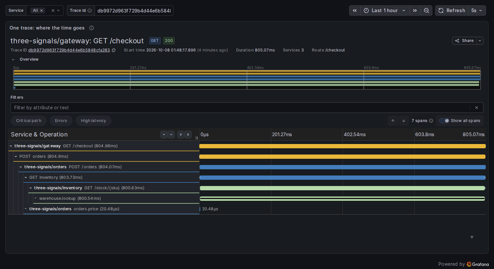

# three-signals

> English version: [README.md](README.md) · Versão em português: [README.pt-BR.md](README.pt-BR.md)

Una petición de cada doce es lenta, y nadie sabe por qué. Este miniproyecto ejecuta tres servicios instrumentados con OpenTelemetry y muestra cómo las tres señales responden tres preguntas distintas sobre esa petición: la **métrica** dice que algo es lento, el **trace** dice dónde, el **log** dice por qué.

Código: MP-OBS-1. Explicación completa: [docs/es/observability/three-signals.md](../../../docs/es/observability/three-signals.md).

```text
client -> gateway (TS) -> orders (TS) -> inventory (Go) -> warehouse.lookup   <- slow for one SKU
              |               |               |
              +------- OTLP/HTTP (traces, metrics, logs) -------+
                                   v
                         OpenTelemetry Collector
                    traces |      metrics |      logs |
                           v              v           v
                         Tempo       Prometheus      Loki
                           +--------- Grafana --------+       http://127.0.0.1:3000
```

## El span lento

El fallo inyectado: en el servicio inventory, la consulta del SKU `slow-widget` tarda 800 ms (un "escaneo completo de estantería"), todos los demás SKUs tardan 8 ms. Un trace lo muestra. Este es el panel de trace de Grafana para una petición encontrada por la demo, guardado con `docker compose --profile screenshot run --rm screenshot`:



La consulta que lo encontró, en TraceQL:

```traceql
{ name = "warehouse.lookup" && duration > 500ms }
```

El mismo trace como texto, de [results/results.md](results/results.md) (el resultado crudo de la consulta está en [results/slow-trace.json](results/slow-trace.json)):

```text
span                                         start ms   dur ms  self ms
gateway: GET /checkout                            0.0    805.0      0.4
  gateway: POST orders                            0.0    804.6      0.5
    orders: POST /orders                          1.0    804.1      0.3
      orders: orders.price                        1.0      0.0      0.0
      orders: GET inventory                       1.0    803.7      3.1
        inventory: GET /stock/{sku}               1.4    800.6      0.1
          inventory: warehouse.lookup             1.5    800.5    800.5
```

Seis spans son largos, y cinco de ellos solo esperan. El self time (la duración menos los hijos) deja un solo culpable, y sus atributos lo explican: `warehouse.sku = slow-widget`, `warehouse.scan = full`.

## La investigación, señal por señal

| Paso | Señal | Consulta | Qué responde | Qué no puede responder |
| --- | --- | --- | --- | --- |
| 1 | Métrica (Prometheus, PromQL) | `histogram_quantile(0.99, sum by (le, service_name) (rate(http_server_request_duration_seconds_bucket[5m])))` | El p99 es 0.94 s en los tres servicios | Qué peticiones: el SKU no es un label, a propósito (una serie temporal por producto sería un problema de cardinalidad) |
| 2 | Trace (Tempo, TraceQL) | `{ name = "warehouse.lookup" && duration > 500ms }` | Qué span concentra el tiempo, en qué servicio, para qué SKU | Por qué la consulta fue lenta |
| 3 | Log (Loki, LogQL) | `{service_name=~".+"} \| trace_id="<trace id>"` | `warehouse lookup was slow: full shelf scan, no index for this sku` | Con qué frecuencia ocurre (eso es otra vez la métrica) |

El vínculo entre los pasos es el **trace id**: el gateway lo devuelve en el encabezado de respuesta `x-trace-id`, cada span lo lleva, y el SDK lo escribe en cada registro de log.

## Temas del quiz que demuestra

- `observability` / `three-signals`: en qué es buena cada señal, y el trace id que las une
- `observability` / `distributed-tracing`: spans, padre e hijo, el encabezado W3C `traceparent` entre tres procesos en dos lenguajes, self time
- `observability` / `opentelemetry`: API y SDK, los tres providers, el Resource, OTLP, y el Collector con un pipeline por señal
- `observability` / `metric-types-cardinality`: un histograma de duración con buckets explícitos, y por qué el SKU no es un atributo de la métrica
- `observability` / `red-use-golden-signals`: el dashboard tiene tasa, errores y duración por servicio
- `observability` / `prometheus-grafana-loki-tempo`: una consulta básica en PromQL, LogQL y TraceQL, data sources y dashboards provisionados desde archivos

## Ejecutar

El único requisito es Docker.

```sh
./setup-unix-three-signals.sh        # Linux y macOS
./setup-windows-three-signals.ps1    # Windows
```

El script construye las imágenes, ejecuta las pruebas unitarias de ambos lenguajes sin red, levanta toda la pila, ejecuta la prueba de extremo a extremo y lo elimina todo al final. Grafana tarda de uno a dos minutos en su primer arranque (crea su base de datos), y la prueba lo espera.

## Explorar a mano

Un comando levanta todo, con imágenes fijadas:

```sh
docker compose up -d
```

Luego abre <http://127.0.0.1:3000> (sin login; define `GRAFANA_PORT` para usar otro puerto). El dashboard **Three signals: one slow request** ya está ahí. Genera tráfico y el reporte:

```sh
docker compose run --rm demo                                   # 60 requests, then the three queries; writes results/
docker compose --profile screenshot run --rm screenshot        # the picture of this README
docker compose --profile screenshot down -v                    # stop and remove everything
```

En el dashboard, haz clic en un trace id de la tabla "Traces with a span slower than 500 ms" para dibujar abajo su cascada (waterfall).

## Dashboards como código

No se hace clic en nada en Grafana. Lee tres archivos al arrancar:

| Archivo | Qué provisiona |
| --- | --- |
| `grafana/provisioning/datasources/datasources.yaml` | Prometheus, Loki y Tempo, con `uid` fijos y los enlaces entre una línea de log y su trace |
| `grafana/provisioning/dashboards/dashboards.yaml` | Un provider que carga cada archivo JSON de una carpeta |
| `grafana/dashboards/three-signals.json` | El dashboard: tasa, errores, duración, traces lentos, un trace, advertencias |

La prueba de extremo a extremo le pide a la API de Grafana el dashboard y comprueba que está marcado como provisionado y tiene los seis paneles.

## Pruebas

```sh
docker compose run --rm ts-test     # typecheck + 9 unit tests, no network
docker compose run --rm go-test     # gofmt, go vet, 5 unit tests, no network
docker compose run --rm e2e-test    # 6 tests against Tempo, Prometheus, Loki and Grafana
docker compose down -v
```

Las pruebas unitarias usan el SDK real con exporters en memoria: prueban que el trace id cruza un salto HTTP en el encabezado `traceparent`, que los registros de log llevan el trace id, y que tres SKUs distintos producen una sola serie temporal.

## Estructura

| Ruta | Qué es |
| --- | --- |
| `ts/src/telemetry.ts` | El SDK de OpenTelemetry configurado a mano: tres providers, un Resource, exporters OTLP |
| `ts/src/instrument.ts` | Instrumentación HTTP manual: span de servidor con `extract`, span de cliente con `inject`, la métrica y el log |
| `ts/src/apps.ts`, `gateway.ts`, `orders.ts` | Los dos servicios TypeScript |
| `go/inventory.go`, `go/telemetry.go` | El servicio Go con la dependencia lenta inyectada, y la configuración de su SDK |
| `ts/src/lab.ts`, `ts/src/demo.ts` | Las tres consultas sobre las APIs HTTP, la cascada y el self time, la demo |
| `config/` | Configuración de Collector, Tempo, Loki y Prometheus |
| `grafana/` | Data sources y dashboard como código |
| `screenshot/` | El script de Playwright que guarda `results/slow-span.png` |
| `results/` | El reporte versionado, el JSON del trace y la captura de pantalla |

## Solo local

- La red `lab` es `internal`: sus contenedores no pueden alcanzar internet. Solo Grafana se une a una segunda red para publicar un puerto, atado a `127.0.0.1`.
- El reporte de uso está desactivado en todas partes: `analytics.reporting_enabled: false` en Loki, `usage_report.reporting_enabled: false` en Tempo, las variables `GF_ANALYTICS_*` y el feed de noticias en Grafana, y la propia telemetría del Collector. Prometheus no envía ninguno.
- Grafana permite acceso anónimo de solo lectura porque esto es un laboratorio sin ningún secreto. No copies esa configuración a un servidor.

## Versiones

| Componente | Versión |
| --- | --- |
| OpenTelemetry Collector | `otel/opentelemetry-collector:0.162.0` |
| Tempo | `grafana/tempo:3.1.0` |
| Loki | `grafana/loki:3.7.8` |
| Prometheus | `prom/prometheus:v3.15.0` |
| Grafana | `grafana/grafana:13.2.3` |
| Bun | `oven/bun:1.4.2` |
| Go | `golang:1.27.1-bookworm` |
| Playwright | `mcr.microsoft.com/playwright:v1.63.0-noble`, `@playwright/test` 1.63.0 |
| OpenTelemetry JS | `@opentelemetry/api` 1.9.1; `sdk-trace-base`, `sdk-metrics`, `resources`, `core`, `context-async-hooks` 2.12.0; `sdk-logs`, `api-logs` y los tres `exporter-*-otlp-http` 0.223.0 |
| OpenTelemetry Go | `otel`, `sdk`, `sdk/metric`, `sdk/log`, `otlptracehttp`, `otlpmetrichttp` v1.47.0; `otlploghttp` v0.23.0; `contrib/bridges/otelslog` v0.21.0 |
| Zod | 4.6.5 |

OpenTelemetry está en el stack del repositorio; los paquetes de arriba son su SDK. Dos de los módulos de Go (`otlploghttp`, `otelslog`) y los paquetes de logs de JS todavía tienen números de versión `0.x`: son las versiones actuales, no pre-releases, pero su API puede cambiar entre versiones menores.

## Notas

- La instrumentación es manual a propósito. En Bun, los hooks de auto-instrumentación de Node.js no parchean el servidor HTTP integrado, y escribir a mano `extract`, `inject` y el span es la lección.
- Tempo tarda hasta un minuto antes de que un trace nuevo aparezca en una **búsqueda** TraceQL. Obtener un trace **por id** funciona de inmediato. La demo y las pruebas reintentan hasta que la respuesta está ahí.
- `rate()` necesita dos muestras de una serie, así que la demo envía una petición de calentamiento y espera antes de la carga.
