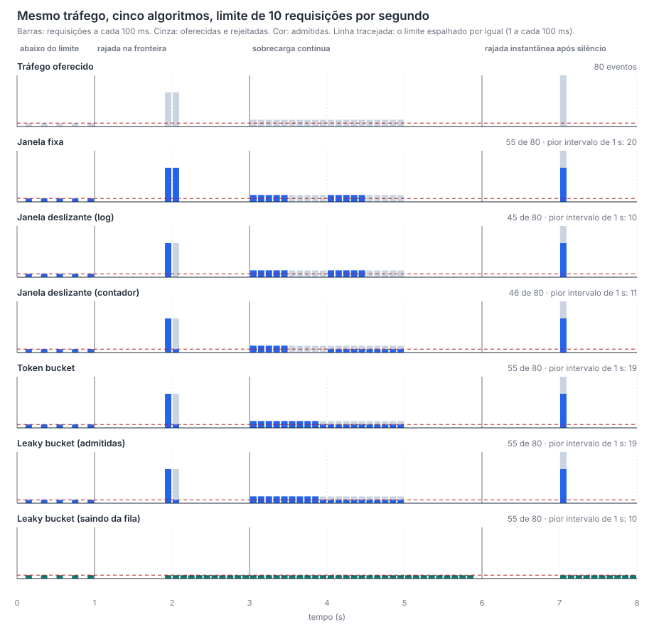
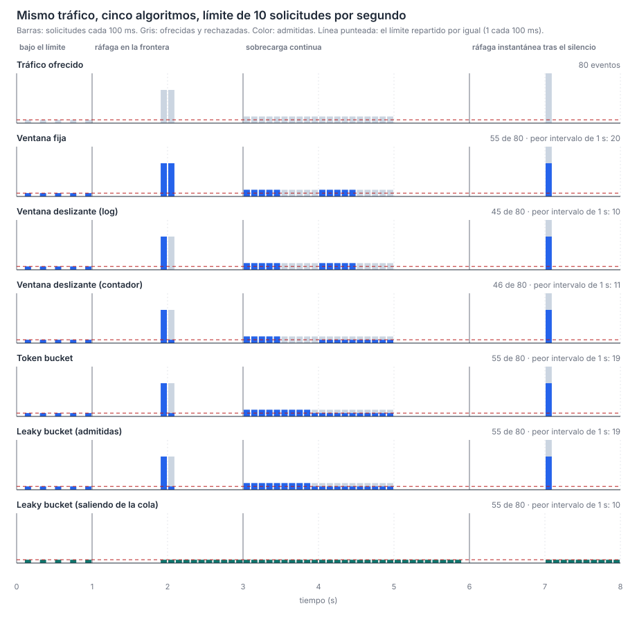

# Burst experiment

Generated by `docker compose run --rm experiment`. Do not edit by hand.

Every algorithm is configured as 10 requests per 1000 ms and receives the same 80 requests. The experiment is a simulation with an injected clock, so the numbers do not depend on the machine: the test suite fails when this folder is out of date.

## Requests admitted (English)

| Series | under the limit (0-1 s) | burst across a boundary (1-3 s) | sustained overload (3-6 s) | instant burst after silence (6-8 s) | Total | worst 1 s interval |
| --- | --- | --- | --- | --- | --- | --- |
| Offered traffic | 5 | 20 | 40 | 15 | 80 | 20 |
| Fixed window | 5 | 20 | 20 | 10 | 55 | 20 |
| Sliding window (log) | 5 | 10 | 20 | 10 | 45 | 10 |
| Sliding window (counter) | 5 | 11 | 20 | 10 | 46 | 11 |
| Token bucket | 5 | 11 | 29 | 10 | 55 | 19 |
| Leaky bucket (admitted) | 5 | 11 | 29 | 10 | 55 | 19 |
| Leaky bucket (leaving the queue) | 5 | 11 | 29 | 10 | 55 | 10 |

## Requisições admitidas (Português)

| Série | abaixo do limite (0-1 s) | rajada na fronteira (1-3 s) | sobrecarga contínua (3-6 s) | rajada instantânea após silêncio (6-8 s) | Total | pior intervalo de 1 s |
| --- | --- | --- | --- | --- | --- | --- |
| Tráfego oferecido | 5 | 20 | 40 | 15 | 80 | 20 |
| Janela fixa | 5 | 20 | 20 | 10 | 55 | 20 |
| Janela deslizante (log) | 5 | 10 | 20 | 10 | 45 | 10 |
| Janela deslizante (contador) | 5 | 11 | 20 | 10 | 46 | 11 |
| Token bucket | 5 | 11 | 29 | 10 | 55 | 19 |
| Leaky bucket (admitidas) | 5 | 11 | 29 | 10 | 55 | 19 |
| Leaky bucket (saindo da fila) | 5 | 11 | 29 | 10 | 55 | 10 |

## Solicitudes admitidas (Español)

| Serie | bajo el límite (0-1 s) | ráfaga en la frontera (1-3 s) | sobrecarga continua (3-6 s) | ráfaga instantánea tras el silencio (6-8 s) | Total | peor intervalo de 1 s |
| --- | --- | --- | --- | --- | --- | --- |
| Tráfico ofrecido | 5 | 20 | 40 | 15 | 80 | 20 |
| Ventana fija | 5 | 20 | 20 | 10 | 55 | 20 |
| Ventana deslizante (log) | 5 | 10 | 20 | 10 | 45 | 10 |
| Ventana deslizante (contador) | 5 | 11 | 20 | 10 | 46 | 11 |
| Token bucket | 5 | 11 | 29 | 10 | 55 | 19 |
| Leaky bucket (admitidas) | 5 | 11 | 29 | 10 | 55 | 19 |
| Leaky bucket (saliendo de la cola) | 5 | 11 | 29 | 10 | 55 | 10 |

