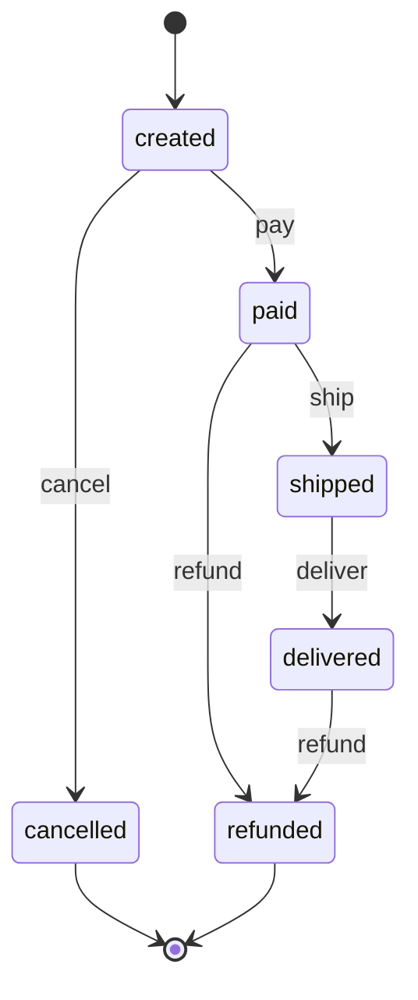

# order-state-machine

> English version: [README.md](README.md) · Versão em português: [README.pt-BR.md](README.pt-BR.md)

El ciclo de vida de un pedido como una máquina de estados explícita. Enseña **cómo los estados y transiciones explícitos eliminan situaciones inválidas**: las reglas viven en una tabla de transiciones, una función genérica consulta la tabla, todo evento que no está en la tabla se rechaza, y las pruebas y el diagrama se generan a partir de esa misma tabla.

Explicación completa: [docs/es/state-machines/order-state-machine.md](../../../docs/es/state-machines/order-state-machine.md).

## La máquina

El diagrama y la tabla de abajo están en [`diagram.md`](diagram.md), generados a partir de [`machine.json`](machine.json).



6 estados y 5 eventos dan 30 pares (estado, evento). La tabla permite 6 de ellos; los otros 24 se rechazan.

## Temas del quiz que demuestra

- `state-machines` / `states-transitions-events-actions`: estados, eventos, transiciones, estados terminales, lectura de una tabla de transiciones, y por qué un solo campo de estado supera a las banderas booleanas independientes.
- `state-machines` / `deterministic-finite-automata`: una máquina dirigida por una tabla con una consulta por evento.
- `state-machines` / `state-machines-in-software`: implementación dirigida por tabla, rechazo explícito, verificación de exhaustividad en TypeScript, pattern matching en las cláusulas de función en Elixir, eventos duplicados, pruebas y diagrama generados a partir de la tabla.

## Ejecución

El único requisito es Docker.

```sh
./setup-unix-order-state-machine.sh        # Linux and macOS
./setup-windows-order-state-machine.ps1    # Windows
```

El script construye las dos imágenes, ejecuta las pruebas de ambos lenguajes y ejecuta la demo de ambos.

## Estructura

| Ruta | Qué es |
| --- | --- |
| `machine.json` | la tabla de transiciones, la única fuente de verdad para ambos lenguajes |
| `diagram.md` | diagrama Mermaid y tabla, generados a partir de `machine.json` y confirmados en el repositorio |
| `ts/src/table.ts` | estados y eventos como tipos cerrados, y la validación con Zod de `machine.json` |
| `ts/src/machine.ts` | la función de transición genérica y el recorrido de una lista de eventos |
| `ts/src/labels.ts` | un `switch` sobre los estados con una verificación de exhaustividad |
| `ts/src/diagram.ts`, `ts/src/generate-diagram.ts` | el generador del diagrama y su comando |
| `ts/src/cli.ts` | `bun run order <event...>` y `bun run demo` |
| `elixir/lib/order_state_machine.ex` | una cláusula de función por fila de la tabla, generada en tiempo de compilación |
| `elixir/lib/order_state_machine/diagram.ex` | el mismo diagrama, renderizado de forma independiente |
| `elixir/lib/order_state_machine/cli.ex`, `elixir/lib/mix/tasks/order.ex` | `mix order <event...>` y `mix order demo` |

TypeScript corre sobre la imagen fijada `oven/bun:1.4.2`; su única dependencia es `zod` 4.6.5, que valida la tabla y la entrada de la línea de comandos. Elixir corre sobre `elixir:1.20.4-otp-28-slim` sin dependencias.

## Pruebas

```sh
docker compose run --rm ts-test
docker compose run --rm elixir-test
```

En ambos lenguajes la prueba principal está **generada a partir de la tabla**: un caso por par (estado, evento), 6 que deben tener éxito con el destino de la tabla y 24 que deben rechazarse y dejar el pedido donde estaba. Otras pruebas verifican la validación de la tabla, los estados terminales, la línea de comandos, y que `diagram.md` esté al día. La ejecución de Elixir también verifica el formato (`mix format --check-formatted`).

## Demo y línea de comandos

```sh
docker compose run --rm ts-demo          # a full order, then a rejected transition
docker compose run --rm elixir-demo      # the same, in Elixir
```

```text
== A full order / Um pedido completo / Un pedido completo ==
start: created
  pay      created -> paid
  ship     paid -> shipped
  deliver  shipped -> delivered
end: delivered

== A rejected transition / Uma transição rejeitada / Una transición rechazada ==
start: created
  pay      created -> paid
  deliver  REJECTED: not allowed in paid, the order stays in paid
  ship     paid -> shipped
  deliver  shipped -> delivered
end: delivered
```

La versión en TypeScript también imprime una descripción del estado final en inglés, portugués y español, después de `end:` (`EN: delivered to the customer`, `PT: entregue ao cliente`, `ES: entregado al cliente`).

Para recorrer un pedido propio, pasa los eventos en orden. El código de salida es 0 cuando todos los eventos fueron aceptados, 1 cuando se rechazó alguno y 2 para un evento desconocido.

```sh
docker compose run --rm ts-demo bun run order pay refund
docker compose run --rm elixir-demo mix order pay pay
```

## Diagrama

```sh
docker compose run --rm ts-diagram
```

Esto reescribe `diagram.md` a partir del `machine.json` de tu disco. Si cambias la tabla y no lo ejecutas, la prueba "the committed diagram.md is up to date" falla en ambos lenguajes. El bloque Mermaid de este README es una copia para leer; `diagram.md` es el archivo verificado.
