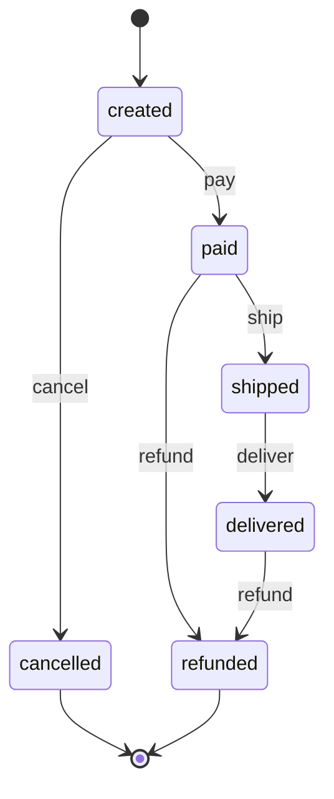

# order-state-machine

> Versão em português: [README.pt-BR.md](README.pt-BR.md)

The life cycle of an order as an explicit state machine. It teaches **how explicit states and transitions remove invalid situations**: the rules live in one transition table, one generic function looks the table up, every event that is not in the table is rejected, and the tests and the diagram are generated from that same table.

Full explanation: [docs/en/state-machines/order-state-machine.md](../../../docs/en/state-machines/order-state-machine.md).

## The machine

The diagram and the table below are in [`diagram.md`](diagram.md), generated from [`machine.json`](machine.json).



6 states and 5 events give 30 (state, event) pairs. The table allows 6 of them; the other 24 are rejected.

## Quiz topics it demonstrates

- `state-machines` / `states-transitions-events-actions`: states, events, transitions, terminal states, reading a transition table, and why one state field beats independent boolean flags.
- `state-machines` / `deterministic-finite-automata`: a table-driven machine with one lookup per event.
- `state-machines` / `state-machines-in-software`: table-driven implementation, explicit rejection, exhaustiveness checking in TypeScript, pattern matching on function clauses in Elixir, duplicated events, tests and diagram generated from the table.

## Run

The only requirement is Docker.

```sh
./setup-unix-order-state-machine.sh        # Linux and macOS
./setup-windows-order-state-machine.ps1    # Windows
```

The script builds the two images, runs the tests of both languages and runs the demo of both.

## Structure

| Path | What it is |
| --- | --- |
| `machine.json` | the transition table, the single source of truth for both languages |
| `diagram.md` | Mermaid diagram and table, generated from `machine.json` and committed |
| `ts/src/table.ts` | states and events as closed types, and the Zod validation of `machine.json` |
| `ts/src/machine.ts` | the generic transition function and the walk over a list of events |
| `ts/src/labels.ts` | a `switch` over the states with an exhaustiveness check |
| `ts/src/diagram.ts`, `ts/src/generate-diagram.ts` | the diagram generator and its command |
| `ts/src/cli.ts` | `bun run order <event...>` and `bun run demo` |
| `elixir/lib/order_state_machine.ex` | one function clause per row of the table, generated at compile time |
| `elixir/lib/order_state_machine/diagram.ex` | the same diagram, rendered independently |
| `elixir/lib/order_state_machine/cli.ex`, `elixir/lib/mix/tasks/order.ex` | `mix order <event...>` and `mix order demo` |

TypeScript runs on the pinned image `oven/bun:1.4.2`; its only dependency is `zod` 4.6.5, which validates the table and the command-line input. Elixir runs on `elixir:1.20.4-otp-28-slim` with no dependencies.

## Tests

```sh
docker compose run --rm ts-test
docker compose run --rm elixir-test
```

In both languages the main test is **generated from the table**: one case per (state, event) pair, 6 that must succeed with the target of the table and 24 that must be rejected and leave the order where it was. Other tests check the validation of the table, the terminal states, the command line, and that `diagram.md` is up to date. The Elixir run also checks the formatting (`mix format --check-formatted`).

## Demo and command line

```sh
docker compose run --rm ts-demo          # a full order, then a rejected transition
docker compose run --rm elixir-demo      # the same, in Elixir
```

```
== A full order / Um pedido completo ==
start: created
  pay      created -> paid
  ship     paid -> shipped
  deliver  shipped -> delivered
end: delivered

== A rejected transition / Uma transição rejeitada ==
start: created
  pay      created -> paid
  deliver  REJECTED: not allowed in paid, the order stays in paid
  ship     paid -> shipped
  deliver  shipped -> delivered
end: delivered
```

The TypeScript version also prints a description of the final state in English and Portuguese.

To walk your own order, pass the events in order. The exit code is 0 when every event was accepted, 1 when one was rejected and 2 for an unknown event.

```sh
docker compose run --rm ts-demo bun run order pay refund
docker compose run --rm elixir-demo mix order pay pay
```

## Diagram

```sh
docker compose run --rm ts-diagram
```

This rewrites `diagram.md` from the `machine.json` on your disk. If you change the table and do not run it, the test "the committed diagram.md is up to date" fails in both languages. The Mermaid block in this README is a copy for reading; `diagram.md` is the checked file.
