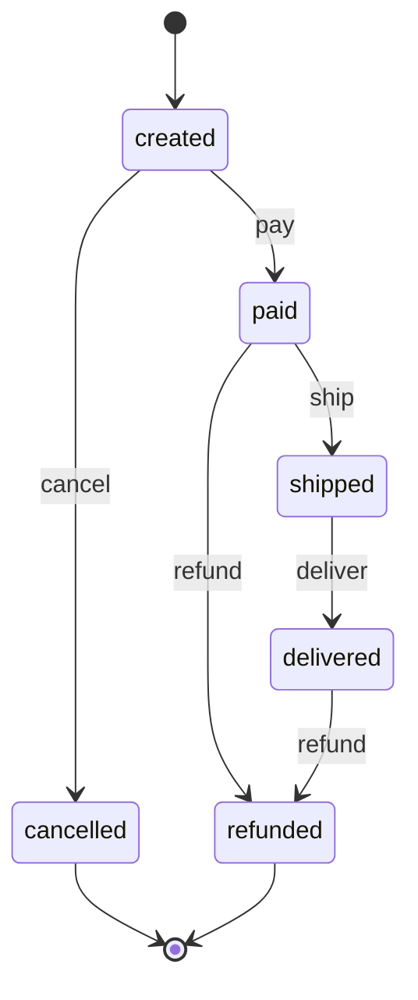

# order-state-machine

> English version: [README.md](README.md) · Versión en español: [README.es.md](README.es.md)

O ciclo de vida de um pedido como uma máquina de estados explícita. Ensina **como estados e transições explícitos eliminam situações inválidas**: as regras ficam em uma única tabela de transições, uma função genérica consulta a tabela, todo evento que não está na tabela é rejeitado, e os testes e o diagrama são gerados a partir dessa mesma tabela.

Explicação completa: [docs/pt/state-machines/order-state-machine.md](../../../docs/pt/state-machines/order-state-machine.md).

## A máquina

O diagrama e a tabela abaixo estão em [`diagram.md`](diagram.md), gerado a partir de [`machine.json`](machine.json).



6 estados e 5 eventos dão 30 pares (estado, evento). A tabela permite 6 deles; os outros 24 são rejeitados.

## Tópicos do quiz que ele demonstra

- `state-machines` / `states-transitions-events-actions`: estados, eventos, transições, estados terminais, leitura de uma tabela de transições, e por que um único campo de estado é melhor que flags booleanas independentes.
- `state-machines` / `deterministic-finite-automata`: uma máquina orientada a tabela, com uma consulta por evento.
- `state-machines` / `state-machines-in-software`: implementação orientada a tabela, rejeição explícita, verificação de exaustividade em TypeScript, casamento de padrões em cláusulas de função em Elixir, eventos duplicados, testes e diagrama gerados a partir da tabela.

## Como rodar

O único requisito é o Docker.

```sh
./setup-unix-order-state-machine.sh        # Linux e macOS
./setup-windows-order-state-machine.ps1    # Windows
```

O script constrói as duas imagens, roda os testes das duas linguagens e roda a demonstração das duas.

## Estrutura

| Caminho | O que é |
| --- | --- |
| `machine.json` | a tabela de transições, única fonte de verdade para as duas linguagens |
| `diagram.md` | diagrama Mermaid e tabela, gerados a partir de `machine.json` e versionados |
| `ts/src/table.ts` | estados e eventos como tipos fechados, e a validação de `machine.json` com Zod |
| `ts/src/machine.ts` | a função genérica de transição e o percurso por uma lista de eventos |
| `ts/src/labels.ts` | um `switch` sobre os estados com verificação de exaustividade |
| `ts/src/diagram.ts`, `ts/src/generate-diagram.ts` | o gerador do diagrama e seu comando |
| `ts/src/cli.ts` | `bun run order <evento...>` e `bun run demo` |
| `elixir/lib/order_state_machine.ex` | uma cláusula de função por linha da tabela, gerada em tempo de compilação |
| `elixir/lib/order_state_machine/diagram.ex` | o mesmo diagrama, renderizado de forma independente |
| `elixir/lib/order_state_machine/cli.ex`, `elixir/lib/mix/tasks/order.ex` | `mix order <evento...>` e `mix order demo` |

O TypeScript roda na imagem fixada `oven/bun:1.4.2`; sua única dependência é `zod` 4.6.5, que valida a tabela e a entrada da linha de comando. O Elixir roda em `elixir:1.20.4-otp-28-slim`, sem dependências.

## Testes

```sh
docker compose run --rm ts-test
docker compose run --rm elixir-test
```

Nas duas linguagens o teste principal é **gerado a partir da tabela**: um caso por par (estado, evento), 6 que devem dar certo com o destino da tabela e 24 que devem ser rejeitados deixando o pedido onde estava. Outros testes conferem a validação da tabela, os estados terminais, a linha de comando, e se `diagram.md` está atualizado. A execução do Elixir também confere a formatação (`mix format --check-formatted`).

## Demonstração e linha de comando

```sh
docker compose run --rm ts-demo          # um pedido completo, depois uma transição rejeitada
docker compose run --rm elixir-demo      # o mesmo, em Elixir
```

```text
== A full order / Um pedido completo / Un pedido completo ==
start: created
  pay      created -> paid
  ship     paid -> shipped
  deliver  shipped -> delivered
end: delivered

== A rejected transition / Uma transição rejeitada / Una transición rechazada ==
start: created
  pay      created -> paid
  deliver  REJECTED: not allowed in paid, the order stays in paid
  ship     paid -> shipped
  deliver  shipped -> delivered
end: delivered
```

A versão em TypeScript também imprime uma descrição do estado final em inglês, português e espanhol, depois de `end:` (`EN: delivered to the customer`, `PT: entregue ao cliente`, `ES: entregado al cliente`).

Para conduzir o seu próprio pedido, passe os eventos em ordem. O código de saída é 0 quando todo evento foi aceito, 1 quando algum foi rejeitado e 2 para um evento desconhecido.

```sh
docker compose run --rm ts-demo bun run order pay refund
docker compose run --rm elixir-demo mix order pay pay
```

## Diagrama

```sh
docker compose run --rm ts-diagram
```

O comando regrava `diagram.md` a partir do `machine.json` do seu disco. Se você mudar a tabela e não rodá-lo, o teste "the committed diagram.md is up to date" falha nas duas linguagens. O bloco Mermaid deste README é uma cópia para leitura; `diagram.md` é o arquivo conferido.
