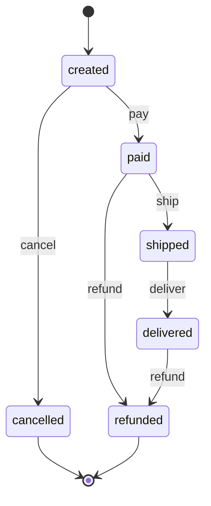

<!-- Generated from machine.json. Do not edit by hand: run the diagram command of the README. -->

# Order state machine

| state | pay | ship | deliver | cancel | refund |
| --- | --- | --- | --- | --- | --- |
| created | paid | - | - | cancelled | - |
| paid | - | shipped | - | - | refunded |
| shipped | - | - | delivered | - | - |
| delivered | - | - | - | - | refunded |
| cancelled | - | - | - | - | - |
| refunded | - | - | - | - | - |
